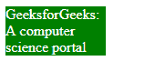
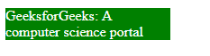

# CSS 最大宽度属性

> 原文:[https://www.geeksforgeeks.org/css-max-width-property/](https://www.geeksforgeeks.org/css-max-width-property/)

CSS 中的**最大宽度**属性用于定义元素的最大宽度。宽度值不能大于最大宽度值。如果内容大于最大宽度，那么它将转到下一行，如果内容小于最大宽度，那么它没有效果。

**语法:**

```css
max-width: none| length| initial| inherit;
```

**属性值:**下面的例子很好地描述了所有的属性。

**无:**为默认值，不包含最大宽度。

**语法:**

```css
max-width: none;
```

**示例:**本示例说明了**最大宽度**属性的使用，该属性的值设置为无。

## 超文本标记语言

```css
<!DOCTYPE html>
<html>
<head>
    <title>max-width property</title>

    <!-- max-width CSS property -->
    <style>
    p {
        max-width: none;
        color: white;
        background-color: green;
    }
    </style>
</head>

<body>
    <p> GeeksforGeeks: A computer science portal </p>
</body>
</html>
```

**输出:**


**长度:**该属性用于设置最大宽度的长度。长度可以设置为 px、cm 等形式。

**语法:**

```css
max-width: length;
```

**示例:**该示例说明了使用**最大宽度**属性来设置最大宽度长度。

## 超文本标记语言

```css
<!DOCTYPE html>
<html>
<head>
    <title>max-width property</title>

    <!-- max-width CSS property -->
    <style>
    p {
        max-width: 110px;
        color: white;
        background-color: green;
    }
    </style>
</head>

<body>
    <p> GeeksforGeeks: A computer science portal </p>
</body>
</html>
```

**输出:**



**百分比(%):** 该属性用于以百分比的形式设置最大宽度。

**语法:**

```css
max-width: %;
```

**示例:**本示例说明了**最大宽度**属性的使用，该属性的值以百分比的形式分配。

## 超文本标记语言

```css
<!DOCTYPE html>
<html>
<head>
    <title>max-width property</title>

    <!-- max-width CSS property -->
    <style>
    p {
        max-width: 20%;
        color: white;
        background-color: green;
    }
    </style>
</head>

<body>
    <p> GeeksforGeeks: A computer science portal </p>
</body>
</html>
```

**输出:**



[](https://www.geeksforgeeks.org/css-value-initial/)****:**用于将元素的 CSS 属性设置为默认值。初始关键字可以用于任何 CSS 属性和任何 HTML 元素。**

****语法:****

```css
max-width: initial;
```

****示例:**该示例说明了使用**最大宽度**属性，以便将该值设置为默认值。**

## **超文本标记语言**

```css
<!DOCTYPE html>
<html>
<head>
    <title>max-width property</title>

    <!-- max-width CSS property -->
    <style>
    p {
        max-width: initial;
        color: white;
        background-color: green;
    }
    </style>
</head>

<body>
    <p> GeeksforGeeks: A computer science portal </p>
</body>
</html>
```

****输出:****

****

**[**inherit:**](https://www.geeksforgeeks.org/css-value-inherit/) 此属性用于从元素的父元素属性值继承元素的属性。inherit 关键字可用于继承任何 CSS 属性和任何 HTML 元素。**

****支持的浏览器:**最大宽度属性支持的浏览器如下:**

*   **谷歌 Chrome 1.0**
*   **Internet Explorer 7.0**
*   **微软边缘 12.0**
*   **Firefox 1.0**
*   **Safari 2.0.2**
*   **Opera 7.0**