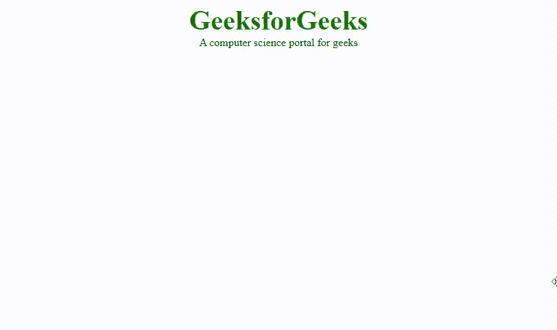

# CSS 媒体查询

> 原文:[https://www.geeksforgeeks.org/css-media-queries/](https://www.geeksforgeeks.org/css-media-queries/)

CSS 中的**媒体查询**用于创建响应性网页设计。这意味着基于屏幕或媒体类型，网页的视图因系统而异。断点指定了设备宽度的大小，内容刚刚开始断裂或变形。

媒体查询可用于检查许多事情:

*   视口的宽度和高度
*   设备的宽度和高度
*   方向
*   解决

媒体查询由媒体类型组成，该媒体类型可以包含一个或多个表达式，这些表达式可以是真也可以是假。如果指定的媒体与显示文档的设备类型匹配，则查询结果为真。如果媒体查询为真，则应用样式表。

**语法:**

```css
@media not | only mediatype and (expression) {
    // Code content
}
```

**示例:**该示例说明了具有不同设备宽度的 CSS 媒体查询，以使其具有响应性。

## 超文本标记语言

```css
<!DOCTYPE html>
<html>

<head>
    <title>CSS media query</title>
    <style>
    body {
        text-align: center;
    }

    .gfg {
        font-size: 40px;
        font-weight: bold;
        color: green;
    }

    @media screen and (max-width:800px) {
        body {
            text-align: center;
            background-color: green;
        }
        .gfg {
            font-size: 30px;
            font-weight: bold;
            color: white;
        }
        .geeks {
            color: white;
        }
    }

    @media screen and (max-width:500px) {
        body {
            text-align: center;
            background-color: blue;
        }
    }
    </style>
</head>

<body>
    <div class="gfg">GeeksforGeeks</div>
    <div class="geeks">A computer science portal for geeks</div>
</body>

</html>
```

**输出:**从输出中我们可以看到，如果屏幕的最大宽度减少到 800px，那么背景颜色就会变成绿色&如果屏幕的最大宽度减少到 500px，那么背景颜色就会变成蓝色。对于桌面大小宽度，背景颜色将为白色。



**CSS 中的媒体类型:**媒体类型有很多种，如下所示:

*   **all:** 用于所有媒体设备
*   **打印:**用于打印机。
*   **屏幕:**用于电脑屏幕、智能手机等。
*   **语音:**用于朗读屏幕的屏幕阅读器。

**媒体查询的特点:**媒体查询的特点有很多，列举如下:

*   **颜色:**输出设备每个颜色分量的位数。
*   **网格:**检查设备是网格还是位图。
*   **高度:**视口高度。
*   **长宽比:**视口的宽高比。
*   **颜色指数:**设备可以显示的颜色数量。
*   **最大分辨率:**使用 dpi 和 dpcm 的设备的最大分辨率。
*   **单色:**单色设备上每种颜色的位数。
*   **扫描:**输出设备的扫描。
*   **更新:**输出设备修改的速度有多快。
*   **宽度:**视口宽度。

**支持的浏览器:**CSS*媒体查询*支持的浏览器如下:

*   Chrome 21.0 及以上版本
*   Mozilla 3.5 及以上版本
*   微软边缘 12.0
*   Opera 9.0 及以上版本
*   Internet Explorer 9.0 及以上版本
*   Safari 4.0 及以上版本