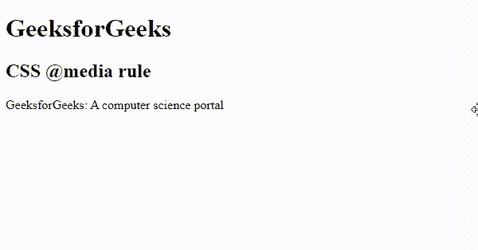

# CSS @媒体规则

> 原文:[https://www.geeksforgeeks.org/css-media-rule/](https://www.geeksforgeeks.org/css-media-rule/)

**@media** [CSS at-rule](https://www.geeksforgeeks.org/css-at-rules/) 用于使用[Media query 为不同的媒体/设备应用不同的样式集。](https://www.geeksforgeeks.org/css-media-queries/)媒体查询主要用于检查设备的高度、宽度、分辨率和方向(纵向/横向)。这一 CSS 规则通过为特定屏幕类型或设备(如智能手机、个人电脑)提供更优化的设计，为响应性设计提供了一条出路。媒体查询也可用于仅为打印文档或屏幕阅读器指定某些样式。

**语法:**

```html
@media not|only mediatype and (media feature and|or|not mediafeature) 
{
    // CSS Property
}
```

**使用的关键词:**

*   **不是:**它恢复整个媒体查询。
*   **仅限:**防止旧浏览器(不支持的浏览器)应用指定的样式。
*   **和:**用于组合两种媒体类型或媒体功能。

**媒体类型:**

*   **all:** 默认媒体类型。它用于所有媒体类型设备。
*   **打印:**用于打印机设备。
*   **屏幕:**用于电脑屏幕、手机屏幕等。
*   **语音:**用于阅读页面的屏幕阅读器。

**媒体功能:**媒体查询中有很多媒体功能，下面列出了其中一些:

*   **任意-悬停:**任何可用的输入机制都允许用户悬停在任何元素上。
*   **任意指针:**它定义任何可用的输入机制为指向设备，如果是，它有多准确？
*   **任意比例:**用于设置视口的宽高比。
*   [**颜色**](https://www.geeksforgeeks.org/css-colors/) **:用于设置输出设备的颜色成分。**
*   **色域:**用于设置用户代理或输出设备支持的颜色范围。
*   **颜色索引:**用于设置设备可以显示的颜色数量。
*   [](https://www.geeksforgeeks.org/css-grid-property/)****:**用于指定行和列的大小。**
*   **[**高度**](geeksforgeeks.org/css-height-property/) **:用于设置视口的高度。****
*   ****悬停:**它允许用户悬停在任何元素上。**
*   ****反转颜色:**这定义了任何设备是否反转颜色**
*   ****光照水平:**定义光照水平。**
*   ****最大长宽比:**用于设置最大宽高比。**
*   ****最大颜色:**用于设置输出设备每个颜色分量的最大位数。**
*   ****最大颜色指数；**用于设置设备可以显示的最大颜色数。**
*   **[**-最大高度**](https://www.geeksforgeeks.org/css-max-height-property/) **:设置浏览器显示区域的最大高度。****
*   ****最大-单色:**用于设置单色设备上每个“颜色”的最大位数。**
*   ****最大分辨率:**用于设置输出设备的最大分辨率。**
*   **[**【最大宽度】**](https://www.geeksforgeeks.org/css-max-width-property/) **:设置浏览器显示区域的最大宽度。****
*   ****最小长宽比:**用于设置最小宽高比。**
*   ****最小颜色:**用于设置输出设备每个颜色分量的最小位数。**
*   ****最小颜色指数；**用于设置设备可以显示的最小颜色数。**
*   **[**最小高度**](https://www.geeksforgeeks.org/css-min-height-property/) **:设置浏览器显示区域的最小高度。****
*   ****最大-单色:**用于设置单色设备上每个“颜色”的最大位数。**
*   ****最小分辨率:**用于设置输出设备的最小分辨率。**
*   **[**最小宽度**](https://www.geeksforgeeks.org/css-min-width-property/) **:设置浏览器显示区域的最小宽度。****
*   ****单色:**用于设置单色设备上每个“颜色”的位数。**
*   ****方向:**用于设置视口的方向，即横向或纵向。**
*   ****溢出块:**用于控制内容溢出视口的情况。**
*   ****溢出-内联:**用于控制内容沿着待滚动的内联轴溢出视口的情况。**
*   ****指针:**它是指向设备的主要输入机制。**
*   **[**分辨率**](https://www.geeksforgeeks.org/css-value-resolution/) **:** 使用 dpi 或 dpcm 设置设备的分辨率。**
*   ****扫描:**用于做输出设备的扫描过程。**
*   ****脚本:**有没有类似 JS 这样的脚本可用。**
*   ****更新:**用于快速更新更新输出设备。**
*   **[**宽度**](https://www.geeksforgeeks.org/css-width-property/) **:用于设置视口的宽度。****

****示例:**该示例说明了使用@media 规则基于一个或多个媒体查询的结果来实现各种样式属性。@media 规则仅在媒体查询与使用内容的设备相匹配时有效。**

## **超文本标记语言**

```html
<!DOCTYPE html>
<html>

<head>
    <title> CSS @media rule </title>
    <style>
    @media screen and (max-width: 600px) {
        h1,
        h2 {
            color: green;
            font-size: 25px;
        }
        p {
            background-color: green;
            color: white;
        }
    }
    </style>
</head>

<body>
    <h1>GeeksforGeeks</h1>
    <h2>CSS @media rule</h2>

<p>GeeksforGeeks: A computer science portal</p>

</body>

</html>
```

****输出:**从输出中我们可以看到，当屏幕宽度调整到小于等于 600px 时，那么文本颜色也会变为绿色。**

****

****支持的浏览器:***@媒体规则*支持的浏览器如下:**

*   **谷歌 Chrome 21.0**
*   **Internet Explorer 9.0**
*   **微软边缘**
*   **Firefox 3.5**
*   **歌剧 9**
*   **Safari 4.0**