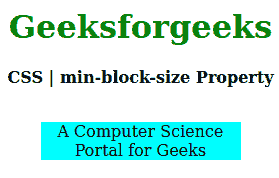
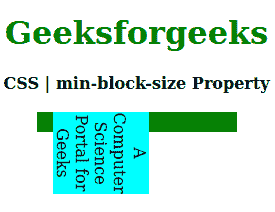

# CSS |最小块大小属性

> 原文:[https://www.geeksforgeeks.org/css-min-block-size-property/](https://www.geeksforgeeks.org/css-min-block-size-property/)

CSS 中的**最小块大小属性**用于创建元素的最小水平或垂直大小。如果书写方向是水平的，那么**最小块尺寸**相当于 **[最小高度](https://www.geeksforgeeks.org/css-min-height-property/)** 属性，如果是垂直模式，那么等于 **[最小宽度](https://www.geeksforgeeks.org/css-min-width-property/)** 属性。

**语法:**

```html
min-block-size: length| percentage| auto| none| min-content| 
                max-content| fit-content| inherit| initial| unset;
```

**属性值:**

*   **长度:**设置 px、cm、pt 等定义的固定值。也允许负值。它的默认值是 0px。
*   **百分比(%):** 与长度相同，但大小是根据窗口大小的百分比设置的。
*   **自动:**当希望浏览器确定块大小时使用。
*   **无:**不想限制盒子大小时使用。
*   **最大内容:**当你喜欢盒子大小的最小宽度时使用。
*   **最小内容:**当你喜欢盒子大小的最小宽度时使用。
*   **适合-内容:**当你喜欢盒子大小的精确宽度时使用。
*   **初始值:**用于将最小块大小属性的值设置为默认值。
*   **inherit:** 当希望元素从其父元素继承最小块大小属性时使用。
*   **取消设置:**用于取消设置默认混合块大小。

以下示例说明了 CSS 中的**最小块大小属性**:
**示例 1:**

```html
<!DOCTYPE html> 
<html> 

<head> 
    <title>CSS | min-block-size Property</title> 
    <style> 
        h1 { 
            color: green; 
        } 

        div { 
            background-color: green; 
            width: 200px; 
            height: 20px; 
        } 

        .one { 
            position: relative; 
            min-block-size: 10px; 
            background-color: cyan; 
        } 
    </style> 
</head> 

<body> 
    <center> 
        <h1>Geeksforgeeks</h1> 
        <b>CSS | min-block-size Property</b> 
        <br><br> 
        <div> 
            <p class="one"> 
                A Computer Science Portal for Geeks 
            </p> 
        </div> 
    </center> 
</body> 

</html>                     
```

**输出:**


**例 2:**

```html
<!DOCTYPE html> 
<html> 

<head> 
    <title>CSS | min-block-size Property</title> 
    <style> 
        h1 { 
            color: green; 
        } 

        div { 
            background-color: green; 
            width: 200px; 
            height: 20px; 
        } 

        .one { 
            position: relative; 
                        writing-mode: vertical-rl;
            min-block-size: auto; 
            background-color: cyan; 
        } 
    </style> 
</head> 

<body> 
    <center> 
        <h1>Geeksforgeeks</h1> 
        <b>CSS | min-block-size Property</b> 
        <br><br> 
        <div> 
            <p class="one"> 
                A Computer Science Portal for Geeks 
            </p> 
        </div> 
    </center> 
</body> 

</html>                     
```

**输出:**


**支持的浏览器:****最小块大小属性**支持的浏览器如下:

*   火狐浏览器
*   谷歌 Chrome
*   边缘
*   歌剧

**参考:**[https://developer . Mozilla . org/en-US/docs/Web/CSS/min-block-size](https://developer.mozilla.org/en-US/docs/Web/CSS/min-block-size)