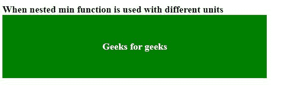

# CSS min()功能

> 原文:[https://www.geeksforgeeks.org/css-min-function/](https://www.geeksforgeeks.org/css-min-function/)

**min()** 函数在 CSS 中用于从一组逗号分隔的值中提取最小值。它可以采用两个参数，如果要在多个值之间进行比较，可以在另一个最小值函数中使用一个最小值函数。

**语法:**

```
min(value1, value2);
min(value1, min(value2, min(value3, value4)));
```

**参数:**取以下参数。

*   **值:**是一组逗号分隔的值，从中提取最小的一个。

**返回:**该函数返回一组逗号分隔值中的最小值。

下面给出了上述函数的几个例子。

**例 1:**

```
<!DOCTYPE html>
<html lang="en">
<head>
  <meta charset="UTF-8">
  <meta name="viewport" 
        content="width=device-width,
                 initial-scale=1.0">
  <title>Document</title>
</head>
<style>
  /* CSS for the html */
*{
  font-family: 'Times New Roman', Times, serif;
  font-size: 20px;
  font-stretch: narrower;
  font-weight: 600;
  }
.box{
  display: flex;
  color: white; 
  background-color: green;
  justify-content: center;
  height: min(200px, 500px);
  width: min(200px, 500px);
}
h2{
  align-self: center;
}
</style>
<body>
  When nested min function is not used
  <div class="box">
    <h2>Geeks for geeks</h2>
  </div>
</body>
</html>
```

**输出:**


**例 2:**

```
<!DOCTYPE html>
<html lang="en">
<head>
  <meta charset="UTF-8">
  <meta name="viewport"
        content="width=device-width,
                 initial-scale=1.0">
  <title>Document</title>
</head>
<style>
  /* CSS for the html */
*{
  font-family: 'Times New Roman', Times, serif;
  font-size: min(20px, 1000px);
  font-stretch: narrower;
  font-weight: 600;
  }
.box{
  display: flex;
  color: white; 
  background-color: green;
  justify-content: center;
  height: min(20vh, min(30vh, min(40vh, 50vh)));
  width: min(50vw, min(50vw, min(40vw, 50vw)));
}
h2{
  align-self: center;
}
</style>
<body>
  When nested min function is
    used with different units
  <div class="box">
    <h2>Geeks for geeks</h2>
  </div>
</body>
</html>
```

**输出:**



**支持的浏览器:**

*   铬
*   歌剧
*   旅行队
*   火狐浏览器
*   边缘