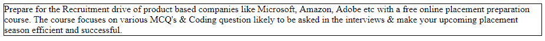

# CSS |最小高度属性

> 原文:[https://www.geeksforgeeks.org/css-min-height-property/](https://www.geeksforgeeks.org/css-min-height-property/)

CSS 中的最小高度属性用于设置元素的最小高度。当元素的内容小于最小高度时，使用最小高度属性，如果内容大于最小高度，则没有影响。此属性确保 height 属性的值不小于所考虑元素的指定最小高度值。

**语法:**

```html
min-height: length|initial|inherit; 
```

**属性值:**

*   **length:** This property is used to set the min-height. The default value of length is 0\. The height can be set in form of px, %, cm etc.

    **语法:**

    ```html
    min-height: length;
    ```

    **示例:**

    ```html
    <!DOCTYPE html>
    <html>
        <head>
            <title>
                min-height property
            </title>

            <style>
                p {
                    min-height:10px;
                    border:1px solid black;
                }
            </style>
        </head>
        <body>
            <p>
                Prepare for the Recruitment drive of product
                based companies like Microsoft, Amazon, Adobe
                etc with a free online placement preparation
                course. The course focuses on various MCQ's 
                & Coding question likely to be asked in the
                interviews & make your upcoming placement 
                season efficient and successful.
            </p>
        </body>
    </html>                    
    ```

    **输出:**
    

*   **initial:** It is used to set the value of min-height property to its default value.

    **语法:**

    ```html
    min-height: initial;
    ```

    **示例:**

    ```html
    <!DOCTYPE html>
    <html>
        <head>
            <title>
                min-height property
            </title>

            <style>
                p {
                    min-height:initial;
                    border:1px solid black;
                }
            </style>
        </head>
        <body>
            <p>
                Prepare for the Recruitment drive of product
                based companies like Microsoft, Amazon, Adobe
                etc with a free online placement preparation
                course. The course focuses on various MCQ's 
                & Coding question likely to be asked in the
                interviews & make your upcoming placement 
                season efficient and successful.
            </p>
        </body>
    </html>                    
    ```

    **输出:**
    

*   **inherit:** 此属性从其父级继承。

**支持的浏览器:**最小高度属性支持的浏览器如下:

*   谷歌 Chrome 1.0
*   Internet Explorer 7.0
*   Firefox 3.0
*   Safari 2.0.2
*   Opera 4.0