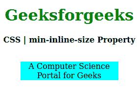
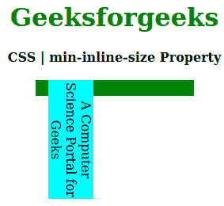

# CSS |最小内嵌尺寸属性

> 原文:[https://www.geeksforgeeks.org/css-min-inline-size-property/](https://www.geeksforgeeks.org/css-min-inline-size-property/)

**CSS 最小内嵌尺寸属性**用于在与写入方向相反的方向上创建元素的最小尺寸。比如如果书写方向是水平的，那么**最小线内尺寸**相当于 **[最小高度](https://www.geeksforgeeks.org/css-min-height-property/)** ，如果是垂直模式，那么等于 **[最小宽度](https://www.geeksforgeeks.org/css-min-width-property/)。**

**语法:**

```css
min-inline-size: length | percentage | auto | none | min-content |
                 max-content | fit-content | inherit | initial | unset;
```

**属性值:**

*   **长度:**设置 px、cm、pt 等定义的固定值。允许负值。它的默认值是 0px。
*   **百分比(%):** 与长度相同，但大小是根据窗口大小的百分比设置的。
*   **自动:**当希望浏览器确定块大小时使用。
*   **无:**不想限制盒子大小时使用。
*   **最大内容:**当你喜欢盒子大小的最大宽度时使用。
*   **最小内容:**当你喜欢盒子大小的最小宽度时使用。
*   **适合-内容:**当你喜欢盒子大小的精确宽度时使用。
*   **初始值:**用于将最小内联尺寸属性的值设置为默认值。
*   **inherit:** 当希望元素继承其父元素的最小内联大小属性作为自己的属性时使用。
*   **取消设置:**用于取消设置默认最小线内尺寸。

以下示例说明了 CSS 中的**最小内联大小属性**:
**示例 1:**

```css
<!DOCTYPE html> 
<html> 

<head> 
    <title>CSS | min-inline-size Property</title> 
    <style> 
        h1 { 
            color: green; 
        } 

        div { 
            background-color: green; 
            width: 200px; 
            height: 20px; 
        } 

        .one { 
            position: relative; 
            min-inline-size: 10px; 
            background-color: cyan; 
        } 
    </style> 
</head> 

<body> 
    <center> 
        <h1>Geeksforgeeks</h1> 
        <b>CSS | min-inline-size Property</b> 
        <br> 
        <br> 
        <div> 
            <p class="one"> 
                A Computer Science Portal for Geeks 
            </p> 
        </div> 
    </center> 
</body> 

</html>                     
```

**输出:**


**例 2:**

```css
<!DOCTYPE html> 
<html> 

<head> 
    <title>CSS | min-inline-size Property</title> 
    <style> 
        h1 { 
            color: green; 
        } 

        div { 
            background-color: green; 
            width: 200px; 
            height: 20px; 
        } 

        .one { 
            position: relative; 
            writing-mode: vertical-rl;
            min-inline-size: 150px; 
            background-color: cyan; 
        } 
    </style> 
</head> 

<body> 
    <center> 
        <h1>Geeksforgeeks</h1> 
        <b>CSS | min-inline-size Property</b> 
        <br> 
        <br> 
        <div> 
            <p class="one"> 
                A Computer Science Portal for Geeks 
            </p> 
        </div> 
    </center> 
</body> 

</html>                                 
```

**输出:**


**支持的浏览器:****最小内嵌尺寸属性**支持的浏览器如下:

*   火狐浏览器
*   谷歌 Chrome
*   边缘
*   歌剧

**参考:**[https://developer . Mozilla . org/en-US/docs/Web/CSS/min-inline-size](https://developer.mozilla.org/en-US/docs/Web/CSS/min-inline-size)