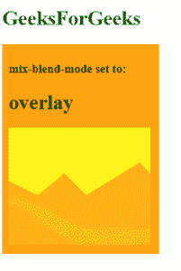

# CSS 混合-混合-模式属性

> 原文:[https://www.geeksforgeeks.org/css-mix-blend-mode-property/](https://www.geeksforgeeks.org/css-mix-blend-mode-property/)

元素的 CSS **混合-混合模式**属性用于指定元素背景与元素父元素的混合。

**语法:**

```
 mix-blend-mode: normal | multiply | exclusion 
            | overlay | lighten | darken 
            | color-dodge | color-burn 
            | hard-light | soft-light 
            | difference | hue 
            | saturation | color | screen 
            | luminosity

```

**值:**

*   **初始**–默认设置，这不会设置混合模式。
*   **继承**–这将继承其父元素的混合模式。
*   **取消设置**–这将从元素中移除当前混合模式。
*   **normal** – no blending is applied on the element.

    ```
    <!DOCTYPE html>
    <html>
    <body>
        <h1 style='color: green'>GeeksForGeeks</h1>
        <div style="background-color: orange; width: 225px; padding: 10px;">
            <h3>mix-blend-mode set to: </h3>
            <h1>normal</h1>

            <!-- mix-blend-mode Property -->
            <div style="mix-blend-mode: normal">
                
            </div>
        </div>
    </body>
    </html>
    ```

    **输出:**

    

*   **multiply** – this multiplies the element’s color with the background. The resulting color is always as dark as the background.

    ```
    <!DOCTYPE html>
    <html>
    <body>
        <h1 style='color: green'>GeeksForGeeks</h1>
        <div style="background-color: orange; width: 225px; padding: 10px;">
            <h3>mix-blend-mode set to: </h3>
            <h1>multiply</h1>

            <!-- mix-blend-mode Property -->
            <div style="mix-blend-mode: multiply">
                
            </div>
        </div>
    </body>
    </html>
    ```

    **输出:**

    

*   **screen** – this multiplies the element’s color with the background and then complements the result. The resulting color is always as bright as one of the blended layers.

    ```
    <!DOCTYPE html>
    <html>
    <body>
        <h1 style='color: green'>GeeksForGeeks</h1>
        <div style="background-color: orange; width: 225px; padding: 10px;">
            <h3>mix-blend-mode set to: </h3>
            <h1>screen</h1>

            <!-- mix-blend-mode Property -->
            <div style="mix-blend-mode: screen">
                
            </div>
        </div>
    </body>
    </html>
    ```

    **输出:**

    

*   **exclusion** – this subtracts the darker of two colors from the lightest color of the element. The result is similar to ‘difference’ but with a lower contrast.

    ```
    <!DOCTYPE html>
    <html>
    <body>
        <h1 style='color: green'>GeeksForGeeks</h1>
        <div style="background-color: orange; width: 225px; padding: 10px;">
            <h3>mix-blend-mode set to: </h3>
            <h1>exclusion</h1>

            <!-- mix-blend-mode Property -->
            <div style="mix-blend-mode: exclusion">
                
            </div>
        </div>
    </body>
    </html>
    ```

    **输出:**

    

*   **overlay** – this applies ‘multiply’ on lighter colors and ‘screen’ on darker colors in the element. The effect is effectively the opposite of ‘hard-light’.

    ```
    <!DOCTYPE html>
    <html>
    <body>
        <h1 style='color: green'>GeeksForGeeks</h1>
        <div style="background-color: orange; width: 225px; padding: 10px;">
            <h3>mix-blend-mode set to: </h3>
            <h1>overlay</h1>

            <!-- mix-blend-mode Property -->
            <div style="mix-blend-mode: overlay">
                
            </div>
        </div>
    </body>
    </html>
    ```

    **输出:**

    

*   **lighten** – this replaces the background with the element’s color where the element is lighter.

    ```
    <!DOCTYPE html>
    <html>
    <body>
        <h1 style='color: green'>GeeksForGeeks</h1>
        <div style="background-color: orange; width: 225px; padding: 10px;">
            <h3>mix-blend-mode set to: </h3>
            <h1>lighten</h1>

            <!-- mix-blend-mode Property -->
            <div style="mix-blend-mode: lighten">
                
            </div>
        </div>
    </body>
    </html>
    ```

    **输出:**

    

*   **darken** – this replaces the background with the element’s color where the element is darker.

    ```
    <!DOCTYPE html>
    <html>
    <body>
        <h1 style='color: green'>GeeksForGeeks</h1>
        <div style="background-color: orange; width: 225px; padding: 10px;">
            <h3>mix-blend-mode set to: </h3>
            <h1>darken</h1>

            <!-- mix-blend-mode Property -->
            <div style="mix-blend-mode: darken">
                
            </div>
        </div>
    </body>
    </html>
    ```

    **输出:**

    

*   **color-dodge** – this lightens the background color to reflect the color of the element.

    ```
    <!DOCTYPE html>
    <html>
    <body>
        <h1 style='color: green'>GeeksForGeeks</h1>
        <div style="background-color: orange; width: 225px; padding: 10px;">
            <h3>mix-blend-mode set to: </h3>
            <h1>color-dodge</h1>

            <!-- mix-blend-mode Property -->
            <div style="mix-blend-mode: color-dodge">
                
            </div>
        </div>
    </body>
    </html>
    ```

    **输出:**

    

*   **彩色燃烧**–这将使背景颜色变暗，以反映图像的自然颜色。结果增加了元素和背景之间的对比度。

    ```
    <!DOCTYPE html>
    <html>
    <body>
        <h1 style='color: green'>GeeksForGeeks</h1>
        <div style="background-color: orange; width: 225px; padding: 10px;">
            <h3>mix-blend-mode set to: </h3>
            <h1>color-burn</h1>

            <!-- mix-blend-mode Property -->
            <div style="mix-blend-mode: color-burn">
                <b>Normal:</b>

    <strong>Syntax:</strong>
    <pre>mix-blend-mode: normal</pre>

    Output:hard-light – this applies ‘multiply’ on lighter colors and ‘screen’ on darker colors of the element. This effect is effectively the opposite of ‘overlay’.<!DOCTYPE html><html><body>    <h1 style='color: green'>GeeksForGeeks</h1>    <div style="background-color: orange; width: 225px; padding: 10px;">        <h3>mix-blend-mode set to: </h3>        <h1>hard-light</h1>        <div style="mix-blend-mode: hard-light">                    </div>    </div></body></html>Output:soft-light – this applies ‘multiply’ on lighter colors and ‘screen’ on darker colors in the element. The resulting effect is softer than that of ‘overlay’.<!DOCTYPE html><html><body>    <h1 style='color: green'>GeeksForGeeks</h1>    <div style="background-color: orange; width: 225px; padding: 10px;">        <h3>mix-blend-mode set to: </h3>        <h1>soft-light</h1>        <div style="mix-blend-mode: soft-light">                    </div>    </div></body></html>Output:difference – this subtracts the absolute difference of the background color and the element’s color.<!DOCTYPE html><html><body>    <h1 style='color: green'>GeeksForGeeks</h1>    <div style="background-color: orange; width: 225px; padding: 10px;">        <h3>mix-blend-mode set to: </h3>        <h1>difference</h1>        <div style="mix-blend-mode: difference">                    </div>    </div></body></html>Output:hue – this applies the hue of the element with the saturation and luminosity of the background.<!DOCTYPE html><html><body>    <h1 style='color: green'>GeeksForGeeks</h1>    <div style="background-color: orange; width: 225px; padding: 10px;">        <h3>mix-blend-mode set to: </h3>        <h1>hue</h1>        <div style="mix-blend-mode: hue">                    </div>    </div></body></html>Output:saturation – this applies the saturation of the element with the hue and luminosity of the background.<!DOCTYPE html><html><body>    <h1 style='color: green'>GeeksForGeeks</h1>    <div style="background-color: orange; width: 225px; padding: 10px;">        <h3>mix-blend-mode set to: </h3>        <h1>saturation</h1>        <div style="mix-blend-mode: saturation">                    </div>    </div></body></html>Output:color – this applies the hue and saturation of the element with the luminosity of the background.<!DOCTYPE html><html><body>    <h1 style='color: green'>GeeksForGeeks</h1>    <div style="background-color: orange; width: 225px; padding: 10px;">        <h3>mix-blend-mode set to: </h3>        <h1>color</h1>        <div style="mix-blend-mode: color">                    </div>    </div></body></html>Output:luminosity – this applies the luminosity of the element with the hue and saturation of the background.<!DOCTYPE html><html><body>    <h1 style='color: green'>GeeksForGeeks</h1>    <div style="background-color: orange; width: 225px; padding: 10px;">        <h3>mix-blend-mode set to: </h3>        <h1>luminosity</h1>        <div style="mix-blend-mode: luminosity">                    </div>    </div></body></html>Output:
    <!DOCTYPE html>
    <html>
    <body>
        <h1 style='color: green'>GeeksForGeeks</h1>
        <div style="background-color: orange; width: 225px; padding: 10px;">
            <h3>mix-blend-mode set to: </h3>
            <h1>hard-light</h1>
            <div style="mix-blend-mode: hard-light">
                
            </div>
        </div>
    </body>
    </html>
    <!DOCTYPE html>
    <html>
    <body>
        <h1 style='color: green'>GeeksForGeeks</h1>
        <div style="background-color: orange; width: 225px; padding: 10px;">
            <h3>mix-blend-mode set to: </h3>
            <h1>soft-light</h1>
            <div style="mix-blend-mode: soft-light">
                
            </div>
        </div>
    </body>
    </html>
    <!DOCTYPE html>
    <html>
    <body>
        <h1 style='color: green'>GeeksForGeeks</h1>
        <div style="background-color: orange; width: 225px; padding: 10px;">
            <h3>mix-blend-mode set to: </h3>
            <h1>difference</h1>
            <div style="mix-blend-mode: difference">
                
            </div>
        </div>
    </body>
    </html>
    <!DOCTYPE html>
    <html>
    <body>
        <h1 style='color: green'>GeeksForGeeks</h1>
        <div style="background-color: orange; width: 225px; padding: 10px;">
            <h3>mix-blend-mode set to: </h3>
            <h1>hue</h1>
            <div style="mix-blend-mode: hue">
                
            </div>
        </div>
    </body>
    </html>
    <!DOCTYPE html>
    <html>
    <body>
        <h1 style='color: green'>GeeksForGeeks</h1>
        <div style="background-color: orange; width: 225px; padding: 10px;">
            <h3>mix-blend-mode set to: </h3>
            <h1>saturation</h1>
            <div style="mix-blend-mode: saturation">
                
            </div>
        </div>
    </body>
    </html>
    <!DOCTYPE html>
    <html>
    <body>
        <h1 style='color: green'>GeeksForGeeks</h1>
        <div style="background-color: orange; width: 225px; padding: 10px;">
            <h3>mix-blend-mode set to: </h3>
            <h1>color</h1>
            <div style="mix-blend-mode: color">
                
            </div>
        </div>
    </body>
    </html>
    <!DOCTYPE html>
    <html>
    <body>
        <h1 style='color: green'>GeeksForGeeks</h1>
        <div style="background-color: orange; width: 225px; padding: 10px;">
            <h3>mix-blend-mode set to: </h3>
            <h1>luminosity</h1>
            <div style="mix-blend-mode: luminosity">
                
            </div>
        </div>
    </body>
    </html>
    ```

支持*混合模式*的浏览器有:

*   Chrome 41.0
*   Firefox 32.0
*   Opera 35.0
*   Safari 8.0