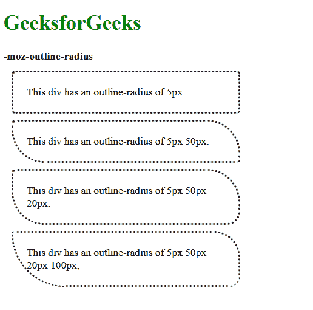
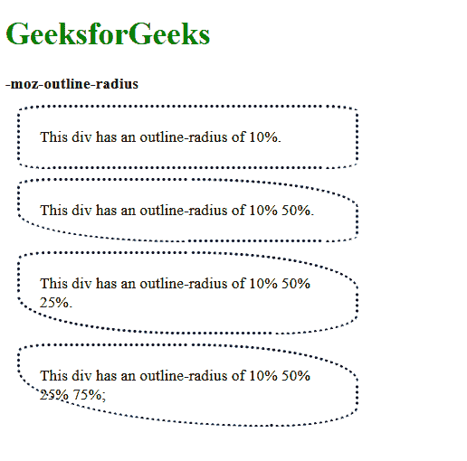

# CSS |-moz-轮廓-半径属性

> 原文:[https://www . geesforgeks . org/CSS-moz-outline-radius-property/](https://www.geeksforgeeks.org/css-moz-outline-radius-property/)

**-moz-轮廓-半径**属性用于指定轮廓的半径。它用于给轮廓赋予圆角。此属性仅在 Firefox 中受支持。

**语法:**

```html
-moz-outline-radius: <length> {1-4} 
| <percentage> (1-4} | initial | inherit
```

**属性值:**

*   **length:** This is used to set the outline radius in length units. The default value of this property is 0.
    The value can be specified in 4 formats.
    *   当指定一个**值时，半径将应用于元素的所有角。**
    *   当指定两个**值时，第一个值适用于左上角和右下角，第二个值适用于左上角和右下角。**
    *   当**指定三个**值时，第一个适用于左上角，第二个适用于右上角和左下角，第三个适用于右下角。
    *   当**指定四个**值时，第一个适用于左上角，第二个适用于右上角，第三个适用于右下角，第四个适用于左下角。

    **示例:**

    ```html
    <!DOCTYPE html>
    <html lang="en">
    <head>
      <title>
        -moz-outline-radius property
      </title>
      <style>
        .elem-1 {
          outline: dotted;
          -moz-outline-radius: 5px;

          width: 300px;
          padding: 20px;
          margin: 15px;
        }

        .elem-2 {
          outline: dotted;
          -moz-outline-radius: 5px 50px;

          width: 300px;
          padding: 20px;
          margin: 15px;
        }

        .elem-3 {
          outline: dotted;
          -moz-outline-radius: 5px 50px 20px;

          width: 300px;
          padding: 20px;
          margin: 15px;
        }

        .elem-4 {
          outline: dotted;
          -moz-outline-radius: 5px 50px 20px 100px;

          width: 300px;
          padding: 20px;
          margin: 15px;
        }
      </style>
    </head>
    <body>
      <h1 style="color: green">
        GeeksforGeeks
      </h1>
      <b>
        -moz-outline-radius
      </b>
      <div class="elem-1">
        This div has an outline-radius
        of 5px.
      </div>
      <div class="elem-2">
        This div has an outline-radius
        of 5px 50px.
      </div>
      <div class="elem-3">
        This div has an outline-radius
        of 5px 50px 20px.
      </div>
      <div class="elem-4">
        This div has an outline-radius
        of 5px 50px 20px 100px;
      </div>
    </body>
    </html>
    ```

    **输出:**
    

*   **percentage:** This is used to set the outline radius in percentage values. The values are applied in a similar format as in the length values. The default value of this property is 0.

    **示例:**

    ```html
    <!DOCTYPE html>
    <html lang="en">

    <head>
      <title>
        -moz-outline-radius property
      </title>
      <style>
        .elem-1 {
          outline: dotted;
          -moz-outline-radius: 10%;

          width: 300px;
          padding: 20px;
          margin: 15px;
        }

        .elem-2 {
          outline: dotted;
          -moz-outline-radius: 10% 50%;

          width: 300px;
          padding: 20px;
          margin: 15px;
        }

        .elem-3 {
          outline: dotted;
          -moz-outline-radius: 10% 50% 25%;

          width: 300px;
          padding: 20px;
          margin: 15px;
        }

        .elem-4 {
          outline: dotted;
          -moz-outline-radius: 10% 50% 25% 75%;

          width: 300px;
          padding: 20px;
          margin: 15px;
        }
      </style>
    </head>
    <body>
      <h1 style="color: green">
        GeeksforGeeks
      </h1>
      <b>
        -moz-outline-radius
      </b>
      <div class="elem-1">
        This div has an outline-radius
        of 10%.
      </div>
      <div class="elem-2">
        This div has an outline-radius
        of 10% 50%.
      </div>
      <div class="elem-3">
        This div has an outline-radius
        of 10% 50% 25%.
      </div>
      <div class="elem-4">
        This div has an outline-radius
        of 10% 50% 25% 75%;
      </div>
    </body>
    </html>
    ```

    **输出:**
    

*   **初始值:**用于将属性设置为默认值。
*   **继承:**用于从其父级继承属性。

**支持的浏览器:**以下列出了 *-moz-outline-radius* 属性支持的浏览器:

*   Firefox 1.5