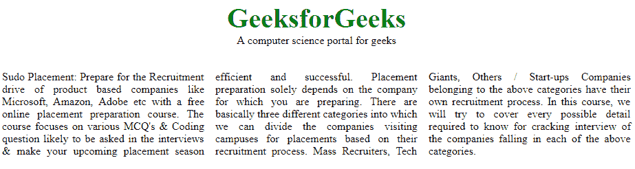

# CSS |多列

> 原文:[https://www.geeksforgeeks.org/css-multiple-columns/](https://www.geeksforgeeks.org/css-multiple-columns/)

多列用于在网页中创建列布局。CSS 中有许多列属性，如下所示:

*   列数
*   柱状间隙
*   列规则样式
*   列宽
*   列规则颜色
*   列规则
*   柱跨度
*   列宽

**列数属性:**该属性用于统计文档中需要划分的列元素个数。

**示例:**

## 超文本标记语言

```html
<!DOCTYPE html>
<html>
    <head>
        <title>Column-count property</title>
        <style>
        .geeks_content {
            -webkit-column-count: 3;
            -moz-column-count: 3;
            column-count: 3;
            padding-top:35px;
            text-align:justify;
        }
        .gfg {
            text-align:center;
            font-size:40px;
            font-weight:bold;
            color:green;
        }
        .geeks {
            text-align:center;
        }
        </style>
    </head>
    <body>
        <div class="gfg">GeeksforGeeks</div>
        <div class = "geeks">A computer science portal for geeks</div>
        <div class="geeks_content">
            Sudo Placement: Prepare for the Recruitment
            drive of product based companies like Microsoft,
            Amazon, Adobe etc with a free online placement
            preparation course. The course focuses on
            various MCQ's & Coding question likely to be
            asked in the interviews & make your upcoming
            placement season efficient and successful.
            Placement preparation solely depends on the
            company for which you are preparing. There
            are basically three different categories
            into which we can divide the companies visiting
            campuses for placements based on their recruitment
            process. Mass Recruiters, Tech Giants, Others / Start-ups
            Companies belonging to the above categories have
            their own recruitment process. In this course, we
            will try to cover every possible detail required
            to know for cracking interview of the companies
            falling in each of the above categories.
        </div>
    </body>
</html>                   
```

**输出:**



**列-间隙属性:**该属性用于定义列之间的间隙。

**示例:**

## 超文本标记语言

```html
<!DOCTYPE html>
<html>
    <head>
        <title>Column gap</title>
        <style>
        .geeks_content {
            -webkit-column-count: 3;
            -moz-column-count: 3;
            column-count: 3;
            padding-top:35px;
            text-align:justify;
            -webkit-column-gap: 50px;
            -moz-column-gap: 50px;
            column-gap: 50px;
            width:100%;
        }
        .gfg {
            text-align:center;
            font-size:40px;
            font-weight:bold;
            color:green;
        }
        .geeks {
            text-align:center;
        }
        </style>
    </head>
    <body>
        <div class="gfg">GeeksforGeeks</div>
        <div class = "geeks">A computer science portal for geeks</div>
        <div class="geeks_content">
            Sudo Placement: Prepare for the Recruitment
            drive of product based companies like Microsoft,
            Amazon, Adobe etc with a free online placement
            preparation course. The course focuses on
            various MCQ's & Coding question likely to be
            asked in the interviews & make your upcoming
            placement season efficient and successful.
            Placement preparation solely depends on the
            company for which you are preparing. There
            are basically three different categories
            into which we can divide the companies visiting
            campuses for placements based on their recruitment
            process. Mass Recruiters, Tech Giants, Others / Start-ups
            Companies belonging to the above categories have
            their own recruitment process. In this course, we
            will try to cover every possible detail required
            to know for cracking interview of the companies
            falling in each of the above categories.
        </div>
    </body>
</html>                   
```

**输出:**


**列规则样式属性:**该属性用于指定列之间的样式。

**示例:**

## 超文本标记语言

```html
<!DOCTYPE html>
<html>
    <head>
        <title>Column-rule-style property</title>
        <style>
        .geeks_content {
            -webkit-column-count: 3;
            -moz-column-count: 3;
            column-count: 3;
            padding-top:35px;
            column-rule-style:solid;
            text-align:justify;

        }
        .gfg {
            text-align:center;
            font-size:40px;
            font-weight:bold;
            color:green;
        }
        .geeks {
            text-align:center;
        }
        </style>
    </head>
    <body>
        <div class="gfg">GeeksforGeeks</div>
        <div class = "geeks">A computer science portal for geeks</div>
        <div class="geeks_content">
            Sudo Placement: Prepare for the Recruitment
            drive of product based companies like Microsoft,
            Amazon, Adobe etc with a free online placement
            preparation course. The course focuses on
            various MCQ's & Coding question likely to be
            asked in the interviews & make your upcoming
            placement season efficient and successful.
            Placement preparation solely depends on the
            company for which you are preparing. There
            are basically three different categories
            into which we can divide the companies visiting
            campuses for placements based on their recruitment
            process. Mass Recruiters, Tech Giants, Others / Start-ups
            Companies belonging to the above categories have
            their own recruitment process. In this course, we
            will try to cover every possible detail required
            to know for cracking interview of the companies
            falling in each of the above categories.
        </div>
    </body>
</html>                   
```

**输出:**


**列-规则-宽度属性:**该属性用于指定列间规则的宽度。

**示例:**

## 超文本标记语言

```html
<!DOCTYPE html>
<html>
    <head>
        <title>Column-rule-width property</title>
        <style>
        .geeks_content {
            -webkit-column-count: 3;
            -moz-column-count: 3;
            column-count: 3;
            padding-top:35px;
            -webkit-column-gap: 40px;
            -moz-column-gap: 50px;
            column-gap: 50px;
            -webkit-column-rule-style: solid;
            -moz-column-rule-style: solid;
            column-rule-style: solid;
            -webkit-column-rule-width: 10px;
            -moz-column-rule-width: 10px;
            column-rule-width: 10px;
            width:100%;
            text-align:justify;
        }
        .gfg {
            text-align:center;
            font-size:40px;
            font-weight:bold;
            color:green;
        }
        .geeks {
            text-align:center;
        }
        </style>
    </head>
    <body>
        <div class="gfg">GeeksforGeeks</div>
        <div class = "geeks">A computer science portal for geeks</div>
        <div class="geeks_content">
            Sudo Placement: Prepare for the Recruitment
            drive of product based companies like Microsoft,
            Amazon, Adobe etc with a free online placement
            preparation course. The course focuses on
            various MCQ's & Coding question likely to be
            asked in the interviews & make your upcoming
            placement season efficient and successful.
            Placement preparation solely depends on the
            company for which you are preparing. There
            are basically three different categories
            into which we can divide the companies visiting
            campuses for placements based on their recruitment
            process. Mass Recruiters, Tech Giants, Others / Start-ups
            Companies belonging to the above categories have
            their own recruitment process. In this course, we
            will try to cover every possible detail required
            to know for cracking interview of the companies
            falling in each of the above categories.
        </div>
    </body>
</html>                   
```

**输出:**


**列-规则-颜色属性:**该属性用于定义列之间的颜色。

**示例:**

## 超文本标记语言

```html
<!DOCTYPE html>
<html>
    <head>
        <title>Column-rule-color property</title>
        <style>
        .geeks_content {
            -webkit-column-count: 3;
            -moz-column-count: 3;
            column-count: 3;
            padding-top:35px;
            -webkit-column-gap: 50px;
            -moz-column-gap: 50px;
            column-gap: 50px;
            -webkit-column-rule-style: solid;
            -moz-column-rule-style: solid;
            column-rule-style: solid;
            -webkit-column-rule-width: 10px;
            -moz-column-rule-width: 10px;
            column-rule-width: 10px;
            width:100%;
            text-align:justify;
            -webkit-column-rule-color: green;
            -moz-column-rule-color: green;
            column-rule-color: green;
        }
        .gfg {
            text-align:center;
            font-size:40px;
            font-weight:bold;
            color:green;
        }
        .geeks {
            text-align:center;
        }
        </style>
    </head>
    <body>
        <div class="gfg">GeeksforGeeks</div>
        <div class = "geeks">A computer science portal for geeks</div>
        <div class="geeks_content">
            Sudo Placement: Prepare for the Recruitment
            drive of product based companies like Microsoft,
            Amazon, Adobe etc with a free online placement
            preparation course. The course focuses on
            various MCQ's & Coding question likely to be
            asked in the interviews & make your upcoming
            placement season efficient and successful.
            Placement preparation solely depends on the
            company for which you are preparing. There
            are basically three different categories
            into which we can divide the companies visiting
            campuses for placements based on their recruitment
            process. Mass Recruiters, Tech Giants, Others / Start-ups
            Companies belonging to the above categories have
            their own recruitment process. In this course, we
            will try to cover every possible detail required
            to know for cracking interview of the companies
            falling in each of the above categories.
        </div>
    </body>
</html>                   
```

**输出:**


**列规则属性:**该属性用于定义列间规则的样式、宽度和颜色。

**示例:**

## 超文本标记语言

```html
<!DOCTYPE html>
<html>
    <head>
        <title>Column-rule property</title>
        <style>
        .geeks_content {
            -webkit-column-count: 3;
            -moz-column-count: 3;
            column-count: 3;
            padding-top:35px;
            -webkit-column-rule: 10px solid green;
            -moz-column-rule: 10px solid green;
            column-rule: 10px solid green;
            width:100%;
            text-align:justify;
        }
        .gfg {
            text-align:center;
            font-size:40px;
            font-weight:bold;
            color:green;
        }
        .geeks {
            text-align:center;
        }
        </style>
    </head>
    <body>
        <div class="gfg">GeeksforGeeks</div>
        <div class = "geeks">A computer science portal for geeks</div>
        <div class="geeks_content">
            Sudo Placement: Prepare for the Recruitment
            drive of product based companies like Microsoft,
            Amazon, Adobe etc with a free online placement
            preparation course. The course focuses on
            various MCQ's & Coding question likely to be
            asked in the interviews & make your upcoming
            placement season efficient and successful.
            Placement preparation solely depends on the
            company for which you are preparing. There
            are basically three different categories
            into which we can divide the companies visiting
            campuses for placements based on their recruitment
            process. Mass Recruiters, Tech Giants, Others / Start-ups
            Companies belonging to the above categories have
            their own recruitment process. In this course, we
            will try to cover every possible detail required
            to know for cracking interview of the companies
            falling in each of the above categories.
        </div>
    </body>
</html>                   
```

**输出:**


**列跨度属性:**该属性用于定义一个元素应该跨越多少列。

**示例:**

## 超文本标记语言

```html
<!DOCTYPE html>
<html>
    <head>
        <title>Column-span property</title>
        <style>
        .geeks_content {
            -webkit-column-span: 3;
            column-span: 3;
            -moz-column-count: 3;
            column-count: 3;
            padding-top:35px;
            -webkit-column-gap: 50px;
            -moz-column-gap: 50px;
            column-gap: 50px;
            -webkit-column-rule-style: solid;
            -moz-column-rule-style: solid;
            column-rule-style: solid;
            -webkit-column-rule-width: 10px;
            -moz-column-rule-width: 10px;
            column-rule-width: 10px;
            width:100%;
            text-align:justify;
            -webkit-column-rule-color: green;
            -moz-column-rule-color: green;
            column-rule-color: green;
        }
        .gfg {
            text-align:center;
            font-size:40px;
            font-weight:bold;
            color:green;
        }
        .geeks {
            text-align:center;
        }
        </style>
    </head>
    <body>
        <div class="gfg">GeeksforGeeks</div>
        <div class = "geeks">A computer science portal for geeks</div>
        <div class="geeks_content">
            Sudo Placement: Prepare for the Recruitment
            drive of product based companies like Microsoft,
            Amazon, Adobe etc with a free online placement
            preparation course. The course focuses on
            various MCQ's & Coding question likely to be
            asked in the interviews & make your upcoming
            placement season efficient and successful.
            Placement preparation solely depends on the
            company for which you are preparing. There
            are basically three different categories
            into which we can divide the companies visiting
            campuses for placements based on their recruitment
            process. Mass Recruiters, Tech Giants, Others / Start-ups
            Companies belonging to the above categories have
            their own recruitment process. In this course, we
            will try to cover every possible detail required
            to know for cracking interview of the companies
            falling in each of the above categories.
        </div>
    </body>
</html>                   
```

**输出:**


**列宽属性:**该属性用于指定每列的宽度。

**示例:**

## 超文本标记语言

```html
<!DOCTYPE html>
<html>
    <head>
        <title>Column-width property</title>
        <style>
        .geeks_content {
            margin-top:35px;
            -webkit-column-width: 250px;
            -moz-column-width: 250px;
            column-width: 250px;
            text-align:justify;
        }
        .gfg {
            text-align:center;
            font-size:40px;
            font-weight:bold;
            color:green;
        }
        .geeks {
            text-align:center;
        }
        </style>
    </head>
    <body>
        <div class="gfg">GeeksforGeeks</div>
        <div class = "geeks">A computer science portal for geeks</div>
        <div class="geeks_content">
            Sudo Placement: Prepare for the Recruitment
            drive of product based companies like Microsoft,
            Amazon, Adobe etc with a free online placement
            preparation course. The course focuses on
            various MCQ's & Coding question likely to be
            asked in the interviews & make your upcoming
            placement season efficient and successful.
            Placement preparation solely depends on the
            company for which you are preparing. There
            are basically three different categories
            into which we can divide the companies visiting
            campuses for placements based on their recruitment
            process. Mass Recruiters, Tech Giants, Others / Start-ups
            Companies belonging to the above categories have
            their own recruitment process. In this course, we
            will try to cover every possible detail required
            to know for cracking interview of the companies
            falling in each of the above categories.
        </div>
    </body>
</html>                   
```

**输出:**

