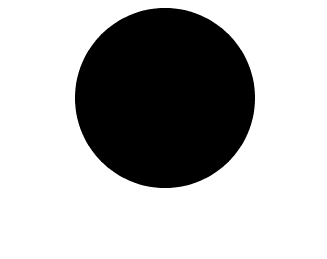
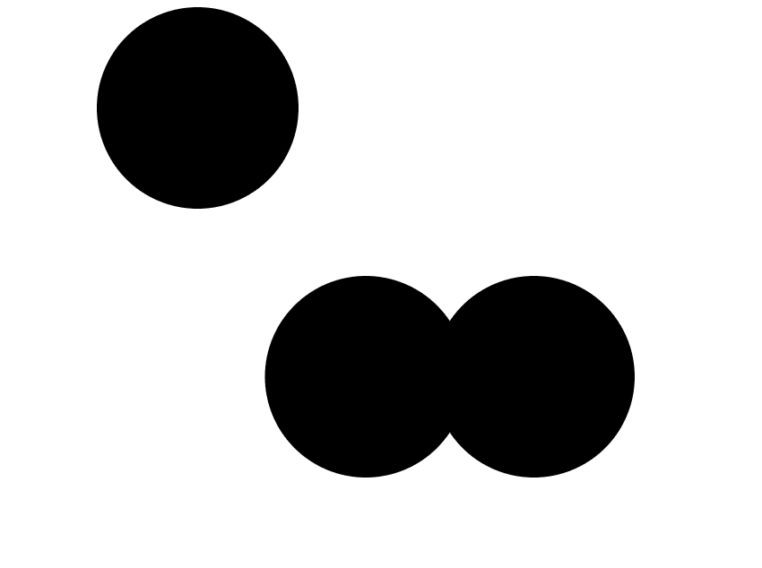
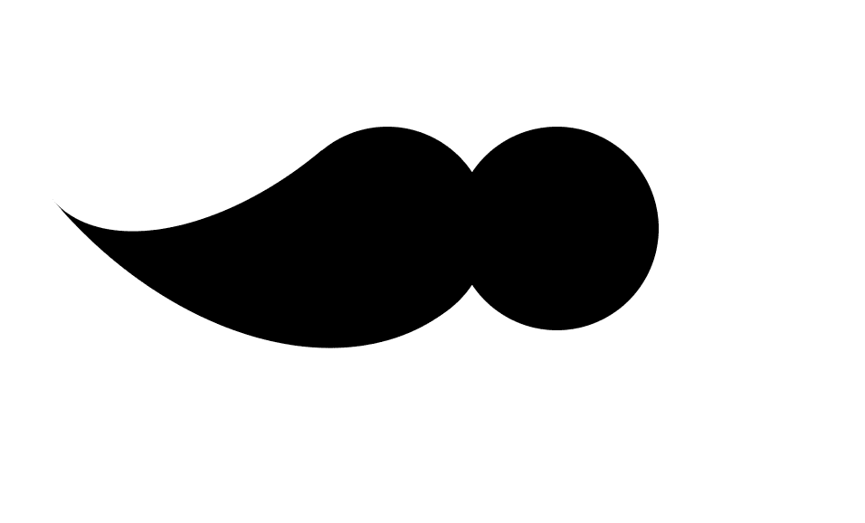
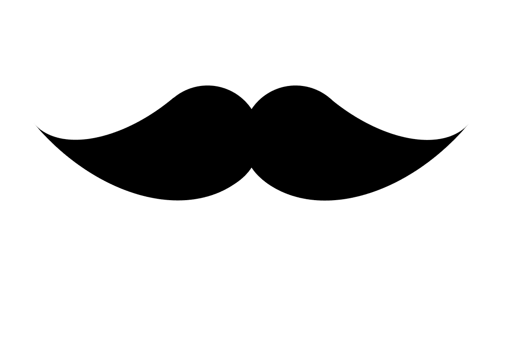

# CSS |小胡子

> 原文:[https://www.geeksforgeeks.org/css-mustache/](https://www.geeksforgeeks.org/css-mustache/)

**问题陈述:**使用 CSS 创建小胡子。

**Steps to create Mustache:**

*   **Step 1:**
    *   创建一个半径为 50%，宽度和高度为 180 像素的黑色圆。
    *   为了保持圆圈在中间，在它的左边加上 350 像素。
    *   同样，为了使圆圈可见，添加一个背景色作为当前颜色。
    *   currentColor 的好处是改变颜色标志，这样背景会自动改变。
    *   HTML 编码将在主体中添加 div 类。

    ```css
    <html>
    <head>
        <meta charset="UTF-8">
        <title>mustache</title>
        <meta name="viewport" content="width=device-width, initial-scale=1">
        <style>
            .mustache {
                width:180px;
                height:180px;
                left:350px;
                border-radius:50%;
                position:absolute;
                color:black;
                background-color:currentColor;
            }
           </style>
           </head>
           <body>
                 <div class = "mustache"></div>
           </body>
           </html>
    ```

    **输出:**
    

    *   **Step 2:**
    *   添加方框阴影，使页面中间有两个圆圈。
    *   阴影的尺寸将为 150px 2410px 0 0 currentcolor。
    *   以上尺寸为 x 偏移、y 偏移、扩散、模糊和颜色。

    ```css
    <html>
    <head>
        <meta charset="UTF-8">
        <title>mustache</title>
        <meta name="viewport" content="width=device-width, initial-scale=1">
        <style>
            .mustache {
                width:180px;
                height:180px;
                left:350px;
                border-radius:50%;
                position:absolute;
                color:black;
                background-color:currentColor;
                            box-shadow:
                150px 240px 0 0 currentColor,
                300px 240px 0 0 currentColor;
            }
           </style>
           </head>
           <body>
                 <div class = "mustache"></div>
           </body>
           </html>
    ```

    **输出:**
    

    *   **Step 3:**
    *   现在，不需要早先的圈子，只需要它的影子。所以，删除原来的圆圈。
    *   将 before 元素添加到 div 中，并添加位置、顶部、宽度、高度和边框。
    *   也添加边界半径，直到弧线需要形成小胡子的地方。
    *   固定旋转原点，使左髭末端准确到来，然后以-40 度角旋转。

    ```css
    <html>
    <head>
        <meta charset="UTF-8">
        <title>mustache</title>
        <meta name="viewport" content="width=device-width, initial-scale=1">
        <style>
            .mustache{
                width:180px;
                height:180px;
                left:350px;
                border-radius:50%;
                position:absolute;
                color:black;
                box-shadow:
                150px 240px 0 0 currentColor,
                300px 240px 0 0 currentColor;
            }
                    .mustache::before{
                content:"";
                position:absolute;
                left:30px;
                top:120px;
                width:210px;
                height:120px;
                border-bottom:solid 180px currentColor;
                border-radius:0 0 0 100%;
                transform:rotate(-40deg);
                transform-origin:right 210px;
            }
           </style>
           </head>
           <body>
                 <div class="mustache"></div>
           </body>
           </html>
    ```

    **输出:**
    

    *   **Step 4:**
    *   现在左边的小胡子已经准备好了，所以把 after 元素添加到 div 中。
    *   在 before 元素中添加位置、顶部、宽度、高度和边框。
    *   也添加边界半径，直到弧线需要形成小胡子的地方。
    *   固定旋转原点，使右髭的末端也准确到来，然后以 40 度角旋转。

    ```css
    <html>
    <head>
        <meta charset="UTF-8">
        <title>mustache</title>
        <meta name="viewport" content="width=device-width, initial-scale=1">
        <style>
            .mustache{
                width:180px;
                height:180px;
                left:350px;
                border-radius:50%;
                position:absolute;
                color:black;
                box-shadow:
                150px 240px 0 0 currentColor,
                300px 240px 0 0 currentColor;
            }
            .mustache::before{
                content:"";
                position:absolute;
                left:30px;
                top:120px;
                width:210px;
                height:120px;
                border-bottom:solid 180px currentColor;
                border-radius:0 0 0 100%;
                transform:rotate(-40deg);
                transform-origin:right 210px;
            }
            .mustache::after{
                content:"";
                position:absolute;
                left:390px;
                top:120px;
                width:210px;
                height:120px;
                border-bottom:solid 180px currentColor;
                border-radius:0 0 100%0;
                transform:rotate(40deg);
                transform-origin:left 210px;
            }
        </style>
    </head>
    <body>
        <div class="mustache"></div>
    </body>
    </html>
    ```

    **输出:**
    