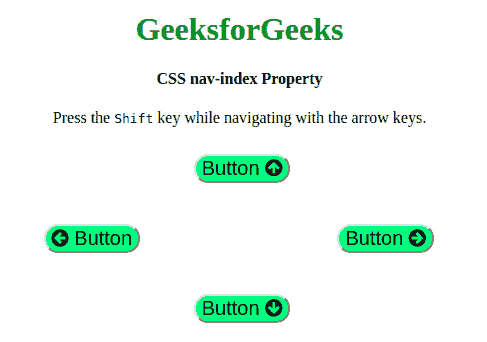

# CSS |导航索引属性

> 原文:[https://www.geeksforgeeks.org/css-nav-index-property/](https://www.geeksforgeeks.org/css-nav-index-property/)

CSS **导航索引**定义了每个元素的顺序导航顺序。与其他 nav 属性相同，不包含目标名称属性。CSS **导航索引**只有 Opera 12.0 支持。
**语法:**

```
 nav-index: auto | number | initial | inherit;
```

**属性:**

*   **自动:**这是浏览器定义顺序的默认值。
*   **编号:**定义元素的跳转顺序。
*   **初始值:**为默认值。
*   **inherit:** 从其父元素继承。

以下示例说明了导航索引属性:
**示例:**

```
<!DOCTYPE html>
<html>

<head>
    <title>CSS nav-index Property</title>
    <link rel="stylesheet" href=
"https://cdnjs.cloudflare.com/ajax/libs/font-awesome/4.7.0/css/font-awesome.min.css">
    <style>
        button {
            position: absolute;
        }

        h1 {
            color: green;
        }

        button {
            background-color: #80ff80;
            nav-right: auto;
            nav-left: auto;
            nav-down: auto;
            nav-up: auto;
            border-radius: 25px;
            font-size: 20px;
        }

        #Geeks1 {
            top: 35%;
            left: 43%;
            nav-index: 1;
        }

        #Geeks2 {
            top: 50%;
            left: 65%;
            nav-index: 2;
        }

        #Geeks3 {
            top: 65%;
            left: 43%;
            nav-index: 3;
        }

        #Geeks4 {
            top: 50%;
            left: 20%;
            nav-index: 4;
        }
    </style>
</head>

<body>
    <center>
        <h1>GeeksforGeeks</h1>
        <h4>CSS nav-index Property</h4>
        <p>
            Press the <samp>Shift</samp> 
          key while navigating with the arrow keys.
        </p>
    </center>
    <button id="Geeks1">Button
        <i class="fa fa-arrow-circle-up"></i>
    </button>
    <button id="Geeks2">Button
        <i class="fa fa-arrow-circle-right"></i>
    </button>
    <button id="Geeks3">Button
        <i class="fa fa-arrow-circle-down"></i>
    </button>
    <button id="Geeks4">Button
        <i class="fa fa-arrow-circle-left"></i>
    </button>

    <div>

    </div>
</body>

</html>
```

**输出:**


**支持的浏览器:**主要浏览器不支持 **CSS 导航索引**属性

**浏览器特定扩展:**CSS nav-index pererty 有浏览器特定扩展。

*   谷歌 Chrome *-webkit-*
*   Internet Explorer *-ms-*
*   Firefox *-moz-*
*   Safari *-webkit-*
*   Opera *-webkit-*