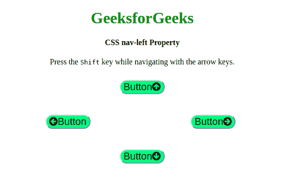

# CSS |左侧导航属性

> 原文:[https://www.geeksforgeeks.org/css-nav-left-property/](https://www.geeksforgeeks.org/css-nav-left-property/)

CSS **左侧导航**属性用于通过键盘上的导航键导航网页。这个**左导航**定义了当用户使用导航键导航时要聚焦的位置。**左导航**可以与**右导航**、**上导航**和**下导航**属性一起使用。

**语法:**

```html
 nav-left: auto|id|target-name|initial|inherit;
```

**属性:**

*   **auto:** 默认情况下，浏览器定义导航哪个元素。
*   **< id > :** 它定义了要导航的 id。
*   **<目标-名称> :** 定义要导航的目标。
*   **初始值:**为默认值。
*   **inherit:** 从其父元素继承。

**注意:**这个属性只支持 Opera 12.0。
下面的例子说明了 **CSS 导航左侧属性**:

**例:1**

```html
<!DOCTYPE html>
<html>

<head>
    <title>CSS nav-left Property</title>
    <link rel="stylesheet" href=
"https://cdnjs.cloudflare.com/ajax/libs/font-awesome/4.7.0/css/font-awesome.min.css">
    <style>
        button {
            position: absolute;
        }

        h1 {
            color: green;
        }

        button {
            background-color: #80ff80;
            nav-right: auto;
            nav-left: auto;
            nav-down: auto;
            nav-up: auto;
            border-radius: 25px;
            font-size: 20px;
        }

        #Geeks1 {
            top: 35%;
            left: 43%;
            nav-index: 1;
        }

        #Geeks2 {
            top: 50%;
            left: 65%;
            nav-index: 2;
        }

        #Geeks3 {
            top: 65%;
            left: 43%;
            nav-index: 3;
        }

        #Geeks4 {
            top: 50%;
            left: 20%;
            nav-index: 4;
        }
    </style>
</head>

<body>
    <center>
        <h1>GeeksforGeeks</h1>
        <h4>CSS nav-left Property</h4>
        <p>
            Press the <samp>Shift</samp> 
          key while navigating with the arrow keys.
        </p>
    </center>
    <button id="Geeks1">Button
      <i class="fa fa-arrow-circle-up"></i>
    </button>
    <button id="Geeks2">Button
      <i class="fa fa-arrow-circle-right"></i>
    </button>
    <button id="Geeks3">Button
      <i class="fa fa-arrow-circle-down"></i>
    </button>
    <button id="Geeks4">
      <i class="fa fa-arrow-circle-left"></i>
      Button
    </button>

    <div>

    </div>
</body>

</html>
```

**输出:**


**支持的浏览器:**主要浏览器不支持 **CSS 导航左侧属性**。