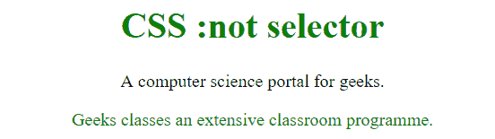
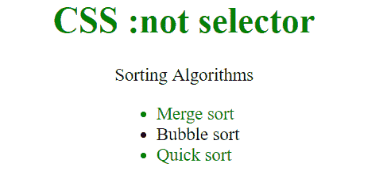

# CSS |:不是选择器

> 原文:[https://www.geeksforgeeks.org/css-not-selector/](https://www.geeksforgeeks.org/css-not-selector/)

**:not(选择器)**选择器用于设置选择器未指定的每个元素的样式。因为它阻止特定项目被选中，所以也被称为否定伪类。

**语法:**

```css
:not(selector) {
  //CSS Property
}

```

**示例-1:**

```css
<!DOCTYPE html>
<html>

<head>
    <title>
        CSS :not selector
    </title>
    <style>
        p {
            color: #000000;
        }

        :not(p) {
            color: green;
        }
    </style>
</head>

<body style="text-align: center;">

    <h1>
            CSS :not selector
    </h1>

    <p>
        A computer science portal for geeks.
    </p>

    <div>
        Geeks classes an extensive classroom programme.
    </div>
</body>

</html>
```

**输出:**


**示例-2:**

```css
<!DOCTYPE html>
<html>

<head>
    <title>
        CSS :not selector
    </title>
    <style>
        /* Style everything but not 
         one named .geek class */

        li:not(.geek) {
            color: green;
        }
    </style>
</head>

<body style="text-align: center;">

    <h1 style="color:green;">
            CSS :not selector
        </h1>

    <p>
        Sorting Algorithms
    </p>
    <ul>
        <li>Merge sort</li>
        <li class="geek">Bubble sort</li>
        <li>Quick sort</li>
    </ul>
</body>

</html>
```

**输出:**

**支持的浏览器:**非选择器支持的浏览器如下:

*   苹果 Safari 3.2
*   谷歌 Chrome 4.0
*   Firefox 3.5
*   歌剧 9.6
*   Internet Explorer 9.0