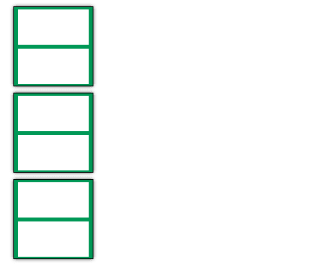
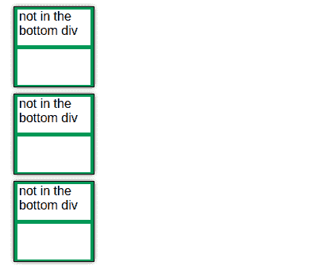
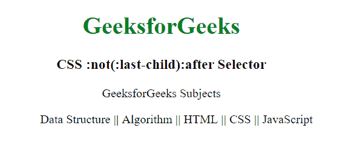

# CSS | :not(:最后一个孩子):在选择器

之后

> 原文:[https://www . geesforgeks . org/CSS-not last-child after-selector/](https://www.geeksforgeeks.org/css-notlast-childafter-selector/)

在前端 web 开发中，我们经常会遇到这样的情况:HTML 中有许多元素，我们需要为最后一个元素或除最后一个元素之外的每个元素赋予特定的样式，或者基本上为不能直接选择的元素赋予特定的样式。出现了伪选择器的使用。
本文解释了选择器后的 **:not(:最后一个孩子)。该选择器不会选择最后一个子元素之后的元素。它主要用于在除最后一个子元素之外的每个子元素之后添加内容。
**示例 1:** 本示例创建一个简单的 div 元素。它不在选择器后使用:not(:last-child):** 

## 超文本标记语言

```
<!DOCTYPE html>
<html>

<head>
    <style>
        div {
            width: 100px;
            height: 100px;
            outline: 1px solid;
            margin: 10px;
            box-shadow: 0 0 5px black;
            background: green;
            font-family: 'Segoe UI', sans-serif;
            display: flex;
            flex-direction: column;
            justify-content: space-around;
            align-items: center;
        }
        .inner-div {
            width: 90%;
            height: 45%;
            background: white;
            margin: 0 auto;
            padding-left: 2px;
        }
    </style>
</head>

<body>
    <div class="div">
        <div class="inner-div"></div>
        <div class="inner-div"></div>
    </div>
    <div class="div">
        <div class="inner-div"></div>
        <div class="inner-div"></div>
    </div>
    <div class="div">
        <div class="inner-div"></div>
        <div class="inner-div"></div>
    </div>
</body>

</html>
```

**输出:**



**例 2:** 应用伪选择器后:not(:last-child):后到上例。

## 超文本标记语言

```
<!DOCTYPE html>
<html>

<head>
    <style>
        div {
            width: 100px;
            height: 100px;
            outline: 1px solid;
            margin: 10px;
            box-shadow: 0 0 5px black;
            background: green;
            font-family: 'Segoe UI', sans-serif;
            display: flex;
            flex-direction: column;
            justify-content: space-around;
            align-items: center;
        }
        .inner-div {
            width: 90%;
            height: 45%;
            background: white;
            margin: 0 auto;
            padding-left: 2px;
        }
        .div .inner-div:not(:last-child):after {
            content: 'not in the bottom div';
        }
    </style>
</head>

<body>
    <div class="div">
        <div class="inner-div"></div>
        <div class="inner-div"></div>
    </div>
    <div class="div">
        <div class="inner-div"></div>
        <div class="inner-div"></div>
    </div>
    <div class="div">
        <div class="inner-div"></div>
        <div class="inner-div"></div>
    </div>
</body>

</html>
```

**输出:**



**说明:**

*   **。div。inner-div:** 选择类为‘inner-div’的所有元素和类为‘div’的元素。在这里，三个 div 都有“div”类，两个孩子 div 有“inner-div”类。它选择类名为' inner-div '所有六个 div 元素。
*   **:不是(:最后一个孩子)**
    *   not()选择器将传递给它的元素排除在选择之外。
    *   :最后一个子选择器选择最后一个子。
    *   将以上两个选择器结合起来，从选择中排除每个父 div 的最后一个子(内部 div)。
*   **:在**之后这是一个很好的选择器，可以在所选元素(这里是每组内部 div 中的第一个内部 div)之后添加内容(有时甚至是块级元素)。所以‘不在底部 div’的内容确实只加在顶部 div，不加在底部 div。

**例 3:**

## 超文本标记语言

```
<!DOCTYPE html>
<html>

<head>
    <style>
        li:not(:last-child):after {
            content: ' || ';
            color:green;
            font-weight:bold;
        }
        li {
            display: inline;
        }
    </style>
</head>

<body style="text-align:center;">

    <h1 style="color:green;">GeeksforGeeks</h1>

    <h3>CSS :not(:last-child):after Selector</h3>

    <div>GeeksforGeeks Subjects</div>

    <ul>
        <li>Data Structure</li>
        <li>Algorithm</li>
        <li>HTML</li>
        <li>CSS</li>
        <li>JavaScript</li>
    </ul>
</body>
```

**输出:**



**支持的浏览器:**

*   谷歌 Chrome
*   微软公司出品的 web 浏览器
*   火狐浏览器
*   歌剧
*   狩猎

CSS 是网页的基础，通过设计网站和网络应用程序用于网页开发。你可以通过以下 [CSS 教程](https://www.geeksforgeeks.org/css-tutorials/)和 [CSS 示例](https://www.geeksforgeeks.org/css-examples/)从头开始学习 CSS。