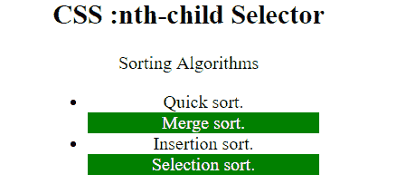

# CSS:第 n 个子()选择器

> 原文:[https://www.geeksforgeeks.org/css-nth-child-selector/](https://www.geeksforgeeks.org/css-nth-child-selector/)

**:第 n 个子()** CSS [伪类](https://www.geeksforgeeks.org/css-pseudo-classes/)选择器用于根据元素在一组兄弟中的位置来匹配元素。它匹配第 n 个子元素的每个元素，不管其父元素的类型如何。

**语法:**

```
:nth-child(number) {
    // CSS Property
}
```

其中**号**是代表匹配元素模式的单个参数。它可以是奇数、偶数，也可以是函数式符号。

*   **奇数:**表示一系列中位置为奇数的元素:1、3、5 等。
*   **偶:**表示位置在 2、4、6 等数列中偶的元素。
*   **函数符号(< An+B > ):** 对于 n 的每一个正整数或零值，它表示兄弟元素的位置与模式 An+B 匹配的元素。这里，A 表示整数步长，B 表示整数偏移量。

**例 1:** 在本例中，选择每一个奇数段。使用的公式是 2n+1，即选择 1、3、5 等段落。

## 超文本标记语言

```
<!DOCTYPE html>
<html>

<head>
    <title>CSS :nth-child Selector</title>
    <style>
    p:nth-child(2n+1) {
        background: green;
        color: white;
    }
    </style>
</head>

<body style="text-align:center">
    <h1 style="color:green;">
            GeeksforGeeks
        </h1>
    <h2>
            CSS :nth-child Selector
        </h2>
    <p>A computer science portal for geeks.</p>

    <p>Geeks classes an extensive classroom programme.</p>

</body>

</html>
```

**输出:**


**例 2:** 在本例中，每隔一个偶数< li >被选择，即 2、4、6 等。

## 超文本标记语言

```
<!DOCTYPE html>
<html>

<head>
    <title>CSS :nth-child Selector</title>
    <style>
    li {
        width: 30%;
    }

    li:nth-child(even) {
        background: green;
        color: white;
    }
    </style>
</head>

<body style="text-align:center">
    <h2>
            CSS :nth-child Selector
        </h2>

<p>Sorting Algorithms</p>

    <ul>
        <li>Quick sort.</li>
        <li>Merge sort.</li>
        <li>Insertion sort.</li>
        <li>Selection sort.</li>
    </ul>
</body>

</html>
```

**输出:**



**支持的浏览器:**以下是*:第 n 个子()*选择器支持的浏览器:

*   谷歌 Chrome 4.0
*   微软边缘 12.0
*   Firefox 3.5
*   歌剧 9.6
*   苹果 Safari 3.2
*   Internet Explorer 9.0