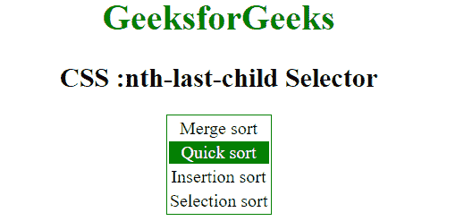

# CSS |:第 n 个-最后一个-子()选择器

> 原文:[https://www.geeksforgeeks.org/css-nth-last-child-selector/](https://www.geeksforgeeks.org/css-nth-last-child-selector/)

CSS 中的**第 n 个-最后一个子()**选择器用于根据元素在兄弟组中的位置进行匹配，从末尾开始计数。

**语法:**

```html
:nth-last-child(number) {
    //CSS Property
}
```

其中**数字**是表示从末尾开始计数的匹配元素模式的参数。它可以是奇数、偶数或函数符号。

*   **奇数:**表示一系列中位置为奇数的元素:1、3、5 等。，从头数到尾。
*   **偶:**表示位置在 2、4、6 等数列中偶的元素。，从头数到尾。
*   **函数符号(< An+B > ):** 对于 n 的每一个正整数或零值，它表示兄弟元素的位置与模式 An+B 匹配的元素。从末尾开始计数，第一个元素的索引为 1。

**示例-1:** 在此示例中，根据公式 2n+1 选择每个奇数元素，从末尾开始计数。

```html
<!DOCTYPE html>
<html>
    <head>
        <title>CSS :nth-last-child Selector</title>
        <style> 
            p:nth-last-child(2n+1) {
              background: green;
              color:white;
            } 
        </style>
    </head>
    <body style = "text-align:center;">

        <h1 style = "color:green;">
            GeeksforGeeks
        </h1>

        <h2>
            CSS :nth-last-child Selector
        </h2>

        <p>A computer science portal for geeks.</p>
        <p>Geeks classes an extensive classroom programme.</p>

    </body>
</html>
```

**输出:**

**例-2:**

```html
<!DOCTYPE html>
<html>
    <head>
        <title>CSS :nth-last-child Selector</title>
        <style> 
            table {
                border: 1px solid green;
                margin:auto;
            }

            /* Selects the last three element */
            tr:nth-last-child(3) {
                background-color: green;
                color:white;
            } 
        </style>
    </head>
    <body style = "text-align:center;">

        <h1 style = "color:green;">
            GeeksforGeeks
        </h1>

        <h2>
            CSS :nth-last-child Selector
        </h2>

        <table>
          <tbody>
            <tr>
              <td>Merge sort</td>
            </tr>
            <tr>
              <td>Quick sort</td>
            </tr>
            <tr>
              <td>Insertion sort</td>
            </tr>
            <tr>
              <td>Selection sort</td>
            </tr>
          </tbody>
        </table>

    </body>
</html>
```

**输出:**


**支持的浏览器:**第 n 个-最后一个子选择器支持的浏览器如下:

*   苹果 Safari 3.2
*   谷歌 Chrome 4.0
*   Firefox 3.5
*   歌剧 9.6
*   Internet Explorer 9.0