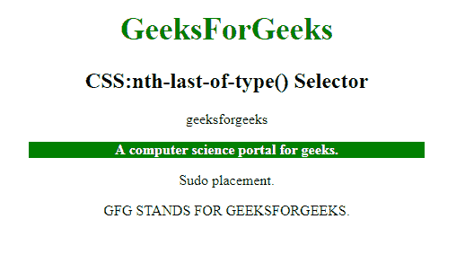
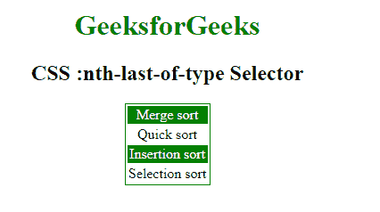

# CSS |:第 n 个末位类型()选择器

> 原文:[https://www . geesforgeks . org/CSS-n-最后一个类型选择器/](https://www.geeksforgeeks.org/css-nth-last-of-type-selector/)

CSS 中的**:第 n 个最后类型()选择器**只用于样式化父元素的第 n 个子元素。从最后一个子元素开始计数的选择器。一个 **n** 可以是一个数字，一个关键词，或者一个公式。

**语法:**

```css
:nth-last-of-type(number) {
  //css Property;
} 
```

其中 number 是表示从末尾开始计数的匹配元素模式的参数。它可以是奇数、偶数或函数符号。

*   **奇数:**表示一系列中位置为奇数的元素:1、3、5 等。，从头数到尾。
*   **偶:**表示位置在 2、4、6 等数列中偶的元素。，从头数到尾。
*   **函数符号():**对于 n 的每一个正整数或零值，它表示兄弟元素的位置与模式 An+B 匹配的元素。从末尾开始计数，第一个元素的索引为 1。

**示例-1:**

```css
<!DOCTYPE html>
<html>

<head>
    <style>
        h1 {
            color: green;
            font-size: 35px;
        }

        p:nth-last-of-type(3) {
            background: green;
            color: white;
            font-weight: bold;
            width: 70%;
        }
    </style>
</head>

<body>
    <center>
        <h1>GeeksForGeeks</h1>
        <h2>CSS:nth-last-of-type() Selector </h2>
        <p class="geeksFORGEEKS">geeksforgeeks</div>
            <p class="forgeeks">A computer science portal for geeks.</div>
                <p class="geeks">Sudo placement.</p>
                <p class="SUDO">GFG STANDS FOR GEEKSFORGEEKS.</p>

</body>

</html>                
```

**输出:**


**示例-2:** 在该示例中，根据从末尾开始计数的公式 2n 选择每个偶数元素。

```css
<!DOCTYPE html>
<html>

<head>
    <title>CSS :nth-last-of-type Selector</title>
    <style>
        table {
            border: 1px solid green;
            margin: auto;
        }
        /* Selects the last three element */

        tr:nth-last-of-type(2n) {
            background-color: green;
            color: white;
        }
    </style>
</head>

<body style="text-align:center;">

    <h1 style="color:green;"> 
            GeeksforGeeks 
        </h1>

    <h2> 
            CSS :nth-last-of-type Selector 
        </h2>

    <table>
        <tbody>
            <tr>
                <td>Merge sort</td>
            </tr>
            <tr>
                <td>Quick sort</td>
            </tr>
            <tr>
                <td>Insertion sort</td>
            </tr>
            <tr>
                <td>Selection sort</td>
            </tr>
        </tbody>
    </table>

</body>

</html>
```

**输出:**


**支持的浏览器:**以下列出了**:第 n 个最后类型()**选择器支持的浏览器:

*   苹果 Safari
*   谷歌 Chrome
*   火狐浏览器
*   歌剧
*   微软公司出品的 web 浏览器