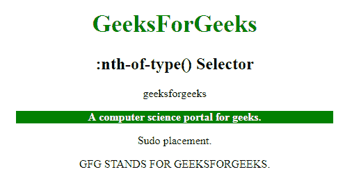
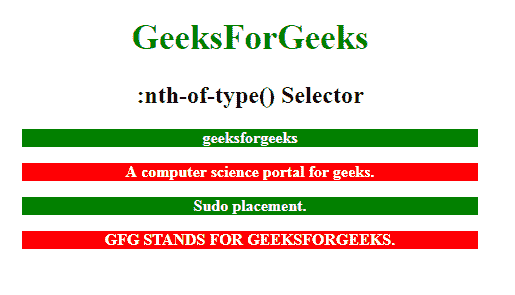

# CSS |:第 n 个类型()选择器

> 原文:[https://www.geeksforgeeks.org/css-nth-of-type-selector/](https://www.geeksforgeeks.org/css-nth-of-type-selector/)

css 选择器中的**:第 n 个类型()**仅用于样式化其父元素的第 n 个数目的子元素。n 可以是数字、关键字或公式。

**语法:**

```html
:nth-of-type(number) {
  // CSS Property;
} 
```

其中**号**是表示匹配元素模式的参数。它可以是奇数、偶数或函数符号。

*   **奇数:**表示一系列中位置为奇数的元素:1、3、5 等。，从头数到尾。
*   **偶:**表示位置在 2、4、6 等数列中偶的元素。，从头数到尾。
*   **函数符号():**对于 n 的每一个正整数或零值，它表示兄弟元素的位置与模式 An+B 匹配的元素。从末尾开始计数，第一个元素的索引为 1。

**示例-1:**

```html
<!DOCTYPE html>
<html>

<head>
    <style>
        h1 {
            color: green;
            font-size: 35px;
        }

        p:nth-of-type(2) {
            background: green;
            color: white;
            font-weight: bold;
            width: 70%;
        }
    </style>
</head>

<body>
    <center>
        <h1>GeeksForGeeks</h1>
        <h2>:nth-of-type() Selector </h2>
        <p class="geeksFORGEEKS">geeksforgeeks</div>
            <p class="forgeeks">A computer science portal for geeks.</div>
                <p class="geeks">Sudo placement.</p>
                <p class="SUDO">GFG STANDS FOR GEEKSFORGEEKS.</p>

</body>

</html>
```

**输出:**


**示例-2:** 在本示例中，通过使用奇数或偶数关键字作为参数来选择每个奇数和偶数元素。

```html
<!DOCTYPE html>
<html>

<head>
    <style>
        h1 {
            color: green;
            font-size: 35px;
        }

        p:nth-of-type(odd) {
            background: green;
            color: white;
            font-weight: bold;
            width: 70%;
        }

        p:nth-of-type(even) {
            background: red;
            color: white;
            font-weight: bold;
            width: 70%;
        }
    </style>
</head>

<body>
    <center>
        <h1>GeeksForGeeks</h1>
        <h2>:nth-of-type() Selector </h2>
        <p class="geeksFORGEEKS">geeksforgeeks</div>
            <p class="forgeeks">A computer science portal for geeks.</div>
                <p class="geeks">Sudo placement.</p>
                <p class="SUDO">GFG STANDS FOR GEEKSFORGEEKS.</p>

</body>

</html>
```

**输出:**


**支持的浏览器:**以下列出了**:第 n 种类型()**选择器支持的浏览器:

*   苹果 Safari
*   谷歌 Chrome
*   火狐浏览器
*   歌剧
*   微软公司出品的 web 浏览器