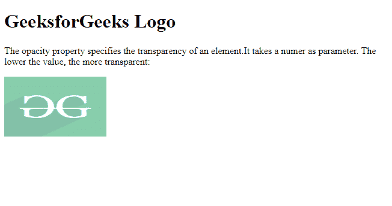
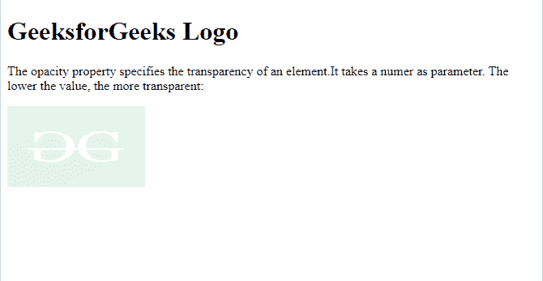

# CSS |数字数据类型

> 原文:[https://www.geeksforgeeks.org/css-number-data-type/](https://www.geeksforgeeks.org/css-number-data-type/)

**CSS 值**由<数>表示，该数以整数为参数或带有小数部分的数。它们可以用符号(+)或(-)来表示。该数字可以是正数，也可以是负数。数字的所有数字都是 0 到 9，并且都是数字类型。

**语法:**

```html
<number>
```

**注意:**没有与数字关联的单位。

**有效数字示例**

```html
23, +90, -76, 0.56, 34.67, 10e4, -4.6e-2
```

**无效数字示例**

```html
23., -+45, 45.7.6
```

**示例 1:** 以下示例演示了对任何元素应用不透明度。

```html
<!DOCTYPE html>
<html>

<head>
    <style>
        img {
            opacity: 0.5;
        }
    </style>
</head>

<body>
    <h1>GeeksforGeeks Logo</h1>

    <p>
        The opacity property specifies 
        the transparency of an element.
        It takes a number as parameter.
        The lower the value, the image 
        is more transparent 
    </p>

    
</body>

</html>
```

**输出:**


**示例 2:** 以下示例显示了不透明度属性的一些变化值。

```html
<!DOCTYPE html>
<html>

<head>
    <style>
        img {
            opacity: .11;
        }
    </style>
</head>

<body>

    <h1>GeeksforGeeks Logo</h1>]

    <p>
        The opacity property specifies 
        the transparency of an element.
        It takes a number as parameter.
        The lower the value, the image 
        is more transparent:
    </p>

    
</body>

</html>
```

**输出:**
