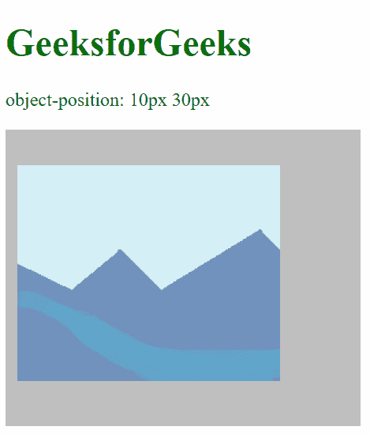
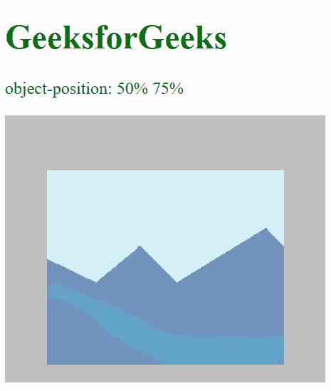
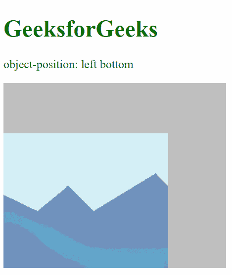
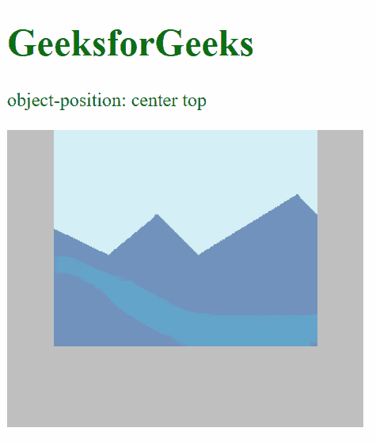
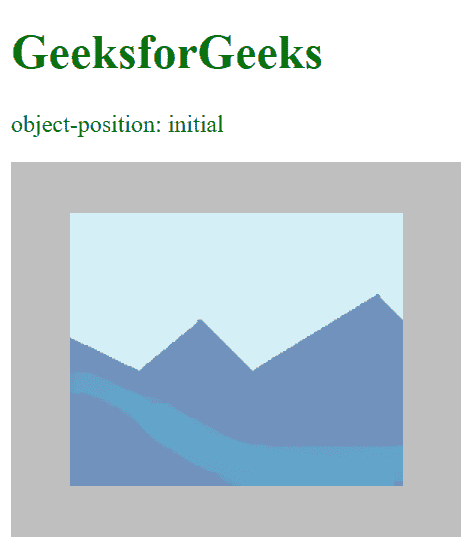
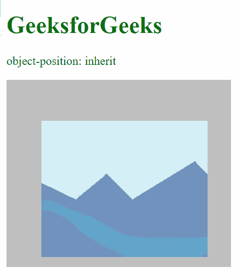

# CSS |对象位置属性

> 原文:[https://www.geeksforgeeks.org/css-object-position-property/](https://www.geeksforgeeks.org/css-object-position-property/)

CSS 的**对象位置**属性指定图像或视频元素如何在其内容框内用 x/y 坐标定位。

**语法:**

```html
object-position: <position> | initial | inherit 
```

**属性值:**

*   **position:** This specifies the position of the element. It takes 2 numerical values corresponding to the distance from the left of the content-box and the distance from the top of the content-box respectively. It is also possible to use negative values.

    **示例#1:**

    ```html
    <!DOCTYPE html>

    <head>
        <title>CSS object-position</title>
        <style>
            img {
                width: 300px;
                height: 250px;
                background-color: silver;
                object-fit: none;
                /* Setting the object-position to '10px' 
                 from the leftmost of the
                 box and '30px' from the topmost of the box */
                object-position: 10px 30px;
            }
        </style>
    </head>

    <body>
        <h1 style="color: green">GeeksforGeeks</h1>
        <p>object-position: 10px 30px</p>
        
    </body>

    </html>
    ```

    **输出:**

    

    **例 2:**

    ```html
    <!DOCTYPE html>

    <head>
        <title>CSS object-position</title>
        <style>
            img {
                width: 300px;
                height: 250px;
                background-color: silver;
                object-fit: none;
                /* Setting the object-position to '50%'
                from the leftmost of the
                box and '75%' from the topmost of the box */
                object-position: 50% 75%;
            }
        </style>
    </head>

    <body>
        <h1 style="color: green">GeeksforGeeks</h1>
        <p>object-position: 50% 75%</p>
        
    </body>

    </html>
    ```

    **输出:**

    

    **示例#3:**

    ```html
    <!DOCTYPE html>

    <head>
        <title>CSS object-position</title>
        <style>
            img {
                width: 300px;
                height: 250px;
                background-color: silver;
                object-fit: none;
                /* Setting the object-position to 'left'
                 from the leftmost of the
                 box and 'bottom' from the topmost of the box */
                object-position: left bottom;
            }
        </style>
    </head>

    <body>
        <h1 style="color: green">GeeksforGeeks</h1>
        <p>object-position: left bottom</p>
        
    </body>

    </html>
    ```

    **输出:**

    

    **示例#4:**

    ```html
    <!DOCTYPE html>

    <head>
        <title>CSS object-position</title>
        <style>
            img {
                width: 300px;
                height: 250px;
                background-color: silver;
                object-fit: none;
                /* Setting the object-position to 'center'
                 from the leftmost of the
                 box and 'top' from the topmost of the box */
                object-position: center top;
            }
        </style>
    </head>

    <body>
        <h1 style="color: green">GeeksforGeeks</h1>
        <p>object-position: center top</p>
        
    </body>

    </html>
    ```

    **输出:**

    

*   **initial:** This sets the default value of the property, that is 50% 50%, where the element is in the middle of the content box.

    **示例:**

    ```html
    <!DOCTYPE html>

    <head>
        <title>CSS object-position</title>
        <style>
            img {
                width: 300px;
                height: 250px;
                background-color: silver;
                object-fit: none;
                /* sets the default value of
                 object-position property */
                object-position: initial
            }
        </style>
    </head>

    <body>
        <h1 style="color: green">GeeksforGeeks</h1>
        <p>object-position: initial</p>
        
    </body>

    </html>
    ```

    **输出:**

    

*   **inherit:** This receives the property from the parent element. When used with the root element, the initial property is used instead.

    **示例:**

    ```html
    <!DOCTYPE html>

    <head>
        <title>CSS object-position</title>
        <style>
            #parent {
                object-position: 60% 80%;
            }

            img {
                width: 300px;
                height: 250px;
                background-color: silver;
                object-fit: none;
                /* inherits the property of the parent */
                object-position: inherit;
            }
        </style>
    </head>

    <body>
        <h1 style="color: green">GeeksforGeeks</h1>
        <p>object-position: inherit</p>
        <div id="parent">
            
        </div>
    </body>

    </html>
    ```

    **输出:**

    

**支持的浏览器:***对象位置*属性支持的浏览器如下:

*   谷歌 Chrome
*   边缘
*   火狐浏览器
*   歌剧
*   旅行队