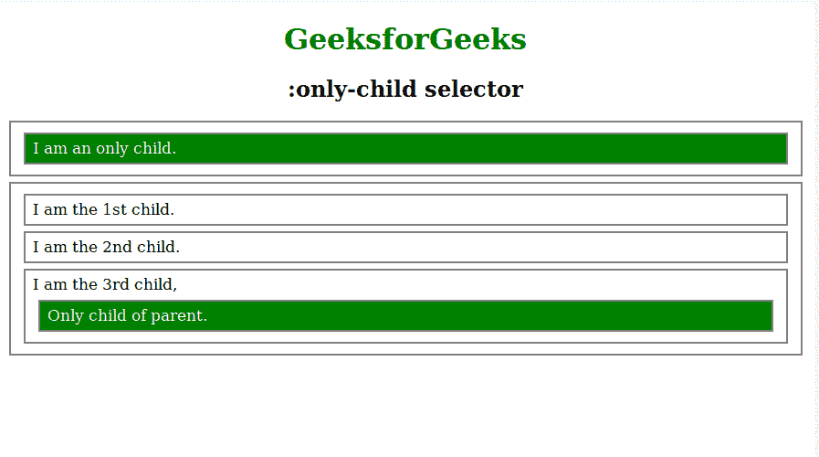
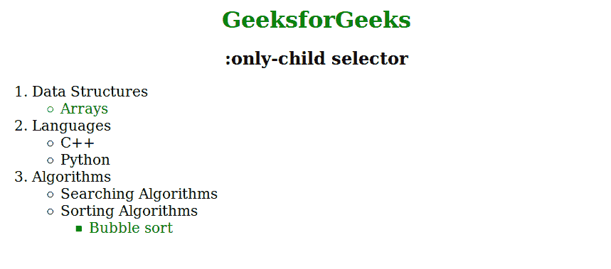

# CSS |:独生子选择器

> 原文:[https://www.geeksforgeeks.org/css-only-child-selector/](https://www.geeksforgeeks.org/css-only-child-selector/)

CSS 中的:独生子选择器用于匹配作为其父元素的唯一子元素的每个元素。它表示没有任何兄弟的元素。

**语法:**

```
:only-child {
    // CSS property
} 

```

**例 1:**

```
<!DOCTYPE html>
<html>
    <head>
        <title>:only-child selector</title>
        <style>
            h1 {
                color: green;
                text-align: center;
            }
            h2 {
                text-align: center;
            }
            div:only-child {
                color: white;
                background: green;
            }
            div {
                display: block;
                margin: 6px;
                font-size: 17px;
                padding: 5px 8px;
                border: solid 2px grey;
            }
        </style>
    </head>
    <body>
        <h1>GeeksforGeeks</h1>
        <h2>:only-child selector</h2>
        <div>
            <div>I am an only child.</div>
        </div>
        <div>
            <div>I am the 1st child.</div>
            <div>I am the 2nd child.</div>
            <div>I am the 3rd child, <div> Only 
            child of parent.</div></div>
        </div>
    </body>
</html>
```

**输出:**


**例 2:**

```
<!DOCTYPE html>
<html>
    <head>
        <title>:only-child selector</title>
        <style>
            h1 {
                color: green;
                text-align: center;
            }
            h2 {
                text-align: center;
            }
            li:only-child {
            color: green;
            }
            li {
                font-size: 20px;
            }
        </style>
    </head>
    <body>
        <h1>GeeksforGeeks</h1>
        <h2>:only-child selector</h2>
        <ol>
            <li>Data Structures</li>
            <ul>
                <li>Arrays </li>
            </ul>
            <li>Languages</li>
            <ul>
                <li>C++ </li>
                <li>Python</li>
            </ul>
            <li>Algorithms</li>
            <ul>
                <li>Searching Algorithms</li>
                <li>Sorting Algorithms</li>
                <ul>
                    <li>Bubble sort </li>
                </ul>
            </ul>
        </ol>
    </body>
</html>
```

**输出:**


**支持的浏览器:**以下列出了:独生子选择器支持的浏览器:

*   谷歌 Chrome 4.0
*   Internet Explorer 9.0
*   Firefox 3.5
*   Safari 3.2
*   歌剧 9.6