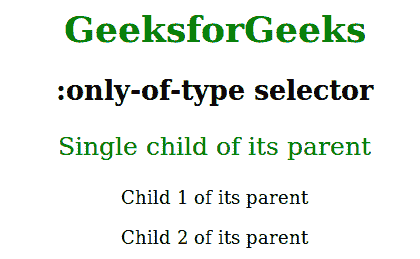
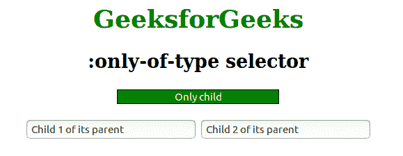

# CSS |:唯一类型选择器

> 原文:[https://www.geeksforgeeks.org/css-only-of-type-selector/](https://www.geeksforgeeks.org/css-only-of-type-selector/)

CSS 中的:only-of-type 选择器只表示那些没有给定类型的同级的元素。它用于设置该元素的 CSS 属性。

**语法:**

```html
:only-of-type {
    // CSS property
}

```

**例 1:**

```html
<!DOCTYPE html>
<html>
    <head>
        <title>:only-of-type selector</title>
        <style> 
            h1 {
                color:green;
            }
            body {
                text-align:center;
            }
            p:only-of-type {
                color:green;
                font-size:25px;
            }
        </style>
    </head>
    <body>
        <h1>GeeksforGeeks</h1>
        <h2>:only-of-type selector</h2>
        <div><p>Single child of its parent</p></div>
        <div>
            <p>Child 1 of its parent</p>
            <p>Child 2 of its parent</p>
        </div>
    </body>
</html>                    
```

**输出:**


**例 2:**

```html
<!DOCTYPE html> 
<html> 
    <head> 
        <title>:only-of-type selector</title> 
        <style> 
            h1 { 
                color:green; 
            } 
            body {
                text-align:center;
            }
            input:only-of-type {
                background-color:green;
                border:1px solid black;
                color:white;
                text-align:center;
            }
        </style> 
    </head> 
    <body>
        <h1>GeeksforGeeks</h1>
        <h2>:only-of-type selector</h2>
        <div>
            <input type="text" value="Only child">
        </div><br>
        <div>
            <input type="text" value="Child 1 of its parent">
            <input type="text" value="Child 2 of its parent">
        </div>
    </body> 
</html>                    
```

**输出:**


**支持的浏览器:**仅类型选择器支持的浏览器如下:

*   Chrome 4.0
*   歌剧 9.6
*   Firefox 3.5
*   Internet Explorer 9.0
*   Safari 3.2