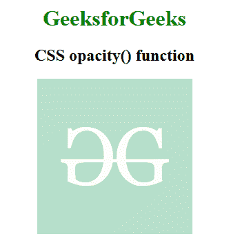

# CSS |不透明度()功能

> 原文:[https://www.geeksforgeeks.org/css-opacity-function/](https://www.geeksforgeeks.org/css-opacity-function/)

**不透明度()功能**是一个内置功能，用于对图像应用滤镜来设置图像的透明度。

**语法:**

```css
opacity( amount )
```

**参数:**该功能接受保存透明度的单个参数**量**。不透明度的值是根据数量和百分比设置的。值 0%代表完整的透明图像，100%代表原始图像。

下面的例子说明了 CSS 中的不透明度()函数:

**示例:**

```css
<!DOCTYPE html> 
<html> 

<head> 
    <title>CSS opacity() Function</title> 

    <style>
        h1 {
            color:green;
        }
        body {
            text-align:center;
        }
        .opacity_effect {
            filter: opacity(30%);
        }
    </style>
</head> 

<body> 
    <h1>GeeksforGeeks</h1> 

    <h2>CSS opacity() function</h2>

     
</body> 

</html>
```

**输出:**


**支持的浏览器:**不透明度()功能支持的浏览器如下:

*   谷歌 Chrome
*   微软公司出品的 web 浏览器
*   火狐浏览器
*   旅行队
*   歌剧