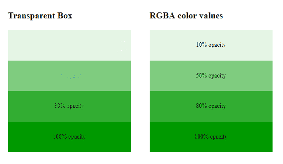

# CSS 不透明度/透明度

> 原文:[https://www.geeksforgeeks.org/css-opacity-transparency/](https://www.geeksforgeeks.org/css-opacity-transparency/)

CSS 中的**不透明度**是描述元素透明度的元素属性。它与透明度相反&代表内容隐藏在元素后面的程度。

我们可以对元素应用不同样式属性的不透明度。下面讨论其中的几个:

**图像不透明度:**图像中使用不透明度属性来描述图像的透明度。不透明度的值介于 0.0 到 1.0 之间，其中低值表示高透明度，高值表示低透明度。不透明度百分比计算为不透明度% =不透明度* 100。

**示例:**本示例通过将不透明度属性应用于图像来描述不透明度属性。

## 超文本标记语言

```css
<!DOCTYPE html>
<html>

<head>
    <title>Opacity property</title>
    <style>
    .forest {
        opacity: 0.5;
    }

    p {
        font-size: 25px;
        font-weight: bold;
        margin-bottom: 5px;
    }

    .opacity {
        text-align: center;
    }
    </style>
</head>

<body>
    <div class="opacity">

<p>Image with 100% opacity (original image)</p>

            
        <br>
        <br>

<p>Image with 50% opacity</p>

            
    </div>
</body>

</html>
```

**输出:**


**图像悬停不透明度:**当鼠标放在图像上时，悬停不透明度属性应用于图像，否则不透明度属性会改变。不透明度的值可以很容易地逆转这一过程，方法是首先将不透明度设置为较高的值，然后在悬停时将其降低，如下所示:

**语法:**

```css
.hightolow {
    opacity: 1.0;
}

.hightolow:hover {
    opacity: 0.5;
}
```

**示例:**本示例通过将不透明度属性应用于图像，并将其悬停在图像上以生成不透明度来描述不透明度属性。

## 超文本标记语言

```css
<!DOCTYPE html>
<html>

<head>
    <title>Image Hover Opacity</title>
    <style>
    .gfg_opacity {
        opacity: 0.5;
    }

    .gfg_opacity:hover {
        opacity: 1.0;
    }

    .main {
        text-align: center;
    }
    </style>
</head>

<body>
    <div class="main">
        <h1>Image Hover Opacity:</h1> 
            
        <br> 
        
        <br>
        <br> 
    </div>
</body>

</html>
```

**输出:**


**透明度框和使用 RGBA 值的透明度:**在透明度框中，子属性从父属性继承属性，但是在使用 RGBA 的透明度的情况下，仅使用或应用不透明度属性来为元素的背景添加透明度。

**示例:**本示例通过使用 RGBA 值应用透明度来描述不透明度属性。

## 超文本标记语言

```css
<!DOCTYPE html>
<html>

<head>
    <title>Transparent box</title>
    <style>
    .geeks {
        background: rgb(0, 153, 0);
        padding: 15px;
        text-align: center;
        width: 300px;
    }

    #geek {
        padding: 15px;
        text-align: center;
        width: 300px;
    }

    .rgba1 {
        background: rgba(0, 153, 0, 0.1);
    }

    .rgba2 {
        background: rgba(0, 153, 0, 0.5);
    }

    .rgba3 {
        background: rgba(0, 153, 0, 0.8);
    }

    .rgba4 {
        background: rgba(0, 153, 0, 1.0);
    }

    .g1 {
        float: left;
        margin-left: 50px;
    }

    .g2 {
        margin-top: -40px;
        margin-left: 50px;
        float: left;
    }
    </style>
</head>

<body>
    <div class="g1">
        <p style="font-size:24px;font-weight:bold;">Transparent Box</p>

        <div class="geeks" style="opacity:0.1;">

<p>10% opacity</p>

        </div>
        <div class="geeks" style="opacity:0.5;">

<p>50% opacity</p>

        </div>
        <div class="geeks" style="opacity:0.8;">

<p>80% opacity</p>

        </div>
        <div class="geeks">

<p>100% opacity</p>

        </div>
    </div>
    <br>
    <br>
    <div class="g2">
        <p style="font-size:24px;font-weight:bold;">RGBA color values</p>

        <div class="rgba1" id="geek">
            <p>10% opacity</p>

        </div>
        <div class="rgba2" id="geek">
            <p>50% opacity</p>

        </div>
        <div class="rgba3" id="geek">
            <p>80% opacity</p>

        </div>
        <div class="rgba4" id="geek">
            <p>100% opacity</p>

        </div>
    </div>
</body>

</html>
```

**输出:**



**透明盒子里的文字:**不透明度属性可以用来减少或者增加盒子的不透明度，把文字放在里面，用来制作最出彩的帖子。

**示例:**本示例通过将文本放置在透明框中来描述不透明度属性。

## 超文本标记语言

```css
<!DOCTYPE html>
<html>

<head>
    <style>
    div.bg {
        background: url(
"https: //media.geeksforgeeks.org/wp-content/uploads/geeksforgeeks-10.png");
        width: 550px;
        height: 300px;
        border: 1px solid;
    }

    div.box {
        margin: 50px 20px;
        text-align: center;
        width: 500px;
        height: 150px;
        background-color: #000000;
        border: 3px solid white;
        opacity: 0.7;
    }

    div.box p {
        margin: 5%;
        font-family: Arial;
        color: #009900;
        font-weight: bold;
        font-size: 25px;
    }
    </style>
</head>

<body>
    <div class="bg">
        <div class="box">
            <p>GeeksforGeeks</p>

        </div>
    </div>
</body>

</html>
```

**输出:**


**支持的浏览器:**

*   谷歌 Chrome 1.0
*   微软边缘 12.0
*   Internet Explorer 9.0
*   Firefox 1.0
*   Opera 9.0
*   Safari 2.0