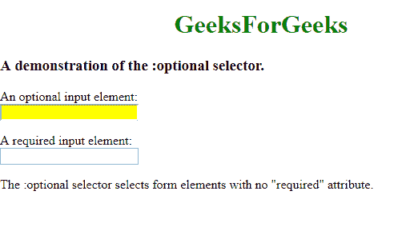

# CSS |可选选择器

> 原文:[https://www.geeksforgeeks.org/css-optional-selector/](https://www.geeksforgeeks.org/css-optional-selector/)

CSS 中的**:可选**选择器用于选择表单输入元素的样式，这些元素是可选的。也就是说，它可以从一个 HTML 表单中选择那些没有声明为“必需”的输入元素。

**语法:**

```html
:optional {
  /* css declarations; */
}

```

**示例:**

```html
<!DOCTYPE html>
<html>
    <head>
        <title>optional Selector</title>

        <style>
            /* Select optional fields and change 
                color to Yellow */
            input:optional {
                background-color: yellow;
            }

            h1 {
                color:green;
            }

            h1, h2 {
                text-align:center;
            }
        </style>
    </head>

    <body>
        <h1>GeeksForGeeks</h1>

        <h3>A demonstration of the :optional selector.</h3>

        <!-- Create an HTML form -->
        <form>
            <!-- Optional Input -->
            <label>An optional input element:</label><br />
            <input>

            <br /><br />

            <!-- Required Input -->
            <label>A required input element:</label><br />
            <input required>
        </form>

        <p>
            The :optional selector selects form elements
            with no "required" attribute.
        </p>
    </body>
</html>                    
```

**输出:**


**支持的浏览器:**支持的浏览器:“可选”选择器如下:

*   谷歌 Chrome 50.0，4.0 -webkit-
*   Internet Explorer 10.0
*   火狐 52.0， 2.0 -moz-
*   Safari 9.0，3.1 -webkit-
*   Opera 37.0，15.0 -webkit-，11.1