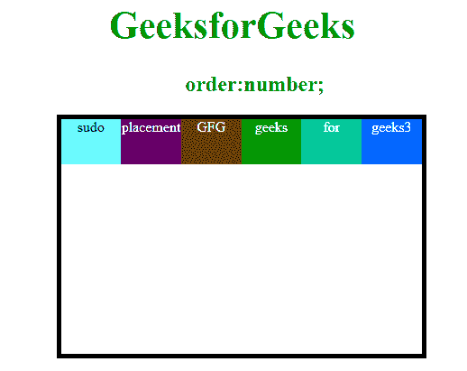
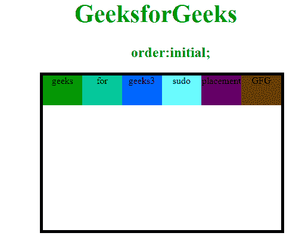

# CSS |订单属性

> 原文:[https://www.geeksforgeeks.org/css-order-property/](https://www.geeksforgeeks.org/css-order-property/)

此属性用于指定每个灵活项目相对于灵活容器内其他项目的顺序。它只给出容器中存在的物品的位置，并根据用户的需要分类为不同的顺序。如果元素不是灵活项，则此属性不再存在。

**语法:**

```html
order: number|initial|inherit;
```

**属性值:**

**1。number:** 此属性用于指定灵活项目的顺序，它根据用户的要求为每个项目赋予一个编号。

**语法:**

```html
order:number;
```

**示例:**

## 超文本标记语言

```html
<!DOCTYPE html>
<html>
    <head>
        <title>order property</title>
        <style>
            #main {
                width: 400px;
                height: 260px;
                border: 5px solid black;
                display: flex;
                flex-wrap: nowrap;
                margin-left:70px;
                margin-bottom:70px;
            }

            #main div {
                width: 100px;
                height: 50px;
            }
            h1 {
                color:#009900;
                font-size:42px;
                margin-left:50px;
                margin-top:50px;
            }
            h2{
                color:green;
                margin-left:100px;
            }
            }
            h3 {
                margin-top:-20px;
                margin-left:50px;
            }
            div#gfg{order:4;}
            div#geeks{order:5;}
            div#sudo{order:6;}
            div#for{order:1;}
            div#geek{order:2;}
            div#g{order:3;}
            div{
                color:white;}
            }
        </style>
    </head>
    <body>
        <center>
        <h1>GeeksforGeeks</h1>
        <h2>order:number;</h2>
        <div id="main">
            <div style="background-color:#009900;"id="gfg">
               geeks</div>
            <div style="background-color:#00cc99;"id="geeks">
               for</div>
            <div style="background-color:#0066ff;"id="sudo">
               geeks3</div>
            <div style="background-color:#66ffff;color:black;"
                    id="for">
               sudo</div>
            <div style="background-color:#660066;"id="geek">
               placement</div>
            <div style="background-color:#663300;"id="g">
               GFG</div>
        </div>
        </center>
    </body>
</html>                               
```

**输出:**



**2。initial:** 它将属性设置为默认值。

**语法:**

```html
order:initial;
```

**示例:**

## 超文本标记语言

```html
<!DOCTYPE html>
<html>
    <head>
        <title>order property</title>
        <style>
            #main {
                width: 400px;
                height: 260px;
                border: 5px solid black;
                display: flex;
                flex-wrap: nowrap;
                margin-left:70px;
                margin-bottom:70px;
            }

            #main div {
                width: 100px;
                height: 50px;
            }
            h1 {
                color:#009900;
                font-size:42px;
                margin-left:50px;
                margin-top:50px;
            }
            h2{
                color:green;
                margin-left:100px;
            }
            }
            h3 {
                margin-top:-20px;
                margin-left:50px;
            }
            div{
                order:initial;}
            }
        </style>
    </head>
    <body>
        <center>
        <h1>GeeksforGeeks</h1>
        <h2>order:initial;</h2>
        <div id="main">
            <div style="background-color:#009900;">
              geeks</div>
            <div style="background-color:#00cc99;">
              for</div>
            <div style="background-color:#0066ff;">
              geeks3</div>
            <div style="background-color:#66ffff;color:black;"
                    id="for">
              sudo</div>
            <div style="background-color:#660066;">
              placement</div>
            <div style="background-color:#663300;">
              GFG</div>
        </div>
        </center>
    </body>
</html>              
```

*   **输出:**



**支持的浏览器:***订单属性*支持的浏览器如下:

*   谷歌 Chrome
*   微软公司出品的 web 浏览器
*   火狐浏览器
*   歌剧
*   旅行队