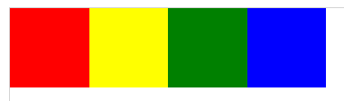
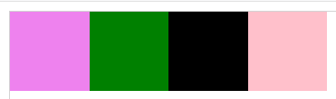

# CSS |订购弹性项目

> 原文:[https://www.geeksforgeeks.org/css-ordering-flex-items/](https://www.geeksforgeeks.org/css-ordering-flex-items/)

CSS 的 **order** 属性可以用来订购 flex 项。它指定弹性项相对于其他弹性项的顺序。元素必须是一个灵活的项目，order 属性才能工作。元素按其顺序值的升序显示。如果两个元素具有相同的顺序值，则根据它们在源代码中的出现情况来显示它们。

**语法:**

```html
order: integer | initial | inherit
```

**属性值:**

*   **整数:**表示弹性项的顺序。弹性项的默认值为 0。
*   **初始值:**将属性设置为默认值。
*   **Inherit:** 表示关联元素取其父元素顺序属性的指定值。

**例 1:**

```html
<!DOCTYPE>
<html>

<head>
    <title>
        CSS | Ordering Flex Items
    </title>

    <style>
        #GFG {
            width: 400px;
            height: 100px;
            border: 1px solid #d3d3d3;
            display: -webkit-flex; /* Safari */
            display: flex;
        }
        #GFG div {
            width: 70px;
            height: 70px;
        }

        /* Safari 6.1+ */
        div#second {-webkit-order: 2;}
        div#fourth {-webkit-order: 4;}
        div#third {-webkit-order: 3;}
        div#first {-webkit-order: 1;}

        /* Normal syntax */
        div#second {order: 2;}
        div#fourth {order: 4;}
        div#third {order: 3;}
        div#first {order: 1;}
    </style>
</head>

<body>
    <div id="GFG">
        <div style="background-color:yellow;" id="second"></div>
        <div style="background-color:blue;" id="fourth"></div>
        <div style="background-color:green;" id="third"></div>
        <div style="background-color:red;" id="first"></div>
    </div>
</body>

</html>
```

**输出:**


**例 2:**

```html
<!DOCTYPE>
<html>

<head>
    <title>
        CSS | Ordering Flex Items
    </title>

    <style>
        #GFG {
            width: 400px;
            height: 100px;
            border: 1px solid #d3d3d3;
            display: -webkit-flex; /* Safari */
            display: flex;
        }
        #GFG div {
            width: 70px;
            height: 70px;
        }

        /* Safari 6.1+ */
        div#second {-webkit-order: 2;}
        div#fourth {-webkit-order: 4;}
        div#third {-webkit-order: 3;}
        div#first {-webkit-order: 1;}

        /* Normal syntax */
        div#second {order: 2;}
        div#fourth {order: 4;}
        div#third {order: 3;}
        div#first {order: 1;}
    </style>
</head>

<body>
    <div id="GFG">
        <div style="background-color:green;" id="second"></div>
        <div style="background-color:pink;" id="fourth"></div>
        <div style="background-color:black;" id="third"></div>
        <div style="background-color:violet;" id="first"></div>
    </div>
</body>

</html>
```

**输出:**


**支持的浏览器:**订购 Flex 项目支持的浏览器如下:

*   谷歌 Chrome 29.0，21.0 -webkit-
*   火狐浏览器 28.0， 18.0 -moz-
*   Internet Explorer 11.0
*   Safari 9.0，6.1 -webkit-
*   Opera 17.0