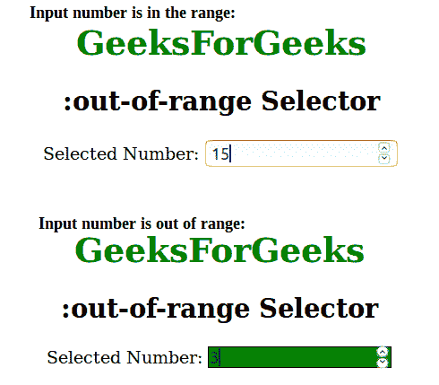

# CSS |:超范围选择器

> 原文:[https://www.geeksforgeeks.org/css-out-of-range-selector/](https://www.geeksforgeeks.org/css-out-of-range-selector/)

:超出范围选择器用于选择位于给定范围之外的元素。此选择器仅适用于具有最大和最小属性的输入元素。

示例应用:学生的分数应该在 0 到 100 之间。如果讲师试图进入范围外，我们可以突出显示超出范围的值。

**语法:**

```css
:out-of-range {
    // CSS property
} 
```

**示例:**

## 超文本标记语言

```css
<!DOCTYPE html>
<html>
    <head>
        <title>out of range selector</title>
        <style>
            h1 {
            color:green;
            }
            input:out-of-range {
                border: 1px solid black;
                background-color:green;
            }
            body {
                text-align:center;
            }
        </style>
    </head>
    <body>
        <h1>GeeksForGeeks</h1>
        <h2>:out-of-range Selector</h2>
        <!-- If selected number is out of given range then
        the CSS property of input elements will change. -->
        Selected Number: <input type="number" min="5" max="25">
    </body>
</html>                   
```

**输出:**



**支持的浏览器:***:超范围*选择器支持的浏览器如下:

*   苹果 Safari 10.1
*   谷歌 Chrome 53.0
*   Firefox 50.0
*   Opera 40.0
*   Internet Explorer 13.0