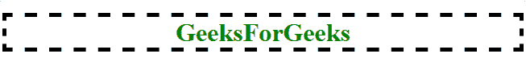
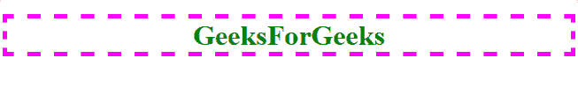
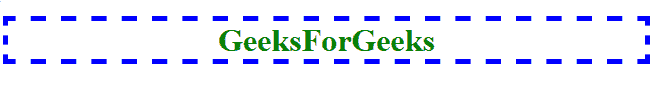
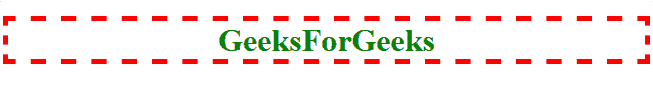
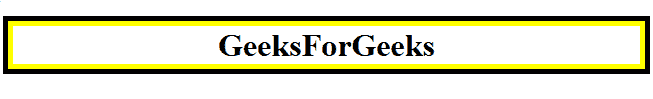
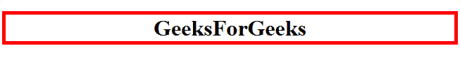

# CSS |轮廓-颜色属性

> 原文:[https://www.geeksforgeeks.org/css-outline-color-property/](https://www.geeksforgeeks.org/css-outline-color-property/)

CSS 的轮廓颜色属性设置元素的轮廓颜色。

**语法**

```html
outline-color: <color> | invert | inherit;
```

**属性值:**

*   **<color>:** It sets the outline color to any valid CSS color.

    **例:**轮廓-颜色:黑色；

    ```html
    <!DOCTYPE html>
    <html>

    <head>
        <title>CSS outline-color property</title>

        <!-- Internal CSS Style Sheet -->
        <style>
            h1 {
                color: green;
                text-align: center;
                outline-width: 5px;
                outline-style: dashed;
                /* CSS property for outline-color */
                outline-color: black;
            }
        </style>

    </head>

    <body>
        <!-- outline-color: black;-->
        <h1>GeeksForGeeks</h1>
    </body>

    </html>
    ```

    **输出:**
    

    **例:**轮廓-颜色:# FF00FF

    ```html
    <!DOCTYPE html>
    <html>

    <head>
        <title>CSS outline-color property</title>

        <!-- Internal CSS Style Sheet -->
        <style>
            h1 {
                color: green;
                text-align: center;
                outline-width: 5px;
                outline-style: dashed;
                /* CSS property for outline-color */
                outline-color: #FF00FF;
            }
        </style>

    </head>

    <body>
        <!-- outline-color: #FF00FF;-->
        <h1>GeeksForGeeks</h1>
    </body>

    </html>
    ```

    **输出:**
    

    **示例:**轮廓-颜色:rgb(0，0，255)；

    ```html
    <!DOCTYPE html>
    <html>

    <head>
        <title>CSS outline-color property</title>

        <!-- Internal CSS Style Sheet -->
        <style>
            h1 {
                color: green;
                text-align: center;
                outline-width: 5px;
                outline-style: dashed;
                /* CSS property for outline-color */
                outline-color: rgb(0, 0, 255);
            }
        </style>

    </head>

    <body>
        <!-- outline-color: rgb(0, 0, 255);-->
        <h1>GeeksForGeeks</h1>
    </body>

    </html>
    ```

    **输出:**
    

    **例:**轮廓-颜色:hsl(0，100%，50%)；

    ```html
    <!DOCTYPE html>
    <html>

    <head>
        <title>CSS outline-color property</title>

        <!-- Internal CSS Style Sheet -->
        <style>
            h1 {
                color: green;
                text-align: center;
                outline-width: 5px;
                outline-style: dashed;
                /* CSS property for outline-color */
                outline-color: hsl(0, 100%, 50%);
            }
        </style>

    </head>

    <body>
        <!-- outline-color: hsl(0, 100%, 50%);-->
        <h1>GeeksForGeeks</h1>
    </body>

    </html>
    ```

    **输出:**
    

*   **invert:** It set the outline color to a color which is inverse of the background, which ensures the outline will always be visible. Note: It is not supported by all browsers.

    **示例:**轮廓-颜色:反转；

    ```html
    <!DOCTYPE html>
    <html>

    <head>
        <title>CSS outline-color property</title>

        <!-- Internal CSS Style Sheet -->
        <style>
            h1 {
                border: 5px solid yellow;
                text-align: center;
                outline-width: 5px;
                outline-style: solid;
                /* CSS property for outline-color */
                outline-color: invert;
            }
        </style>

    </head>

    <body>
        <!-- outline-color: invert;-->
        <h1>GeeksForGeeks</h1>
    </body>

    </html>
    ```

    **输出:**
    

*   **Inherit:** It sets the outline color according to outline-color property inherited from its parent element.

    **例:**轮廓-颜色:继承；

    ```html
    <!DOCTYPE html>
    <html>

    <head>
        <title>CSS outline-color property</title>

        <!-- Internal CSS Style Sheet -->
        <style>
            body {
                outline-color: red;
            }

            h1 {
                text-align: center;
                outline-width: 5px;
                outline-style: solid;
                /* CSS property for outline-color */
                outline-color: inherit;
            }
        </style>

    </head>

    <body>
        <!-- outline-color: inherit;-->
        <h1>GeeksForGeeks</h1>
    </body>

    </html>
    ```

    **输出:**
    

    **支持的浏览器:**CSS 的*轮廓颜色*属性受以下浏览器支持:

    *   铬合金 1
    *   边缘 12
    *   Firefox 1.5
    *   Internet Explorer 8
    *   歌剧 7
    *   Safari 1.2