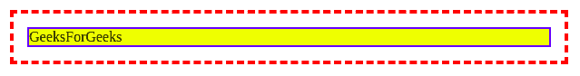
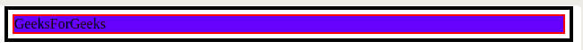
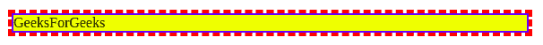

# CSS |轮廓偏移属性

> 原文:[https://www.geeksforgeeks.org/css-outline-offset-property/](https://www.geeksforgeeks.org/css-outline-offset-property/)

CSS 轮廓偏移属性设置轮廓和元素边缘或边框之间的间距。

轮廓是围绕边框边缘之外的元素绘制的线条。元素与其轮廓之间的空间是透明的。此外，轮廓可以是非矩形的。默认值为 0。

**语法**

```css
outline-offset: length|initial|inherit;

```

**属性值**:

*   **length**: It is the distance or space between the outline and the border i.e it is the distance the outline is outset from the border edge. It can also have negative value. If length is negative then the outline is placed inside the element. If length is 0 then there is no space between the outline and the element.
    **syntax**:

    ```css
    outline-offset: 5px;

    ```

    **例 1:**

    ```css
    <!DOCTYPE html>
    <html>
    <head>
        <title>
            outline-offset Property
        </title>
        <style> 
            div {
                margin: 30px;
                border: 2px solid blue;
                background-color: yellow;
                outline: 4px dashed red;
                outline-offset: 15px;
            } 
        </style>
    </head>

    <body>
        <div >GeeksForGeeks</div>
        <br>
    </body>
    </html>                    
    ```

    **输出:**
    
    **例 2:**

    ```css
    <!DOCTYPE html>
    <html>
    <head>
        <title>
            outline-offset Property
        </title>
        <style> 
            div {
                margin: 10px;
                border: 2px solid red;
                background-color: blue;
                outline: 4px solid black;
                outline-offset: 5px;
            } 
        </style>
    </head>

    <body>
        <div >GeeksForGeeks</div>
        <br>
    </body>
    </html>                    
    ```

    **输出:**
    

*   **initial**: It sets the outline-offset property to its default value.
    **syntax**:

    ```css
    outline-offset: initial;

    ```

    **示例:**

    ```css
    <!DOCTYPE html>
    <html>

    <head>
        <title>
            outline-offset Property
        </title>
        <style>
            div {
                margin: 30px;
                border: 2px solid blue;
                background-color: yellow;
                outline: 4px dashed red;
                outline-offset: initial;
            }
        </style>
    </head>

    <body>
        <div>GeeksForGeeks</div>
        <br>
    </body>

    </html> 
    ```

    **输出:**
    

*   **inherit**: The element inherits the outline-offset property from its parent element.

    **语法**:

    ```css
    outline-offset: inherit;

    ```

**支持的浏览器:***轮廓偏移属性*支持的浏览器如下:

*   谷歌 Chrome 4.0
*   Internet Explorer 15.0
*   歌剧 10.5
*   Firefox 3.5
*   苹果 Safari 3.1