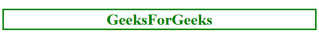
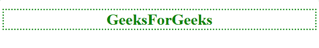
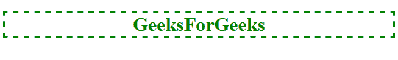
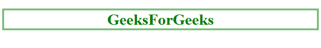
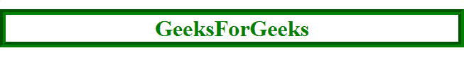
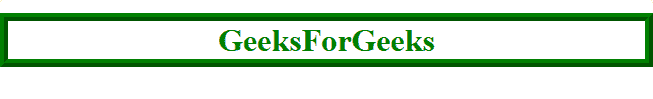
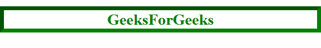
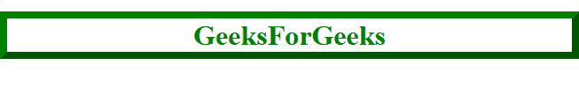
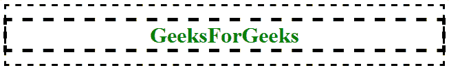

# CSS |轮廓样式属性

> 原文:[https://www.geeksforgeeks.org/css-outline-style-property/](https://www.geeksforgeeks.org/css-outline-style-property/)

CSS 中的 outline-style 属性用于设置元素轮廓的外观。元素的轮廓和边框相似，但不相同。轮廓不占用空间，并且绘制在元素的边框之外。此外，默认情况下，轮廓是围绕元素的所有四个边绘制的，无法更改这一点。

**语法:**

```html
outline-style: auto|none|dotted|dashed|solid|double|groove|ridge|
inset|outset|initial|inherit;
```

**属性值:**

*   **auto:** It sets the outline of an elements through the browser.

    **语法:**

    ```html
    outline-style: auto;
    ```

    **示例:**

    ```html
    <!DOCTYPE html>
    <html>
        <head>
            <title>
                CSS outline-style property
            </title>

            <!-- Internal CSS Style Sheet -->
            <style>
                h1 {
                    color: green;
                    text-align: center;

                    /* CSS Property for outline-style */ 
                    outline-style: auto;
                }
            </style>

        </head>

        <body>
            <!-- outline-style: auto;-->
            <h1>GeeksForGeeks</h1>
        </body>
    </html>                    
    ```

    **输出:**
    

*   **none:** It is the default value and it sets the outline width to zero. Hence, it is not visible.

    **语法:**

    ```html
    outline-style: none;
    ```

    **示例:**

    ```html
    <!DOCTYPE html>
    <html>
        <head>
            <title>
                CSS outline-style property
            </title>

            <!-- Internal CSS Style Sheet -->
            <style>
                h1 {
                    color: green;
                    text-align: center;

                    /* CSS Property for outline-style */ 
                    outline-style: none;
                }
            </style>

        </head>

        <body>

            <!-- outline-style: none;-->
            <h1>GeeksForGeeks</h1>
        </body>
    </html>                    
    ```

    **输出:**
    

*   **dotted:** It is used to set a series of dots around the element as outline.

    **语法:**

    ```html
    outline-style: dotted;
    ```

    **示例:**

    ```html
    <!DOCTYPE html>
    <html>
        <head>
            <title>
                CSS outline-style property
            </title>

            <!-- Internal CSS Style Sheet -->
            <style>
                h1 {
                    color: green;
                    text-align: center;

                    /* CSS Property for outline-style */ 
                    outline-style: dotted;
                }
            </style>

        </head>

        <body>

            <!-- outline-style: dotted;-->
            <h1>GeeksForGeeks</h1>
        </body>
    </html>                    
    ```

    **输出:**
    

*   **dashed:** It is used to set a series of dashed line segment around the element as outline.

    **语法:**

    ```html
    outline-style: dashed;
    ```

    **示例:**

    ```html
    <!DOCTYPE html>
    <html>
        <head>
            <title>
                CSS outline-style property
            </title>

            <!-- Internal CSS Style Sheet -->
            <style>
                h1 {
                    color: green;
                    text-align: center;

                    /* CSS Property for outline-style */ 
                    outline-style: dashed;
                }
            </style>

        </head>

        <body>

            <!-- outline-style: dashed;-->
            <h1>GeeksForGeeks</h1>
        </body>
    </html>                    
    ```

    **输出:**
    

*   **solid:** It is used to set solid line segment around the element as outline.

    **语法:**

    ```html
    outline-style: solid;
    ```

    **示例:**

    ```html
    <!DOCTYPE html>
    <html>
      <head>
        <title>CSS outline-style property</title>

        <!-- Internal CSS Style Sheet -->
        <style>
          h1{
            color: green;
            text-align: center;

            /* CSS Property for outline-style */ 
            outline-style: solid;
          }
        </style>

      </head>

      <body>
          <!-- outline-style: solid;-->
          <h1>GeeksForGeeks</h1>
      </body>

    </html>
    ```

    **输出:**
    

*   **double:** It sets a doubled line segments around the element as outline. The width of the outline is equal to the sum of width of the individual line segments and space between them.

    **语法:**

    ```html
    outline-style: double;
    ```

    **示例:**

    ```html
    <!DOCTYPE html>
    <html>
      <head>
        <title>CSS outline-style property</title>

        <!-- Internal CSS Style Sheet -->
        <style>
          h1{
            color: green;
            text-align: center;

            /* CSS Property for outline-style */ 
            outline-style: double;
          }
        </style>

      </head>

      <body>
          <!-- outline-style: double;-->
          <h1>GeeksForGeeks</h1>
      </body>

    </html>
    ```

    **输出:**
    

*   **groove:** It sets grooved line segments around the element as the outline, which makes feel that it is carved.

    **语法:**

    ```html
    outline-style: groove;
    ```

    **示例:**

    ```html
    <!DOCTYPE html>
    <html>
        <head>
            <title>
                CSS outline-style property
            </title>

            <!-- Internal CSS Style Sheet -->
            <style>
                h1 {
                    color: green;
                    text-align: center;
                    outline-width: 8px;

                    /* CSS Property for outline-style */ 
                    outline-style: groove;
                }
            </style>

        </head>

        <body>

            <!-- outline-style: groove;-->
            <h1>GeeksForGeeks</h1>
        </body>
    </html>                    
    ```

    **输出:**
    

*   **ridge:** It sets ridged line segments around the element as outline, which makes feel that it is extruding. It is opposite to that of a groove.

    **语法:**

    ```html
    outline-style: ridge;
    ```

    **示例:**

    ```html
    <!DOCTYPE html>
    <html>
        <head>
            <title>
                CSS outline-style property
            </title>

            <!-- Internal CSS Style Sheet -->
            <style>
                h1 {
                    color: green;
                    text-align: center;
                    outline-width: 8px;

                    /* CSS Property for outline-style */ 
                    outline-style: ridge;
                }
            </style>
        </head>

        <body>

            <!-- outline-style: ridge;-->
            <h1>GeeksForGeeks</h1>
        </body>
    </html>                    
    ```

    **输出:**
    

*   **inset:** It sets embedded line segments around the element as the outline, which makes us feel that it is fixed in the display.

    **语法:**

    ```html
    outline-style: inset;
    ```

    **示例:**

    ```html
    <!DOCTYPE html>
    <html>
        <head>
            <title>
                CSS outline-style property
            </title>

            <!-- Internal CSS Style Sheet -->
            <style>
                h1 {
                    color: green;
                    text-align: center;
                    outline-width: 8px;

                    /* CSS Property for outline-style */ 
                    outline-style: inset;
                }
            </style>
        </head>

        <body>

            <!-- outline-style: inset;-->
            <h1>GeeksForGeeks</h1>
        </body>
    </html>                    
    ```

    **输出:**
    

*   **outset:** It sets line segments around the element which appears to be coming out, as outline. It is opposite of inset.

    **语法:**

    ```html
    outline-style: outset;
    ```

    **示例:**

    ```html
    <!DOCTYPE html>
    <html>
        <head>
            <title>
                CSS outline-style property
            </title>

            <!-- Internal CSS Style Sheet -->
            <style>
                h1 {
                    color: green;
                    text-align: center;
                    outline-width: 8px;

                    /* CSS Property for outline-style */ 
                    outline-style: outset;
                }
            </style>
        </head>

        <body>

            <!-- outline-style: outset;-->
            <h1>GeeksForGeeks</h1>
        </body>
    </html>                    
    ```

    **输出:**
    

*   **initial:** It is used to set outline-style property to its default value. It sets the width of the outline to zero. Hence, the outline is not visible.

    **语法:**

    ```html
    outline-style: initial;
    ```

    **示例:**

    ```html
    <!DOCTYPE html>
    <html>
        <head>
            <title>
                CSS outline-style property
            </title>

            <!-- Internal CSS Style Sheet -->
            <style>
                h1 {
                    color: green;
                    text-align: center;
                    outline-width: 5px;
                    outline-color: black;

                    /* CSS Property for outline-style */
                    outline-style: initial;
                }
            </style>
        </head>

        <body>

            <!-- outline-style: initial;-->
            <h1>GeeksForGeeks</h1>
        </body>

    </html>                    
    ```

    **输出:**
    

*   **inherit:** It makes the outline-style property to be inherited from its parent element.

    **语法:**

    ```html
    outline-style: inherit;
    ```

    **示例:**

    ```html
    <!DOCTYPE html>
    <html>
        <head>
            <title>
                CSS outline-style property
            </title>

            <!-- Internal CSS Style Sheet -->
            <style>
                * {
                    padding: 1px;
                }
                body {
                    outline-style: dashed;
                }
                h1 {
                    color: green;
                    text-align: center;
                    outline-width: 5px;
                    outline-color: black;

                    /* CSS Property for outline-style */
                    outline-style: inherit;
                }
            </style>
        </head>

        <body>

            <!-- outline-style: inherit;-->
            <h1>GeeksForGeeks</h1>
        </body>
    </html>                    
    ```

    **输出:**
    

**支持的浏览器:***轮廓式*属性支持的浏览器如下:

*   谷歌 Chrome 1.o
*   Internet Explorer 8
*   Firefox 1.5
*   Opera 7.0
*   Safari 1.2