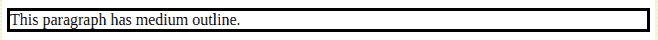

# CSS |轮廓宽度属性

> 原文:[https://www.geeksforgeeks.org/css-outline-width-property/](https://www.geeksforgeeks.org/css-outline-width-property/)

轮廓是在元素边框之外的指定元素周围创建的线条，以使特定的元素更加独特和易于区分。

**轮廓宽度**属性用于指定特定元素的轮廓宽度。

在所需元素上使用轮廓宽度属性之前，必须声明或使用*轮廓样式*属性。从逻辑上讲，一个元素必须有一个轮廓来定义宽度或设计宽度的样式。

元素的轮廓显示在元素的边距周围，与边框属性不同。由于轮廓不是元素尺寸的一部分，因此元素的宽度和高度属性不包含轮廓的宽度。

**语法**:

```html
outline-width: medium|thin|thick|length|initial|inherit;

```

**属性值**:

*   **medium:** This value sets the outline width to default.The width of the outline is thinner than the outline setas thick and thicker than the outline set as thin.

    ```html
    outline-width: medium;

    ```

    ```html
    <html>
       <head>
          <title>
             CSS | outline-width Property
          </title>
       </head>

       <body>
          <p style = "outline-width:medium;
                      outline-style:solid;">
             This paragraph has medium outline.
          </p>
       </body>
    </html>
    ```

    **输出:**
    

*   **thin:** This value sets the outline width to thin, the outline achieved is thinner than outline specified with width as medium and thick.

    ```html
    outline-width: thin;

    ```

    ```html
    <html>
       <head>
          <title>
             CSS | outline-width Property
          </title>
       </head>

       <body>
          <p style = "outline-width:thin; 
                      outline-style:solid;">
             This paragraph has thin outline.
          </p>
       </body>
    </html>
    ```

    **输出:**
    

*   **thick:** This value sets the outline width to thick, the outline achieved is thicker than outline specified with width as medium and think.

    ```html
    outline-width: thick;

    ```

    ```html
    <!DOCTYPE html>
    <html>
       <head>
          <title>
             CSS | outline-width Property
          </title>
       </head>

       <body>
          <p style = "outline-width:thick; 
                      outline-style:solid;">
             This paragraph has thick outline.
          </p>
       </body>
    </html>
    ```

    **输出:**
    

*   **length:** This value is used to define the thickness of the outline.

    ```html
    outline-width: 15px;

    ```

    ```html
    <!DOCTYPE html>
    <html>
       <head>
          <title>
             CSS | outline-width Property
          </title>
       </head>

       <body>
          <p style = "outline-width:15px; 
                      outline-style:solid;">
             This paragraph has 15px outline.
          </p>
       </body>
    </html>
    ```

    **输出:**
    

*   **initial:** This value sets the outline -width to its default value.

    ```html
    outline-width: initial;

    ```

    ```html
    <html>
       <head>
          <title>
             CSS | outline-width Property
          </title>
       </head>

       <body>
          <p style = "outline-width:initial; 
                      outline-style:solid;">
             This paragraph has initial outline.
          </p>
       </body>
    </html>
    ```

    **输出:**
    

*   **inherit:** This value inherits the specifications of outline-width property of parent.

    ```html
    outline-width: inherit;

    ```

    ```html
    <!DOCTYPE html>
    <html>
    <head>
        <title>
            CSS | outline-width Property
        </title>
    </head>

    <body>
        <p style = "outline-width:medium; 
                     outline-style:solid;">
            This paragraph has medium outline.
        </p>

        <p style = "outline-width:thin; 
                    outline-style:solid;">
            This paragraph has thin outline.
        </p>
        <br>

        <p style = "outline-width:thick; 
                    outline-style:solid;">
            This paragraph has thick outline.
        </p>
        <br>

        <p style = "outline-width:15px; 
                    outline-style:solid;">
            This text has an outline of 15px.
        </p>
        <br><br> 
        <p style = "outline-width:initial; 
                    outline-style:solid;">
            This text has an outline of default
            type set by initial
        </p>

    </body>
    </html>                    
    ```

    

**支持的浏览器:**CSS |轮廓宽度属性支持的浏览器如下:

*   谷歌 Chrome 1.0
*   Internet Explorer 8.0
*   firefox 1.5
*   Opera 7.0
*   Safari 1.2