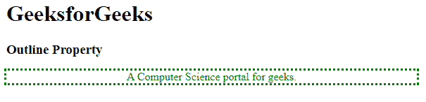
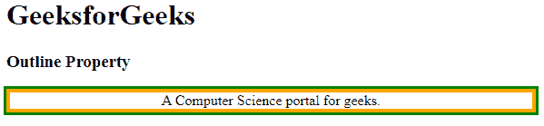
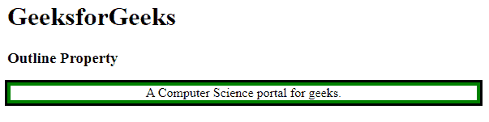
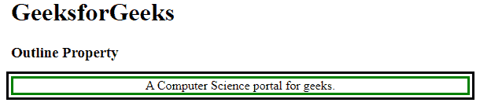

# CSS 轮廓

> 原文:[https://www.geeksforgeeks.org/css-outline/](https://www.geeksforgeeks.org/css-outline/)

**轮廓** CSS [简写](https://www.geeksforgeeks.org/css-shorthand-properties/)属性允许在边框外围绕元素绘制一条线。它用于在单个声明中设置大纲的所有属性。CSS 轮廓属性可以分为 4 种类型，即轮廓样式、轮廓颜色、轮廓宽度&轮廓偏移。我们将通过示例顺序讨论所有类型的轮廓属性。

**属性:**CSS 大纲集合下有很多属性，都用例子描述的很好。

[**轮廓样式**](https://www.geeksforgeeks.org/css-outline-style-property/) **:** 用于设置元素 ie 的轮廓外观。，它告诉我们轮廓的样式或类型。不设置大纲样式，就无法访问任何其他大纲属性。如果不存在，则默认样式将设置为无。

**语法:**

```html
outline-style: auto|none|dotted|dashed|solid|double|groove|ridge|inset|outset|initial|inherit;
```

**示例:**此示例说明了**轮廓属性**，其中样式设置为虚线。

## 超文本标记语言

```html
<!DOCTYPE html>
<html>
<head>
    <style>
    .dotted {
        outline-style: dotted;
        color: green;
        text-align: center;
    }
    </style>
</head>

<body >
    <h1>GeeksforGeeks</h1>
    <h3>Outline Property</h3>
    <p class="dotted">A Computer Science portal for geeks.</p>

</body>
</html>
```

**输出:**



[**【轮廓颜色】**](https://www.geeksforgeeks.org/css-outline-color-property/) **:用于设置元素的轮廓颜色。颜色可以通过它的名字来设定。、rgb 值或十六进制值等。如果不存在，那么默认颜色将是当前颜色。**

**语法:**

```html
outline-color: <color> | invert | inherit;
```

**示例:**此示例说明了**轮廓属性**，其中颜色被设置为特定颜色值。

## 超文本标记语言

```html
<!DOCTYPE html>
<html>
<head>
    <style>
    p {
        border: solid orange 4px;
        outline-style: solid;
        outline-color: green;
        text-align: center;
    }
    </style>
</head>

<body>
    <h1>GeeksforGeeks</h1>
    <h3>Outline Property</h3>
    <p>A Computer Science portal for geeks.</p>

</body>
</html>
```

**输出:**



[**【轮廓-宽度】**](https://www.geeksforgeeks.org/css-outline-width-property/) **:用于为特定元素指定该轮廓的宽度。轮廓的宽度可以通过用 px、cm、pt 等来指定宽度的大小来设置，或者通过使用诸如薄、厚、中等术语来设置。如果没有，那么默认宽度将是中等。**

**语法**:

```html
outline-width: medium|thin|thick|length|initial|inherit;
```

**示例:**该示例说明了**轮廓属性**，其中宽度被设置为特定值。

## 超文本标记语言

```html
<!DOCTYPE html>
<html>
<head>
    <style>
    p {
        border: solid green 4px;
        outline-style: solid;
        outline-width: 3px;
        text-align: center;
    }
    </style>
</head>

<body>
    <h1>GeeksforGeeks</h1>
    <h3>Outline Property</h3>
    <p>A Computer Science portal for geeks.</p>

</body>
</html>
```

**输出:**



[**【轮廓-偏移】**](https://www.geeksforgeeks.org/css-outline-offset-property/)**:**CSS 轮廓-偏移属性设置轮廓和元素边缘或边框之间的间距。轮廓是围绕边框边缘之外的元素绘制的线条。元素与其轮廓之间的空间是透明的。此外，轮廓可以是非矩形的。默认值为 0。

**语法:**

```html
outline-offset: length|initial|inherit;
```

**示例:**此示例说明了**轮廓属性**，其中偏移是用特定值定义的。

## 超文本标记语言

```html
<!DOCTYPE html>
<html>
<head>
    <style>
    p {
        border: solid green 3px;
        outline-style: solid;
        outline-offset: 3px;
        text-align: center;
    }
    </style>
</head>

<body>
    <h1>GeeksforGeeks</h1>
    <h3>Outline Property</h3>
    <p>A Computer Science portal for geeks.</p>

</body>
</html>
```

**输出:**



**支持的浏览器:**

*   谷歌 Chrome 1.0
*   微软边缘 12.0
*   Internet Explorer 8.0
*   Firefox 1.5
*   Opera 7.0
*   Safari 1.2