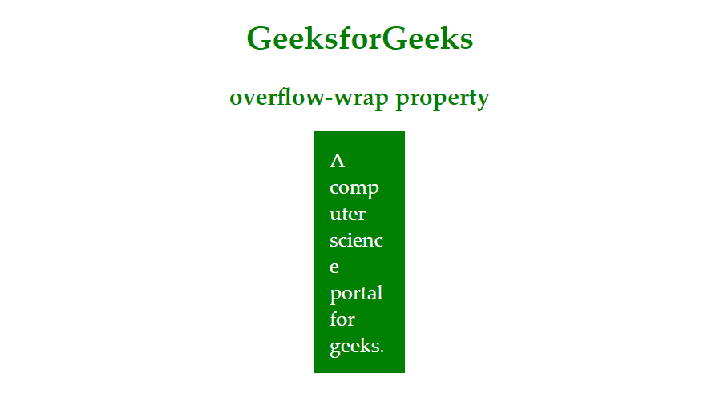

# CSS |溢出包装属性

> 原文:[https://www.geeksforgeeks.org/css-overflow-wrap-property/](https://www.geeksforgeeks.org/css-overflow-wrap-property/)

CSS 中的**溢出换行**属性用于指定浏览器可以在任何目标元素中换行，以防止原始字符串太长而无法容纳时溢出。这个属性在早期被称为**自动换行**，它仍然被一些浏览器支持，但是在 CSS3 草案中被重命名为**溢出换行**。

**语法:**

```html
.box{
    overflow-wrap: break-word;
}

```

**值:**

*   **正常:**线路会按照原来的断线规则断线。
*   **断句:**太长而无法容纳在容器元素中的单词会被分成几部分。
*   **inherit:** 它允许元素从其父元素继承值。
*   **初始值:**使属性使用默认值。

**示例:**

```html
<!DOCTYPE html>
<html>

<head>
    <title>
        CSS overflow-wrap property
    </title>

    <style>
        p {
            color: green;
        }

        .gfg {
            margin: auto;
            padding: 15px 15px;
            color: white;
            background-color: green;
            font-size: 20px;
            width: 60px;
            overflow-wrap: break-word;
        }

        div {
            text-align: justify;
        }

        h1,
        h2 {
            color: green;
        }

        h1,
        h2 {
            text-align: center;
        }
    </style>
</head>

<body>
    <h1>GeeksforGeeks</h1>
    <h2>overflow-wrap property</h2>
    <div class="gfg">
        A computer science portal for geeks.
    </div>
</body>

</html>
```

**输出:**
