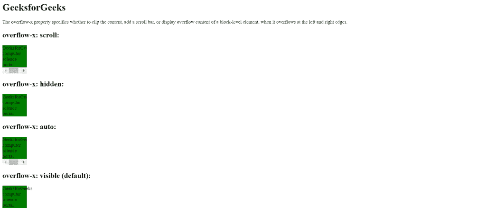

# CSS |溢出-x 属性

> 原文:[https://www.geeksforgeeks.org/css-overflow-x-property/](https://www.geeksforgeeks.org/css-overflow-x-property/)

CSS 中的 **overflow-x** 属性指定当块级元素在左右边缘溢出时，是添加滚动条、剪辑内容还是显示溢出内容。
换句话说，这个属性帮助我们水平显示页面溢出的内容。
overflow-x 属性的默认值可见。此 CSS 属性不可设置动画。
**语法:**

```html
overflow-x: visible|hidden|scroll|auto|initial|inherit;
```

**房产价值:**

*   **可见:**该属性不剪辑内容。内容可以在左边缘和右边缘之外呈现。
*   **隐藏:**用于剪辑内容，不提供滚动机制。
*   **滚动:**用于剪辑内容并提供滚动机制。
*   **auto:** 为溢出的盒子提供滚动机制。
*   **初始值:**该属性用于将 overflow-x 属性设置为默认值。
*   **inherit:** 此属性从其父级继承。

**例**T2】

## 超文本标记语言

```html
<!DOCTYPE html>
<html>
<head>
    <style>
    div.example1 {
        background-color: green;
        width: 80px;
        overflow-x: scroll;
    }

    div.example2 {
        background-color: green;
        width: 80px;
        overflow-x: hidden;
    }

    div.example3 {
        background-color:green;
        width: 80px;
        overflow-x: auto;
    }

    div.example4 {
        background-color: green;
        width: 80px;
        overflow-x: visible;
    }
    </style>
</head>
<body>
    <h1>GeeksforGeeks</h1>

<p>
        The overflow-x property specifies whether to
        clip the content, add a scroll bar, or display
        overflow content of a block-level element,
        when it overflows at the left and right edges.
    </p>

    <h2>overflow-x: scroll:</h2>
    <div class="example1">
        GeeksforGeeks computer science portal
    </div>

    <h2>overflow-x: hidden:</h2>
    <div class="example2">
        GeeksforGeeks computer science portal
    </div>

    <h2>overflow-x: auto:</h2>
    <div class="example3">
        GeeksforGeeks computer science portal
    </div>

    <h2>overflow-x: visible (default):</h2>
    <div class="example4">
        GeeksforGeeks computer science portal
    </div>
</body>
</html>                   
```

**输出:**



**支持的浏览器:**overflow-x 属性支持的浏览器如下:

*   谷歌 Chrome 4.0
*   Internet Explorer 9.0
*   Firefox 3.5
*   Safari 3.0
*   歌剧 9.5