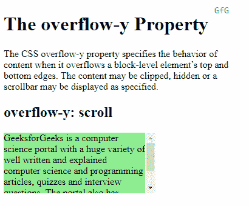
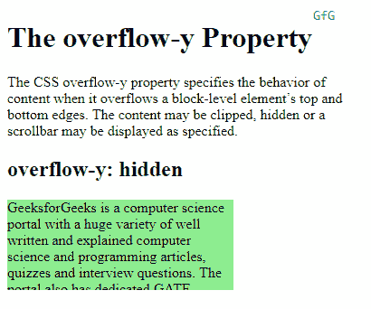
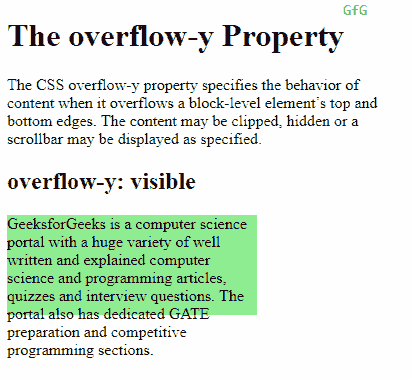
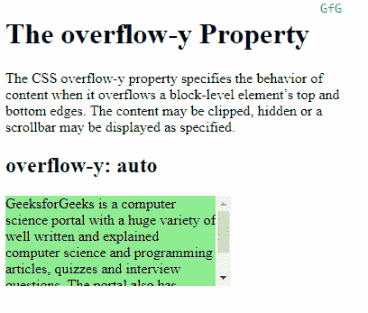

# CSS 溢出-y 属性

> 原文:[https://www.geeksforgeeks.org/css-overflow-y-property/](https://www.geeksforgeeks.org/css-overflow-y-property/)

CSS 的 **overflow-y** 属性指定内容溢出块级元素的上下边缘时的行为。基于分配给 overflow-y 属性的值，内容可以被剪切、隐藏或相应地显示滚动条。

**语法:**

```html
overflow-y: scroll | hidden | visible | auto
```

**属性值**:

*   **Scroll:** If the value assigned to the property is “scroll” then the content is clipped to fit the element and a scrollbar is displayed by the browser to help scroll the overflowed content. The scrollbar is added regardless of the content being clipped.

    **示例:**

    ```html
    <!DOCTYPE html>
    <html>
    <head>
        <title>
            CSS overflow-y Property
        </title>
        <style>
            .content {
                background-color: lightgreen;
                height: 100px;
                width: 250px;
                overflow-y: scroll;
            }
        </style>
    </head>

    <body>
        <h1>The overflow-y Property</h1>

        <!-- Below paragraph doesnot have a fixed width
             or height and has no overflow set. So, it 
             will just take up the complete width of 
             it's parent to fit the content -->
        <p>
            The CSS overflow-y property specifies the
            behavior of content when it overflows a 
            block-level element’s top and bottom edges.
            The content may be clipped, hidden or a 
            scrollbar may be displayed as specified.
        </p>

        <h2>overflow-y: scroll</h2>
        <!-- Below div element has fixed height and 
             width and thus overflow may occur. -->
        <div class="content">
            GeeksforGeeks is a computer science portal 
            with a huge variety of well written and 
            explained computer science and programming
            articles,quizzes and interview questions.
            The portal also has dedicated GATE preparation
            and competitive  programming sections.
        </div>
    </body>
    </html>                    
    ```

    **输出** :
    

*   **Hidden:** On assigning “hidden” as the value to the property, the content is clipped to fit the element. No scrollbars are provided and the content is hidden.

    **示例:**

    ```html
    <!DOCTYPE html>
    <html>
    <head>
        <title>
            CSS overflow-y Property
        </title>
        <style>
            .content {
                background-color: lightgreen;
                height: 100px;
                width: 250px;
                overflow-y: hidden;
            }
        </style>
    </head>
    <body>
        <h1>The overflow-y Property</h1>

        <!-- Below paragraph doesnot have a fixed width
             or height and has no overflow set. So, it 
             will just take up the complete width of 
             it's parent to fit the content -->
        <p>
            The CSS overflow-y property specifies the
            behavior of content when it overflows a 
            block-level element’s top and bottom edges.
            The content may be clipped, hidden or a 
            scrollbar may be displayed as specified.
        </p>

        <h2>overflow-y: scroll</h2>
        <!-- Below div element has fixed height and 
             width and thus overflow may occur. -->
        <div class="content">
            GeeksforGeeks is a computer science portal 
            with a huge variety of well written and 
            explained computer science and programming
            articles,quizzes and interview questions.
            The portal also has dedicated GATE preparation
            and competitive  programming sections.
        </div>
    </body>
    </html>                    
    ```

    **输出** :
    

*   **Visible:** If the value assigned to the “overflow-y” property is “visible” then the content is not clipped and may overflow out to the top or bottom of the containing element.
    **Example:**

    ```html
    <!DOCTYPE html>
    <html>
    <head>
        <title>
            CSS overflow-y Property
        </title>
        <style>
            .content {
                background-color: lightgreen;
                height: 100px;
                width: 250px;
                overflow-y: visible;
            }
        </style>
    </head>
    <body>
        <h1>The overflow-y Property</h1>

        <!-- Below paragraph doesnot have a fixed width
             or height and has no overflow set. So, it 
             will just take up the complete width of 
             it's parent to fit the content -->
        <p>
            The CSS overflow-y property specifies the
            behavior of content when it overflows a 
            block-level element’s top and bottom edges.
            The content may be clipped, hidden or a 
            scrollbar may be displayed as specified.
        </p>

        <h2>overflow-y: scroll</h2>
        <!-- Below div element has fixed height and 
             width and thus overflow may occur. -->
        <div class="content">
            GeeksforGeeks is a computer science portal 
            with a huge variety of well written and 
            explained computer science and programming
            articles,quizzes and interview questions.
            The portal also has dedicated GATE preparation
            and competitive  programming sections.
        </div>
    </body>
    </html>                    
    ```

    **输出** :
    

*   **Auto:** The behavior of auto depends on the content and scrollbars are added only when the content overflows, unlike that of the `scroll` value where the scrollbar is added regardless of overflow.

    **示例:**

    ```html
    <!DOCTYPE html>
    <html>
    <head>
        <title>
            CSS overflow-y Property
        </title>
        <style>
            .content {
                background-color: lightgreen;
                height: 100px;
                width: 250px;
                overflow-y: auto;
            }
        </style>
    </head>

    <body>
        <h1>The overflow-y Property</h1>

        <!-- Below paragraph doesnot have a fixed width
             or height and has no overflow set. So, it 
             will just take up the complete width of 
             it's parent to fit the content -->
        <p>
            The CSS overflow-y property specifies the
            behavior of content when it overflows a 
            block-level element’s top and bottom edges.
            The content may be clipped, hidden or a 
            scrollbar may be displayed as specified.
        </p>

        <h2>overflow-y: scroll</h2>
        <!-- Below div element has fixed height and 
             width and thus overflow may occur. -->
        <div class="content">
            GeeksforGeeks is a computer science portal 
            with a huge variety of well written and 
            explained computer science and programming
            articles,quizzes and interview questions.
            The portal also has dedicated GATE preparation
            and competitive  programming sections.
        </div>
    </body>
    </html>                    
    ```

    **输出** :
    

**支持的浏览器:***overflow-y*属性支持的浏览器如下:

*   铬
*   微软公司出品的 web 浏览器
*   火狐浏览器
*   歌剧
*   旅行队