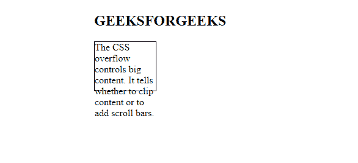

# CSS |溢出

> 原文:[https://www.geeksforgeeks.org/css-overflow/](https://www.geeksforgeeks.org/css-overflow/)

CSS 溢出控制大内容。它告诉您是剪辑内容还是添加滚动条。溢出包含以下属性:

*   看得见的
*   隐藏的
*   卷起
*   汽车

**可见:**内容在元素框外不剪裁可见。
示例:

## 超文本标记语言

```css
<!DOCTYPE>
<html>
   <head>
      <style>
         p {
         width:100px;
         height:80px;
         border:1px solid;
         overflow:visible;
         }
      </style>
   </head>
   <body>
      <h2>
         GEEKSFORGEEKS
      </h2>

<p>
         The CSS overflow controls big content.
         It tells whether to clip content or to add scroll bars.
      </p>

   </body>
</html>
```

**输出:**



**隐藏:**溢出被裁剪，其余内容不可见。
示例:

## 超文本标记语言

```css
<!DOCTYPE>
<html>
   <head>
      <style>
         p {
         width:100px;
         height:80px;
         border:1px solid;
         overflow:hidden;
         }
      </style>
   </head>
   <body>
      <h2>
         GEEKSFORGEEKS
      </h2>

<p>
         The CSS overflow controls big content.
         It tells whether to clip content or to add scroll bars.
      </p>

   </body>
</html>
```

**输出:**


**滚动:**溢出被剪切，但添加了滚动条来查看其余内容。滚动条可以是水平的也可以是垂直的。
示例:

## 超文本标记语言

```css
<!DOCTYPE>
<html>
   <head>
      <style>
         p {
         width:120px;
         height:100px;
         border:1px solid;
         overflow:scroll;
         }
      </style>
   </head>
   <body>
      <h2>
         GEEKSFORGEEKS
      </h2>

<p>
         The CSS overflow controls big content.
         It tells whether to clip content or to add scroll bars.
      </p>

   </body>
</html>
```

**输出:**


**自动:**它会在需要时自动添加滚动条。
示例:

## 超文本标记语言

```css
<!DOCTYPE>
<html>
   <head>
      <style>
         p {
         width:120px;
         height:100px;
         border:1px solid;
         overflow:auto;
         }
      </style>
   </head>
   <body>
      <h2>
         GEEKSFORGEEKS
      </h2>

<p>
         The CSS overflow controls big content.
         It tells whether to clip content or to add scroll bars.
      </p>

   </body>
</html>
```

**输出:**


**Overflow-x 和 Overflow-y:** 该属性指定如何更改元素的溢出。x 处理水平边，y 处理垂直边。
示例:

## 超文本标记语言

```css
<!DOCTYPE>
<html>
   <head>
      <style>
         p {
         width:120px;
         height:100px;
         border:1px solid;
         overflow-x:scroll;
         overflow-y:hidden;
         }
      </style>
   </head>
   <body>
      <h2>
         GEEKSFORGEEKS
      </h2>

<p>
         The CSS overflow controls big content.
         It tells whether to clip content or to add scroll bars.
      </p>

   </body>
</html>
```

**输出:**


**支持的浏览器:**

*   谷歌 Chrome
*   微软公司出品的 web 浏览器
*   火狐浏览器
*   歌剧
*   旅行队