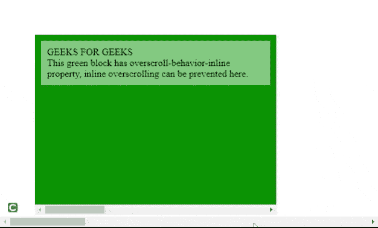

# CSS 过卷-行为-内嵌属性

> 原文:[https://www . geesforgeks . org/CSS-overcroll-behavior-inline-property/](https://www.geeksforgeeks.org/css-overscroll-behavior-inline-property/)

此属性指定浏览器到达滚动区域的内联方向边界时的行为。

**语法:**

```
overscroll-behavior-inline: auto|contain|none;
```

**属性值:**

*   **自动:**为默认值，过卷行为正常。
*   **contain:** 它将默认行为应用于相应的元素，但阻止底层元素的滚动链接。
*   **无:**防止滚动链接和默认过滚动行为。

它可以用来防止内联过度滚动。考虑以下场景，其中存在两个块级元素，一个包含另一个。外部块和内部块都具有各自的水平卷轴。默认情况下，当我们在内部块内滚动并到达其边界时，整个页面将开始滚动，这是必须避免的。通过在内部块中使用**超滚动行为内联**属性，我们可以防止这种情况。

**示例:**

## 超文本标记语言

```
<!DOCTYPE html>
<html>

<head>
    <title>overscroll behavior inline</title>
    <style>
        #outerbox {
            height: 300px;
            width: 3000px;
        }

        #innerbox {
            height: 300px;
            width: 400px;
            overflow: auto;
            position: relative;
            top: 50px;
            left: 50px;
            overscroll-behavior-inline: contain;
        }

        #content {
            height: 100%;
            width: 1500px;
            background-color: green;
        }

        p {
            padding: 10px;
            background-color: rgba(255, 255, 255, 0.5);
            margin: 0;
            width: 360px;
            position: relative;
            top: 10px;
            left: 10px;
        }
    </style>
</head>

<body>
    <div id="outerbox">
        <div id="innerbox">
            <div id="content">
                <p>
                    GEEKS FOR GEEKS<br>This green block has 
                    overscroll-behavior-inline property,
                    inline overscrolling can be prevented here.
                </p>
            </div>
        </div>
    </div>
</body>

</html>
```

**输出:**



**支持的浏览器:**

*   Chrome 77.0 及以上版本
*   Edge 79.0 及以上
*   Firefox 73.0 及以上版本
*   Opera 64.0 及以上版本