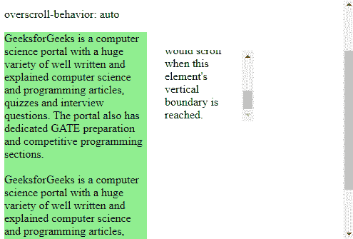
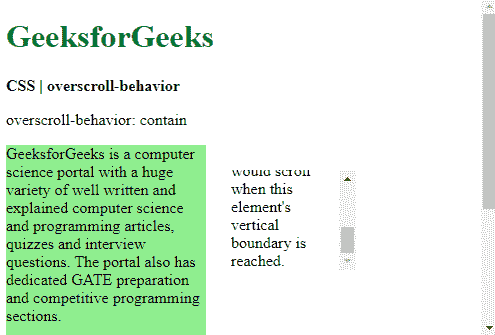
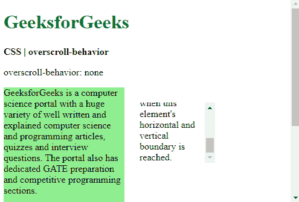
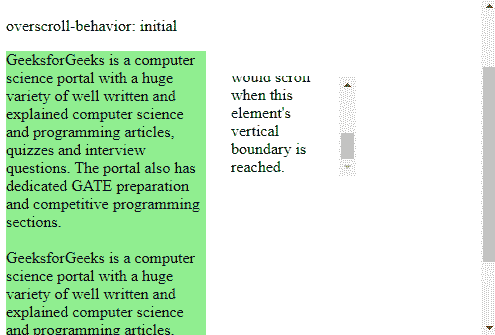

# CSS |过卷行为属性

> 原文:[https://www . geesforgeks . org/CSS-over croll-behavior-property/](https://www.geeksforgeeks.org/css-overscroll-behavior-property/)

**过滚动行为**属性用于设置到达滚动区域边界时浏览器的行为。此属性可用于防止在有多个滚动区域的页面中出现不必要的滚动。这是**超跌行为-x** 和**超跌行为-y** 属性的简写。

**语法:**

```
overscroll-behavior: auto | contain | none | initial | inherit
```

**属性值:**

*   **auto:** It is used to set the scrolling behavior to default. The whole page along with the element will scroll even if the boundary of the element is reached. It is the default value.

    **示例:**

    ```
    <!DOCTYPE html>
    <html>
    <head>
      <title>
        CSS | overscroll-behavior
      </title>
      <style>
        .container {
          display: flex;
        }

        .main-content {
          width: 200px;
          background-color: lightgreen;
        }

        .smaller-box {
          overscroll-behavior: auto;

          height: 100px;
          width: 125px;
          margin: 25px;
          overflow-y: scroll;
        }
      </style>
    </head>
    <body>
      <h1 style="color: green">
        GeeksforGeeks
      </h1>
      <b>CSS | overscroll-behavior</b>
      <p>overscroll-behavior: auto</p>
      <div class="container">
        <div class="main-content">
          GeeksforGeeks is a computer science
          portal with a huge variety of well
          written and explained computer science
          and programming articles, quizzes and
          interview questions. The portal also
          has dedicated GATE preparation and
          competitive programming sections.<br><br>
          GeeksforGeeks is a computer science
          portal with a huge variety of well
          written and explained computer science
          and programming articles, quizzes and
          interview questions. The portal also
          has dedicated GATE preparation and
          competitive programming sections.
        </div>
        <div class="smaller-box">
          This is a smaller element that is also
          scrollable. The overscroll behavior
          can be used to control if the main
          content behind would scroll when this
          element's vertical boundary is reached.
        </div>
      </div>
    </body>
    </html>
    ```

    **输出:**向下滚动较小的元素
    

*   **contain:** It is used to set the scrolling behavior to default only on the element used. Scrolling the element further after it has reached the boundary will not scroll the elements behind it. No scroll-chaining would occur in the neighboring scrolling areas.

    **示例:**

    ```
    <!DOCTYPE html>
    <html>
    <head>
      <title>
        CSS | overscroll-behavior
      </title>
      <style>
        .container {
          display: flex;
        }

        .main-content {
          width: 200px;
          background-color: lightgreen;
        }

        .smaller-box {
          overscroll-behavior: contain;

          height: 100px;
          width: 125px;
          margin: 25px;
          overflow-y: scroll;
        }
      </style>
    </head>
    <body>
      <h1 style="color: green">
        GeeksforGeeks
      </h1>
      <b>CSS | overscroll-behavior</b>
      <p>overscroll-behavior: contain</p>
      <div class="container">
        <div class="main-content">
          GeeksforGeeks is a computer science
          portal with a huge variety of well
          written and explained computer science
          and programming articles, quizzes and
          interview questions. The portal also
          has dedicated GATE preparation and
          competitive programming sections.<br><br>
          GeeksforGeeks is a computer science
          portal with a huge variety of well
          written and explained computer science
          and programming articles, quizzes and
          interview questions. The portal also
          has dedicated GATE preparation and
          competitive programming sections.
        </div>
        <div class="smaller-box">
          This is a smaller element that is also
          scrollable. The overscroll behavior
          can be used to control if the main
          content behind would scroll when this
          element's vertical boundary is reached.
        </div>
      </div>
    </body>
    </html>
    ```

    **输出:**向下滚动较小的元素
    

*   **none:** It is used to prevent scroll-chaining on all elements. The default scroll overflow behavior is also prevented.

    **示例:**

    ```
    <!DOCTYPE html>
    <html>
    <head>
      <title>
        CSS | overscroll-behavior
      </title>
      <style>
        .container {
          display: flex;
        }

        .main-content {
          width: 200px;
          background-color: lightgreen;
        }

        .smaller-box {
          overscroll-behavior: none;

          height: 100px;
          width: 125px;
          margin: 25px;
          overflow-y: scroll;
        }
      </style>
    </head>
    <body>
      <h1 style="color: green">
        GeeksforGeeks
      </h1>
      <b>CSS | overscroll-behavior</b>
      <p>overscroll-behavior: none</p>
      <div class="container">
        <div class="main-content">
          GeeksforGeeks is a computer science
          portal with a huge variety of well
          written and explained computer science
          and programming articles, quizzes and
          interview questions. The portal also
          has dedicated GATE preparation and
          competitive programming sections.<br><br>
          GeeksforGeeks is a computer science
          portal with a huge variety of well
          written and explained computer science
          and programming articles, quizzes and
          interview questions. The portal also
          has dedicated GATE preparation and
          competitive programming sections.
        </div>
        <div class="smaller-box">
          This is a smaller element that is also
          scrollable. The overscroll behavior
          can be used to control if the main
          content behind would scroll when this
          element's vertical boundary is reached.
        </div>
      </div>
    </body>
    </html>
    ```

    **输出:**向下滚动较小的元素
    

*   **初始值:**用于将过卷行为设置为默认值。

    **示例:**

    ```
    <!DOCTYPE html>
    <html>
    <head>
      <title>
        CSS | overscroll-behavior
      </title>
      <style>
        .container {
          display: flex;
        }

        .main-content {
          width: 200px;
          background-color: lightgreen;
        }

        .smaller-box {
          overscroll-behavior: initial;

          height: 100px;
          width: 125px;
          margin: 25px;
          overflow-y: scroll;
        }
      </style>
    </head>
    <body>
      <h1 style="color: green">
        GeeksforGeeks
      </h1>
      <b>CSS | overscroll-behavior</b>
      <p>overscroll-behavior: initial</p>
      <div class="container">
        <div class="main-content">
          GeeksforGeeks is a computer science
          portal with a huge variety of well
          written and explained computer science
          and programming articles, quizzes and
          interview questions. The portal also
          has dedicated GATE preparation and
          competitive programming sections.<br><br>
          GeeksforGeeks is a computer science
          portal with a huge variety of well
          written and explained computer science
          and programming articles, quizzes and
          interview questions. The portal also
          has dedicated GATE preparation and
          competitive programming sections.
        </div>
        <div class="smaller-box">
          This is a smaller element that is also
          scrollable. The overscroll behavior
          can be used to control if the main
          content behind would scroll when this
          element's vertical boundary is reached.
        </div>
      </div>
    </body>
    </html>
    ```

    **输出:**向下滚动较小的元素
    

*   **继承:**用于设置从父级继承的滚动行为。

**支持的浏览器:**由*超滚动行为*属性支持的浏览器如下:

*   Chrome 63.0
*   Firefox 59.0
*   Edge 18.0
*   Opera 50.0