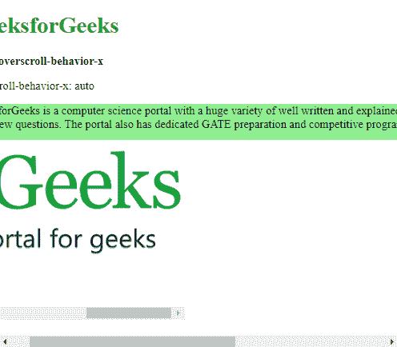
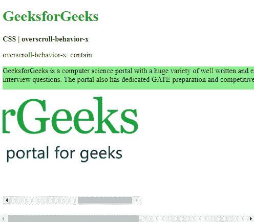
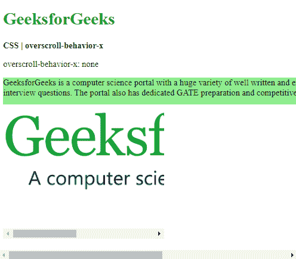
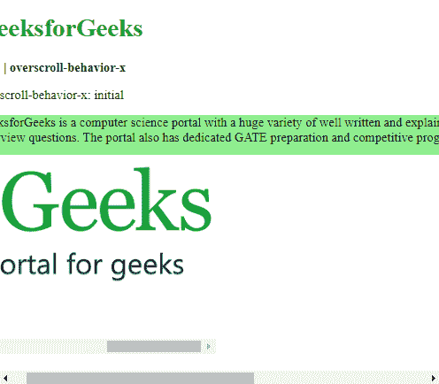

# CSS |过卷-行为-x 属性

> 原文:[https://www . geesforgeks . org/CSS-over croll-behavior-x-property/](https://www.geeksforgeeks.org/css-overscroll-behavior-x-property/)

**过滚动行为-x** 属性用于设置当到达滚动区域的水平边界时浏览器的行为。这可以在有多个滚动区域的网站中使用，滚动一个区域不会影响整个页面。

**语法:**

```html
overscroll-behavior-x: auto | contain | none | initial | inherit
```

**注意:**滚动时可以使用 Shift 键测试水平滚动。

**属性值:**

*   **自动:**用于将所有元素的滚动行为设置为默认。即使到达元素的边界，整个页面也会滚动。这是默认值。

**示例:**

```html
<!DOCTYPE html>
<html>
<head>
  <title>
    CSS | overscroll-behavior-x
  </title>
  <style>
    .main-content {
      height: 50px;
      width: 1000px;
      background-color: lightgreen;
    }

    .smaller-box {
      overscroll-behavior-x: auto;

      height: 250px;
      width: 300px;
      overflow-x: scroll;
    }
  </style>
</head>
<body>
  <h1 style="color: green">
    GeeksforGeeks
  </h1>
  <b>
    CSS | overscroll-behavior-x
  </b>
  <p>
    overscroll-behavior-x: auto
  </p>
  <div class="main-content">
    GeeksforGeeks is a computer science
    portal with a huge variety of well
    written and explained computer science
    and programming articles, quizzes and
    interview questions. The portal also
    has dedicated GATE preparation and
    competitive programming sections.
  </div>
  <div class="smaller-box">
    
</img>
  </div>
</body>
</html>
```

**输出:**在较小的元素
上水平滚动

*   **contain:** It is used to set the scrolling behavior to default only on the element used. No scroll-chaining would occur on the neighboring scrolling areas and the elements behind will not scroll.

    **示例:**

    ```html
    <!DOCTYPE html>
    <html>
    <head>
      <title>
        CSS | overscroll-behavior-x
      </title>
      <style>
        .main-content {
          height: 50px;
          width: 1000px;
          background-color: lightgreen;
        }

        .smaller-box {
          overscroll-behavior-x: contain;

          height: 250px;
          width: 300px;
          overflow-x: scroll;
        }
      </style>
    </head>
    <body>
      <h1 style="color: green">
        GeeksforGeeks
      </h1>
      <b>
        CSS | overscroll-behavior-x
      </b>
      <p>
        overscroll-behavior-x: contain
      </p>
      <div class="main-content">
        GeeksforGeeks is a computer science
        portal with a huge variety of well
        written and explained computer science
        and programming articles, quizzes and
        interview questions. The portal also
        has dedicated GATE preparation and
        competitive programming sections.
      </div>
      <div class="smaller-box">
        
    </img>
      </div>
    </body>
    </html>
    ```

    **输出:**在较小的元素
    上水平滚动

    *   **none:** It is used to prevent scroll-chaining on all elements. The default scroll overflow behavior is also prevented.

    **示例:**

    ```html
    <!DOCTYPE html>
    <html>
    <head>
      <title>
        CSS | overscroll-behavior-x
      </title>
      <style>
        .main-content {
          height: 50px;
          width: 1000px;
          background-color: lightgreen;
        }

        .smaller-box {
          overscroll-behavior-x: none;

          height: 250px;
          width: 300px;
          overflow-x: scroll;
        }
      </style>
    </head>
    <body>
      <h1 style="color: green">
        GeeksforGeeks
      </h1>
      <b>
        CSS | overscroll-behavior-x
      </b>
      <p>
        overscroll-behavior-x: none
      </p>
      <div class="main-content">
        GeeksforGeeks is a computer science
        portal with a huge variety of well
        written and explained computer science
        and programming articles, quizzes and
        interview questions. The portal also
        has dedicated GATE preparation and
        competitive programming sections.
      </div>
      <div class="smaller-box">
        
    </img>
      </div>
    </body>
    </html>
    ```

    **输出:**在较小的元素
    上水平滚动

    *   **initial:** It is used to set the overscroll behavior to default value.

    **示例:**

    ```html
    <!DOCTYPE html>
    <html>
    <head>
      <title>
        CSS | overscroll-behavior-x
      </title>
      <style>
        .main-content {
          height: 50px;
          width: 1000px;
          background-color: lightgreen;
        }

        .smaller-box {
          overscroll-behavior-x: initial;

          height: 250px;
          width: 300px;
          overflow-x: scroll;
        }
      </style>
    </head>
    <body>
      <h1 style="color: green">
        GeeksforGeeks
      </h1>
      <b>
        CSS | overscroll-behavior-x
      </b>
      <p>
        overscroll-behavior-x: initial
      </p>
      <div class="main-content">
        GeeksforGeeks is a computer science
        portal with a huge variety of well
        written and explained computer science
        and programming articles, quizzes and
        interview questions. The portal also
        has dedicated GATE preparation and
        competitive programming sections.
      </div>
      <div class="smaller-box">
        
    </img>
      </div>
    </body>
    </html>
    ```

    **输出:**在较小的元素
    上水平滚动

    *   **inherit:** It is used to set the scrolling behavior to inherit from the parent.

    **支持的浏览器:**由*overcroll-behavior-x*属性支持的浏览器如下:

    *   Chrome 63.0
    *   Firefox 59.0
    *   Opera 50.0