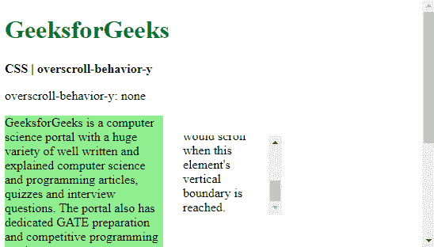

# CSS |过卷行为-y 属性

> 原文:[https://www . geesforgeks . org/CSS-over croll-behavior-y-property/](https://www.geeksforgeeks.org/css-overscroll-behavior-y-property/)

**过滚动行为-y** 属性用于设置当到达滚动区域的垂直边界时浏览器的行为。这可以在有多个滚动区域的网站中使用，滚动一个区域不会影响整个页面。这种效果称为滚动链接，可以相应地启用或禁用。

**语法:**

```
overscroll-behavior-y: auto | contain | none | initial | inherit
```

**属性值:**

*   **auto:** This is used to set the scrolling behavior to default on all the elements. The whole page will scroll even if the boundary of the element is reached. It is the default value.

    **示例:**

    ```
    <!DOCTYPE html>
    <html>

    <head>
      <title>
        CSS | overscroll-behavior-y
      </title>

      <style>
        .container {
          display: flex;
        }

        .main-content {
          width: 200px;
          background-color: lightgreen;
        }

        .smaller-box {
          overscroll-behavior-y: auto;

          height: 100px;
          width: 125px;
          margin: 25px;
          overflow-y: scroll;
        }
      </style>
    </head>

    <body>
      <h1 style="color: green">
        GeeksforGeeks
      </h1>

      <b>CSS | overscroll-behavior-y</b>
      <p>overscroll-behavior-y: auto</p>

      <div class="container">
        <div class="main-content">
          GeeksforGeeks is a computer science
          portal with a huge variety of well
          written and explained computer science
          and programming articles, quizzes and
          interview questions. The portal also
          has dedicated GATE preparation and
          competitive programming sections.<br><br>
          GeeksforGeeks is a computer science
          portal with a huge variety of well
          written and explained computer science
          and programming articles, quizzes and
          interview questions. The portal also
          has dedicated GATE preparation and
          competitive programming sections.
        </div>
        <div class="smaller-box">
          This is a smaller element that is also
          scrollable. The overscroll behavior
          can be used to control if the main
          content behind would scroll when this
          element's vertical boundary is reached.
        </div>
      </div>
    </body>

    </html>
    ```

    **输出:**向下滚动较小的元素
    

*   **contain:** It is used to set the scrolling behavior to default only on the element used. No scroll-chaining would occur on the neighboring scrolling areas and the elements behind will not scroll.

    **示例:**

    ```
    <!DOCTYPE html>
    <html>

    <head>
      <title>
        CSS | overscroll-behavior-y
      </title>

      <style>
        .container {
          display: flex;
        }

        .main-content {
          width: 200px;
          background-color: lightgreen;
        }

        .smaller-box {
          overscroll-behavior-y: contain;

          height: 100px;
          width: 125px;
          margin: 25px;
          overflow-y: scroll;
        }
      </style>
    </head>

    <body>
      <h1 style="color: green">
        GeeksforGeeks
      </h1>

      <b>CSS | overscroll-behavior-y</b>
      <p>overscroll-behavior-y: contain</p>

      <div class="container">
        <div class="main-content">
          GeeksforGeeks is a computer science
          portal with a huge variety of well
          written and explained computer science
          and programming articles, quizzes and
          interview questions. The portal also
          has dedicated GATE preparation and
          competitive programming sections.<br><br>
          GeeksforGeeks is a computer science
          portal with a huge variety of well
          written and explained computer science
          and programming articles, quizzes and
          interview questions. The portal also
          has dedicated GATE preparation and
          competitive programming sections.
        </div>
        <div class="smaller-box">
          This is a smaller element that is also
          scrollable. The overscroll behavior
          can be used to control if the main
          content behind would scroll when this
          element's vertical boundary is reached.
        </div>
      </div>
    </body>

    </html>
    ```

    **输出:**向下滚动较小的元素
    

*   **none:** It is used to prevent scroll-chaining on all elements. The default scroll overflow behavior is also prevented.

    **示例:**

    ```
    <!DOCTYPE html>
    <html>

    <head>
      <title>
        CSS | overscroll-behavior-y
      </title>

      <style>
        .container {
          display: flex;
        }

        .main-content {
          width: 200px;
          background-color: lightgreen;
        }

        .smaller-box {
          overscroll-behavior-y: none;

          height: 100px;
          width: 125px;
          margin: 25px;
          overflow-y: scroll;
        }
      </style>
    </head>

    <body>
      <h1 style="color: green">
        GeeksforGeeks
      </h1>

      <b>CSS | overscroll-behavior-y</b>
      <p>overscroll-behavior-y: none</p>

      <div class="container">
        <div class="main-content">
          GeeksforGeeks is a computer science
          portal with a huge variety of well
          written and explained computer science
          and programming articles, quizzes and
          interview questions. The portal also
          has dedicated GATE preparation and
          competitive programming sections.<br><br>
          GeeksforGeeks is a computer science
          portal with a huge variety of well
          written and explained computer science
          and programming articles, quizzes and
          interview questions. The portal also
          has dedicated GATE preparation and
          competitive programming sections.
        </div>
        <div class="smaller-box">
          This is a smaller element that is also
          scrollable. The overscroll behavior
          can be used to control if the main
          content behind would scroll when this
          element's vertical boundary is reached.
        </div>
      </div>
    </body>

    </html>
    ```

    **输出:**向下滚动较小的元素
    

*   **initial:** It is used to set the overscroll behavior to default value.

    **示例:**

    ```
    <!DOCTYPE html>
    <html>

    <head>
      <title>
        CSS | overscroll-behavior-y
      </title>

      <style>
        .container {
          display: flex;
        }

        .main-content {
          width: 200px;
          background-color: lightgreen;
        }

        .smaller-box {
          overscroll-behavior-y: initial;

          height: 100px;
          width: 125px;
          margin: 25px;
          overflow-y: scroll;
        }
      </style>
    </head>

    <body>
      <h1 style="color: green">
        GeeksforGeeks
      </h1>

      <b>CSS | overscroll-behavior-y</b>
      <p>overscroll-behavior-y: initial</p>

      <div class="container">
        <div class="main-content">
          GeeksforGeeks is a computer science
          portal with a huge variety of well
          written and explained computer science
          and programming articles, quizzes and
          interview questions. The portal also
          has dedicated GATE preparation and
          competitive programming sections.<br><br>
          GeeksforGeeks is a computer science
          portal with a huge variety of well
          written and explained computer science
          and programming articles, quizzes and
          interview questions. The portal also
          has dedicated GATE preparation and
          competitive programming sections.
        </div>
        <div class="smaller-box">
          This is a smaller element that is also
          scrollable. The overscroll behavior
          can be used to control if the main
          content behind would scroll when this
          element's vertical boundary is reached.
        </div>
      </div>
    </body>

    </html>
    ```

    **输出:**向下滚动较小的元素
    

*   **继承:**用于设置从父级继承的滚动行为。

**支持的浏览器:**由*over croll-behavior-y*属性支持的浏览器如下:

*   Chrome 63.0
*   Firefox 59.0
*   Opera 50.0