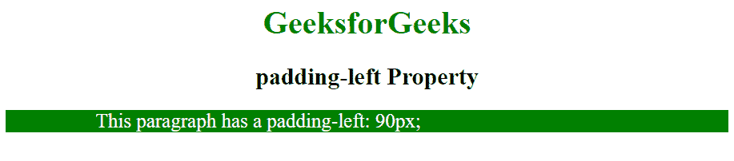

# CSS |左填充属性

> 原文:[https://www.geeksforgeeks.org/css-padding-left-property/](https://www.geeksforgeeks.org/css-padding-left-property/)

填充是其内容和边框之间的空间。CSS 中的左填充属性用于设置元素左侧填充区域的宽度。

**语法:**

```css
padding-left: length|percentage|initial|inherit;
```

**属性值；**

*   **length:** This mode is used to specify the size of padding as a fixed value. The default value is 0\. It must be non-negative.

    **语法:**

    ```css
    padding-left: length;
    ```

    **示例:**

    ```css
    <!DOCTYPE html>
    <html>
        <head>
            <title>
                padding-left Property
            </title>
            <style>
                .geek {
                    padding-left: 90px;
                    color: white;
                    background: green;
                }
            </style>
        </head>

        <body>
            <h1 style = "color: green; text-align:center">
                GeeksforGeeks
            </h1>

            <h2 style = "text-align:center">
                padding-left Property
            </h2>

            <!-- padding-left property used here -->
            <p class="geek">
                This paragraph has a padding-left: 90px;
            </p>
        </body>
    </html>                    
    ```

    **输出:**
    

*   **percentage:** This mode is used to specify the left padding in percent of the width of the element. It must be non-negative.

    **语法:**

    ```css
    padding-left: percentage;
    ```

    **示例:**

    ```css
    <!DOCTYPE html>
    <html>
        <head>
            <title>
                padding-left Property
            </title>
            <style>
                .geek {
                    padding-left: 25%;
                    color: white;
                    background: green;
                }
            </style>
        </head>

        <body>
            <h1 style = "color: green; text-align:center">
                GeeksforGeeks
            </h1>

            <h2 style = "text-align:center">
                padding-left Property
            </h2>

            <!-- padding-left property used here -->
            <p class = "geek">
                This paragraph has a padding-left: 25%;
            </p>
        </body>
    </html>                    
    ```

    **输出:**
    

*   **初始值:**该属性用于将左填充设置为默认值。
    **语法:**

    ```css
    padding-left: initial;
    ```

**支持的浏览器:**左填充属性支持的浏览器如下:

*   谷歌 Chrome 1.0
*   Internet Explorer 4.0
*   Firefox 1.0
*   歌剧 3.5
*   苹果 Safari 1.0