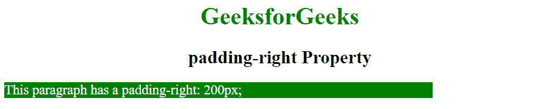
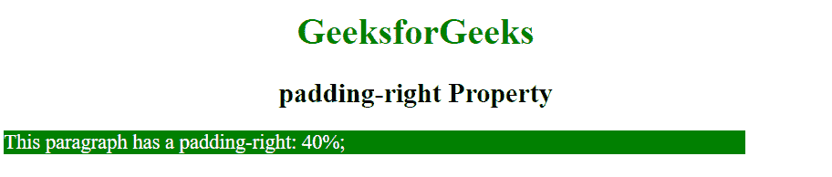
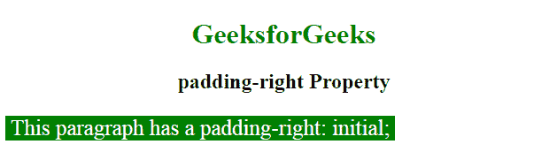

# CSS |填充权限属性

> 原文:[https://www.geeksforgeeks.org/css-padding-right-property/](https://www.geeksforgeeks.org/css-padding-right-property/)

填充是其内容和边框之间的空间。CSS 中的 padding-right 属性用于设置元素右侧填充区域的宽度。

**语法:**

```html
padding-right: length | percentage | initial | inherit;
```

**房产价值:**

*   **长度:**此模式用于将填充的大小指定为固定值。默认值为 0。它必须是非负的。
    **语法:**

```html
padding-right: length;
```

*   **示例:**

## 超文本标记语言

```html
<!DOCTYPE html>
<html>
    <head>
        <title>
            padding-right Property
        </title>

        <style>
            .geek {
                padding-right: 200px;
                color: white;
                background: green;
                width:50%;
                font-size:18px;
            }
        </style>
    </head>

    <body style = "text-align:center">
        <h1 style = "color: green;">
            GeeksforGeeks
        </h1>

        <h2>
            padding-right Property
        </h2>

        <!-- padding-right property used here -->
        <p class = "geek">
            This paragraph has a padding-right: 200px;
        </p>

    </body>
</html>                   
```

*   **输出:**



*   **百分比:**该模式用于设置元素宽度的右填充百分比。它必须是非负的。
    **语法:**

```html
padding-right: percentage;
```

*   **示例:**

## 超文本标记语言

```html
<!DOCTYPE html>
<html>
    <head>
        <title>
            padding-right Property
        </title>
        <style>
            .geek {
                padding-right: 40%;
                color: white;
                background: green;
                width:50%;
                font-size:18px;
            }
        </style>
    </head>

    <body style = "text-align:center">
        <h1 style = "color: green;">
            GeeksforGeeks
        </h1>
        <h2>
            padding-right Property
        </h2>

            <!-- padding-right property used here -->
        <p class = "geek">
            This paragraph has a padding-right: 40%;
        </p>

    </body>
</html>                   
```

*   **输出:**



*   **初始值:**该属性用于设置默认值。
    **语法:**

```html
padding-right: initial;
```

*   **示例:**

## 超文本标记语言

```html
<!DOCTYPE html>
<html>
    <head>
        <title>
            padding-right Property
        </title>

        <style>
            .geek {
                padding-right: initial;
                color: white;
                background: green;
                width:70%;
                font-size:25px;
            }
        </style>
    </head>

    <body style = "text-align:center">
        <h1 style = "color: green;">
            GeeksforGeeks
        </h1>

        <h2>
            padding-right Property
        </h2>

        <!-- padding-right property used here -->
        <p class = "geek">
            This paragraph has a padding-right: initial;
        </p>

    </body>
</html>                   
```

*   **输出:**



**支持的浏览器:**由*右填充*属性支持的浏览器如下:

*   谷歌 Chrome 1.0
*   Internet Explorer 4.0
*   Firefox 1.0
*   歌剧 3.5
*   苹果 Safari 1.0