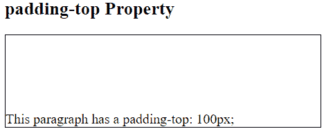
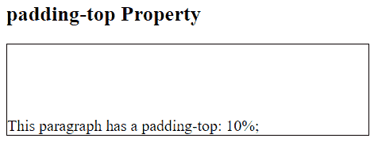
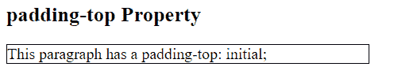

# CSS |填充-顶部属性

> 原文:[https://www.geeksforgeeks.org/css-padding-top-property/](https://www.geeksforgeeks.org/css-padding-top-property/)

填充是其内容和边框之间的空间。CSS 中的 padding-top 属性用于设置元素顶部填充区域的宽度。

**语法:**

```
padding-top: length|percentage|initial|inherit;
```

**属性值:**

*   **length:** This mode is used to specify the size of padding as a fixed value. The size can be set in form of px, cm etc. The default value is 0\. It must be non-negative.

    **语法:**

    ```
    padding-top: length;
    ```

    **示例:**

    ```
    <!DOCTYPE html> 
    <html> 
        <head> 
            <title> 
                padding-top Property 
            </title> 

            <style> 
                .geek { 
                    padding-top: 100px; 
                    width:50%; 
                    font-size:18px; 
                    border: 1px solid black;
                } 
            </style> 
        </head> 

        <body> 
            <h2> 
                padding-top Property 
            </h2> 

            <!-- padding property used here -->
            <p class = "geek"> 
                This paragraph has a padding-top: 100px; 
            </p> 
        </body> 
    </html>                     
    ```

    **输出:**
    

*   **percentage:** This mode is used to set the top padding in percentage of the width of the element. It must be non-negative.

    **语法:**

    ```
    padding-top: percentage (%)
    ```

    **示例:**

    ```
    <!DOCTYPE html> 
    <html> 
        <head> 
            <title> 
                padding-top Property 
            </title> 

            <style> 
                .geek { 
                    padding-top: 10%; 
                    width:50%; 
                    font-size:18px; 
                    border: 1px solid black;
                } 
            </style> 
        </head> 

        <body> 
            <h2> 
                padding-top Property 
            </h2> 

            <!-- padding property used here -->
            <p class = "geek"> 
                This paragraph has a padding-top: 10%; 
            </p> 
        </body> 
    </html>                     
    ```

    **输出:**
    

*   **initial:** It is used to set padding-top property to its default value.

    **语法:**

    ```
    padding-top: initial;
    ```

    **示例:**

    ```
    <!DOCTYPE html> 
    <html> 
        <head> 
            <title> 
                padding-top Property 
            </title> 

            <style> 
                .geek { 
                    padding-top: initial; 
                    width:50%; 
                    font-size:18px; 
                    border: 1px solid black;
                } 
            </style> 
        </head> 

        <body> 
            <h2> 
                padding-top Property 
            </h2> 

            <!-- padding property used here -->
            <p class = "geek"> 
                This paragraph has a padding-top: initial; 
            </p> 
        </body> 
    </html>                     
    ```

    **输出:**
    

*   **inherit:** 用于从其父元素继承 padding-top 属性。

**支持的浏览器:***填充属性*支持的浏览器如下:

*   谷歌 Chrome 1.0
*   Internet Explorer 4.0
*   Firefox 1.0
*   Safari 1.0
*   歌剧 3.5