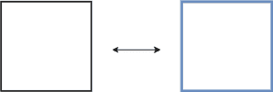
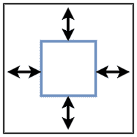
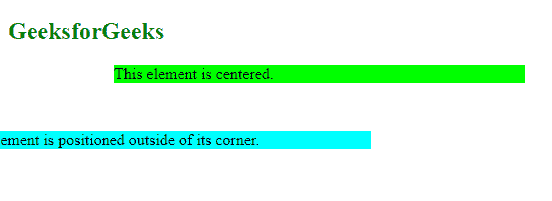
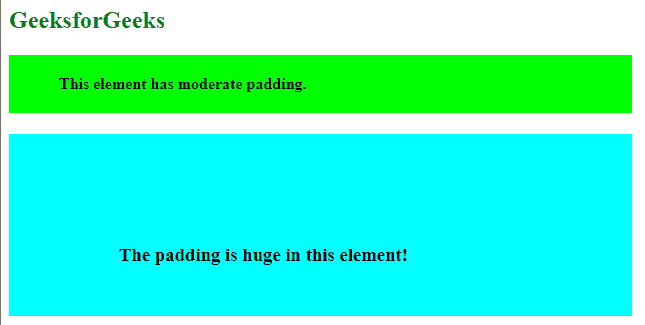
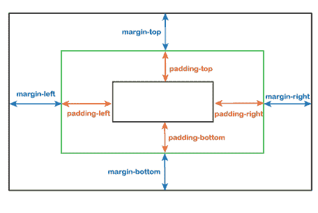

# CSS 填充与边距

> 原文:[https://www.geeksforgeeks.org/css-padding-vs-margin/](https://www.geeksforgeeks.org/css-padding-vs-margin/)

在本文中，我们将解释 [CSS 填充和边距](https://www.geeksforgeeks.org/css-margins-padding/)之间的区别。

**边距:**是元素周围的空间。边距用于在页面上向上或向下移动元素，也可以向左或向右移动元素。边距是完全透明的，没有任何背景色。它清除元素周围的区域。元素的每一侧都有一个可以单独更改的边距大小。在创建间隙时，边距会将相邻元素推开。



**填充:**是元素与其内部相关内容之间的空间。它决定了元素在容器中的外观和位置。它还显示了元素周围的容器背景。背景颜色会影响填充，因为它会清除内容周围的区域。为了创建间隙，它要么增大元素大小，要么缩小内部内容。默认情况下，元素的大小会增加。



**何时使用边距和填充？**

*   调整设计布局时，需要确定是调整边距还是填充。如果页面宽度固定，元素水平居中很简单，只需赋值 [*边距:自动*](https://www.geeksforgeeks.org/how-does-auto-property-work-in-margin0-auto-in-css/) 。您还可以使用边距来设置附近元素之间的距离。
*   如果要在元素和容器边缘或边框之间创建空间，可以更改填充。

**注意:**边距用于在图像和该图像的描述之间添加空格。

如果我们想在一个元素和容器的边缘或边框之间创建一个空间，就使用 CSS 填充。它在改变元素大小的需求中也是有用的。

**CSS 代码:**

```html
.center {
margin: auto;
background: lime;
width: 66%;
}

.outside {
margin: 3rem 0 0 -3rem;
background: cyan;
width: 66%;
}
```

**完整代码:**

## 超文本标记语言

```html
<!DOCTYPE html>
<html>
<head>
<style>
  .center {
margin: auto;
background: lime;
width: 66%;
}

.outside {
margin: 3rem 0 0 -3rem;
background: cyan;
width: 66%;
}
</style>
</head>
<body>
  <h2 style="color:green">GeeksforGeeks</h2>
  <p class="center">This element is centered.</p>

  <p class="outside">The element is positioned outside of its corner.</p>

</body>
</html>
```

**输出:**



元素外角

**注意:**当填充值增加时，文字保持不变，但周围空间会增加。

**CSS 代码:**

```html
h4 {
 background-color: lime;
padding: 20px 50px;
}

h3 {
background-color: cyan;
padding: 110px 50px 50px 110px;
}
```

**完整代码:**

## 超文本标记语言

```html
<!DOCTYPE html>
<html>
<head>
<style>
h4 {
 background-color: lime;
padding: 20px 50px;
}

h3 {
background-color: cyan;
padding: 110px 50px 50px 110px;
}
</style>
</head>
<body>
   <h2 style="color:green">GeeksforGeeks</h2>
   <h4>This element has moderate padding.</h4>
   <h3>The padding is huge in this element!</h3> 
</body>
</html>
```

**输出:**



中等和巨大的填料

填充和边距之间的表格差异。

<figure class="table">

| **Margins** | **Fill** |
| The outer space or margin of an element is the space outside the border. | The inner space of the element, that is, the filling is the space inside the element border. |
| Can be a negative number or any floating-point number. | It does not allow negative values. |
| We can set the margin to automatic. | We can't set the fill to automatic. |
| The shape of elements such as background color does not affect margins. | Fill is influenced by the style of an element, such as the background color. |

</figure>



边距和填充的不同属性