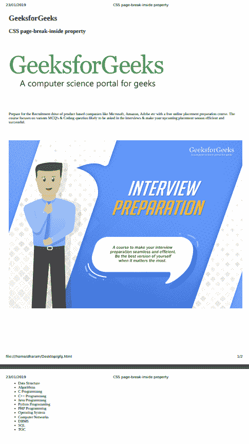
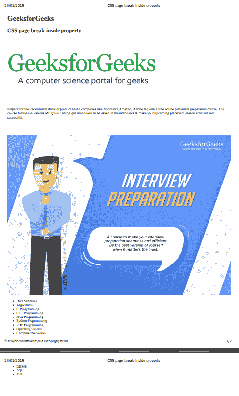

# CSS |分页符-内部属性

> 原文:[https://www . geesforgeks . org/CSS-page-break-inside-property/](https://www.geeksforgeeks.org/css-page-break-inside-property/)

CSS 中的 page-break-inside 属性用于指定打印时如何在应用它的元素内分页。它插入一个分页符，或者有时它用于在打印时避免元素内出现分页符。

**语法:**

```css
page-break-inside: auto|avoid|initial|inherit
```

**属性值:**

*   **auto:** It is the default value. This value represents the page break automatically.

    **语法:**

    ```css
    page-break-inside: auto;
    ```

*   **避免:**避免元素内部出现分页符。
    **语法:**

```css
page-break-inside: avoid;
```

*   **初始值:**它将分页内属性设置为默认值。
    **语法:**

    ```css
    page-break-inside: initial;
    ```

    *   **继承:**分页内属性是从其父级继承的。
    **语法:**

    ```css
    page-break-inside: inherits;
    ```

**注意:**该属性主要用于打印文档。

**打印媒体查询:**

```css
@media print {
    img {
        display: block;
        page-break-inside: avoid;
    }
}
```

**示例 1:** 本示例使用分页内属性值来避免。

```css
<!DOCTYPE html>
<html>

<head>
    <title>
        CSS page-break-inside property
    </title>

    <style type="text/css">
        @media print {
            ul {
              page-break-inside: avoid;
            }
        }
    </style>
</head>

<body>
    <h1>GeeksforGeeks</h1>

    <h2>CSS page-break-inside property</h2>

    <br><br><br>

    

    <br><br><br><br>

    <p>
        Prepare for the Recruitment drive of product based
        companies like Microsoft, Amazon, Adobe etc with a
        free online placement preparation course. The course
        focuses on various MCQ's & Coding question likely to
        be asked in the interviews & make your upcoming 
        placement season efficient and successful. 
    </p>

<br><br><br>

    

    <ul>
        <li>Data Structure</li>
        <li>Algorithms</li>
        <li>C Programming</li>
        <li>C++ Programming</li>
        <li>Java Programming</li>
        <li>Python Programming</li>
        <li>PHP Programming</li>
        <li>Operating System</li>
        <li>Computer Networks</li>
        <li>DBMS</li>
        <li>SQL</li>
        <li>TOC</li>
    </ul>
</body>

</html>                    
```

**输出:**
**打印预览:**


**示例 2:** 此示例将分页符内部属性值设置为无。

```css
<!DOCTYPE html>
<html>

<head>
    <title>
        CSS page-break-inside property
    </title>

    <style type="text/css">
        @media print {
            ul {
              page-break-inside: none;
            }
        }
    </style>
</head>

<body>
    <h1>GeeksforGeeks</h1>

    <h2>CSS page-break-inside property</h2>

    <br><br><br>

    

    <br><br><br><br>

    <p>
        Prepare for the Recruitment drive of product based
        companies like Microsoft, Amazon, Adobe etc with a
        free online placement preparation course. The course
        focuses on various MCQ's & Coding question likely to
        be asked in the interviews & make your upcoming 
        placement season efficient and successful. 
    </p>

<br><br><br>

    

    <ul>
        <li>Data Structure</li>
        <li>Algorithms</li>
        <li>C Programming</li>
        <li>C++ Programming</li>
        <li>Java Programming</li>
        <li>Python Programming</li>
        <li>PHP Programming</li>
        <li>Operating System</li>
        <li>Computer Networks</li>
        <li>DBMS</li>
        <li>SQL</li>
        <li>TOC</li>
    </ul>
</body>

</html>                    
```

**输出:**
**打印预览:**


**支持的浏览器:***分页内*属性支持的浏览器如下:

*   谷歌 Chrome 1.0
*   Internet Explorer 8.0
*   Firefox 19.0
*   Safari 1.3
*   Opera 7.0