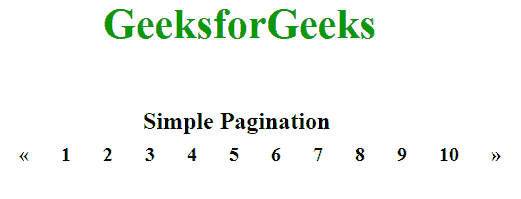
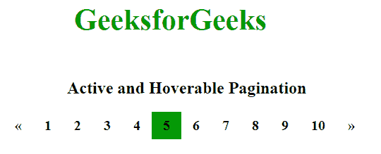
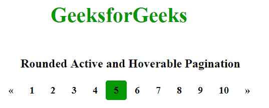
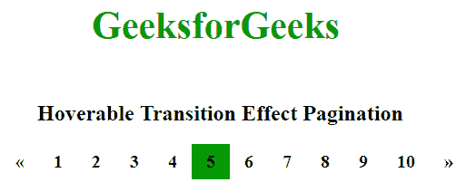
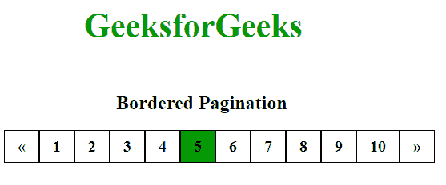
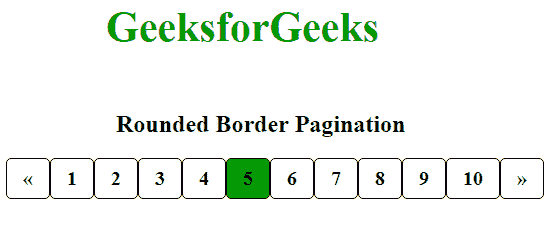
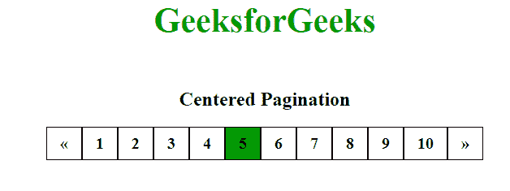
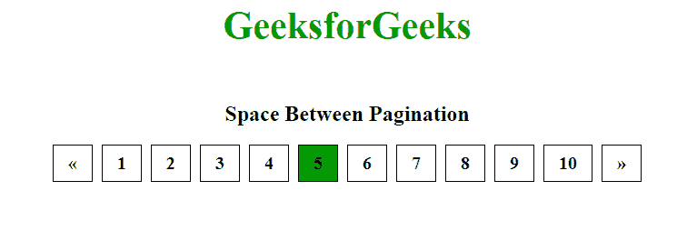
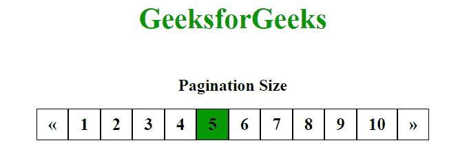

# CSS |分页

> 原文:[https://www.geeksforgeeks.org/css-pagination/](https://www.geeksforgeeks.org/css-pagination/)

分页是将文档分成页面并为它们提供数字的过程。
**分页类型:**CSS 中的分页类型很多。其中一些如下:

1.  简单分页
2.  活动和可悬停分页
3.  圆形活动和可悬停按钮
4.  可悬停过渡效果
5.  带边框分页
6.  圆角边框分页
7.  居中分页
8.  分页之间的间距
9.  分页大小

**简单分页:**这是分页的基本形式。
**语法:**

```css
.pagination {
    display:type
}
.pagination body {
    color:colorname
    decoration:type
}

```

**示例:**

```css
<!DOCTYPE html>
<html>
<head>
<style>
.pagination {
    display: inline-block;
}

.pagination a {
    font-weight:bold;
    font-size:20px;
    color: black;
    float: left;
    padding: 8px 16px;
    text-decoration: none;
}
.GFG {
    font-size:42px;
    font-weight:bold;
    color:#009900;
    margin-left:100px;
    margin-bottom:60px;
}
.peg {
    font-size:24px;
    font-weight:bold;
    margin-left:140px;
}
</style>
</head>
<body>

<div class = "GFG">GeeksforGeeks</div>
<div class = "peg">Simple Pagination</div>
<div class="pagination">
  <a href="#">«</a>
  <a href="#">1</a>
  <a href="#">2</a>
  <a href="#">3</a>
  <a href="#">4</a>
  <a href="#">5</a>
  <a href="#">6</a>
  <a href="#">7</a>
  <a href="#">8</a>
  <a href="#">9</a>
  <a href="#">10</a>
  <a href="#">»</a>
</div>

</body>
</html>
```

**输出:**


**活动和可悬停分页:**在此分页中，通过使用活动类，当前页面将被突出显示。当鼠标在页面链接上移动时，悬停将改变页面链接的颜色。
**语法:**

```css
.pagination body.active {
    display:type
    background-color:colorname
}
.pagination body:hover:not(.active) {
    background-color:colorname
}

```

**示例:**

```css
<!DOCTYPE html>
<html>
<head>
<style>
.pagination {
    display: inline-block;
}

.pagination a {
    font-weight:bold;
    font-size:20px;
    color: black;
    float: left;
    padding: 8px 16px;
    text-decoration: none;
}
.pagination a.active {
        background-color:#009900;
}
.pagination a:hover:not(.active) {
    background-color: #d4d5d2;
}
.GFG {
    font-size:42px;
    font-weight:bold;
    color:#009900;
    margin-left:100px;
    margin-bottom:60px;
}
.peg {
    font-size:24px;
    font-weight:bold;
    margin-left:90px;
    margin-bottom:20px;
}
</style>
</head>
<body>

<div class = "GFG">GeeksforGeeks</div>
<div class = "peg">Active and Hoverable Pagination</div>
<div class="pagination">
  <a href="#">«</a>
  <a href="#">1</a>
  <a href="#">2</a>
  <a href="#">3</a>
  <a href="#">4</a>
  <a class = "active" href="#">5</a>
  <a href="#">6</a>
  <a href="#">7</a>
  <a href="#">8</a>
  <a href="#">9</a>
  <a href="#">10</a>
  <a href="#">»</a>
</div>

</body>
</html>
```

**输出:**


**圆形活动和可悬停按钮:**对于圆形活动和可悬停按钮，只需添加边框半径属性。
**语法:**

```css
.pagination body.active {
    display:type
    background-color:colorname
    border-radius:size
}
.pagination body:hover:not(.active) {
    background-color:colorname
    border-radius:size
}

```

**示例:**

```css
<!DOCTYPE html>
<html>
<head>
<style>
.pagination {
    display: inline-block;
}

.pagination a {
    font-weight:bold;
    font-size:20px;
    color: black;
    float: left;
    padding: 8px 16px;
    text-decoration: none;
}
.pagination a.active {
    border-radius:5px;    
    background-color:#009900;
}
.pagination a:hover:not(.active) {
    background-color: #d4d5d2;
    border-radius:5px;
}
.GFG {
    font-size:42px;
    font-weight:bold;
    color:#009900;
    margin-left:100px;
    margin-bottom:60px;
}
.peg {
    font-size:24px;
    font-weight:bold;
    margin-left:40px;
    margin-bottom:20px;
}
</style>
</head>
<body>

<div class = "GFG">GeeksforGeeks</div>
<div class = "peg">Rounded Active and Hoverable Pagination</div>
<div class="pagination">
  <a href="#">«</a>
  <a href="#">1</a>
  <a href="#">2</a>
  <a href="#">3</a>
  <a href="#">4</a>
  <a class = "active" href="#">5</a>
  <a href="#">6</a>
  <a href="#">7</a>
  <a href="#">8</a>
  <a href="#">9</a>
  <a href="#">10</a>
  <a href="#">»</a>
</div>

</body>
</html>
```

**输出:**


**悬停过渡效果:**添加过渡属性，在悬停时创建过渡效果。
**语法:**

```css
.pagination body:hover {
    transition:type
}

```

**示例:**

```css
<!DOCTYPE html>
<html>
<head>
<style>
.pagination {
    display: inline-block;
}

.pagination a {
    font-weight:bold;
    font-size:20px;
    color: black;
    float: left;
    padding: 8px 16px;
    text-decoration: none;
}
.pagination a.active {
    background-color:#009900;
}
.pagination a:hover:not(.active) {
    background-color: #d4d5d2;
}
.GFG {
    font-size:42px;
    font-weight:bold;
    color:#009900;
    margin-left:100px;
    margin-bottom:60px;
}
.peg {
    font-size:24px;
    font-weight:bold;
    margin-left:40px;
    margin-bottom:20px;
}
</style>
</head>
<body>

<div class = "GFG">GeeksforGeeks</div>
<div class = "peg">Hoverable Transition Effect Pagination</div>
<div class="pagination">
  <a href="#">«</a>
  <a href="#">1</a>
  <a href="#">2</a>
  <a href="#">3</a>
  <a href="#">4</a>
  <a class = "active" href="#">5</a>
  <a href="#">6</a>
  <a href="#">7</a>
  <a href="#">8</a>
  <a href="#">9</a>
  <a href="#">10</a>
  <a href="#">»</a>
</div>

</body>
</html>
```

**输出:**


**带边框分页:**在这种类型的分页中，会在分页中添加边框。使用 border 属性向分页添加边框。
**语法:**

```css
.pagination body {
    border:type
}

```

**示例:**

```css
<!DOCTYPE html>
<html>
<head>
<style>
.pagination {
    display: inline-block;
}
.pagination a {
    font-weight:bold;
    font-size:20px;
    color: black;
    float: left;
    padding: 8px 16px;
    text-decoration: none;
    border:1px solid black;
}
.pagination a.active {
    background-color:#009900;
}
.pagination a:hover:not(.active) {
    background-color: #d4d5d2;
}
.GFG {
    font-size:42px;
    font-weight:bold;
    color:#009900;
    margin-left:100px;
    margin-bottom:60px;
}
.peg {
    font-size:24px;
    font-weight:bold;
    margin-left:140px;
    margin-bottom:20px;
}
</style>
</head>
<body>

<div class = "GFG">GeeksforGeeks</div>
<div class = "peg">Bordered Pagination</div>
<div class="pagination">
  <a href="#">«</a>
  <a href="#">1</a>
  <a href="#">2</a>
  <a href="#">3</a>
  <a href="#">4</a>
  <a class = "active" href="#">5</a>
  <a href="#">6</a>
  <a href="#">7</a>
  <a href="#">8</a>
  <a href="#">9</a>
  <a href="#">10</a>
  <a href="#">»</a>
</div>

</body>
</html>
```

**输出:**


**圆角边框分页:**边框可以使用边框半径属性进行圆角。
**语法:**

```css
.pagination body {
    border:type
    border-radius:size
}

```

**示例:**

```css
<!DOCTYPE html>
<html>
<head>
<style>
.pagination {
    display: inline-block;
}
.pagination a {
    font-weight:bold;
    font-size:20px;
    color: black;
    float: left;
    padding: 8px 16px;
    text-decoration: none;
    border-radius:5px;
    border:1px solid black;
}
.pagination a.active {
    background-color:#009900;
}
.pagination a:hover:not(.active) {
    background-color: #d4d5d2;
}
.GFG {
    font-size:42px;
    font-weight:bold;
    color:#009900;
    margin-left:100px;
    margin-bottom:60px;
}
.peg {
    font-size:24px;
    font-weight:bold;
    margin-left:110px;
    margin-bottom:20px;
}
</style>
</head>
<body>

<div class = "GFG">GeeksforGeeks</div>
<div class = "peg">Rounded Border Pagination</div>
<div class="pagination">
  <a href="#">«</a>
  <a href="#">1</a>
  <a href="#">2</a>
  <a href="#">3</a>
  <a href="#">4</a>
  <a class = "active" href="#">5</a>
  <a href="#">6</a>
  <a href="#">7</a>
  <a href="#">8</a>
  <a href="#">9</a>
  <a href="#">10</a>
  <a href="#">»</a>
</div>

</body>
</html>
```

**输出:**


**居中分页:**分页可以使用文本对齐属性居中。
**语法:**

```css
.center {
    text-align:center
}
.pagination body {
    color:colorname
}

```

**示例:**

```css
<!DOCTYPE html>
<html>
<head>
<style>
.pagination {
    display: inline-block;
}
.center {
    text-align:center;
}
.pagination a {
    font-weight:bold;
    font-size:20px;
    color: black;
    float: left;
    padding: 8px 16px;
    text-decoration: none;
    border:1px solid black;
}
.pagination a.active {
    background-color:#009900;
}
.pagination a:hover:not(.active) {
    background-color: #d4d5d2;
}
.GFG {
    font-size:42px;
    font-weight:bold;
    color:#009900;
    text-align:center;
    margin-bottom:60px;
}
.peg {
    font-size:24px;
    font-weight:bold;
    margin-bottom:20px;
    text-align:center;
}
</style>
</head>
<body>

<div class = "GFG">GeeksforGeeks</div>
<div class = "peg">Centered Pagination</div>
<div class = "center">
  <div class="pagination">
    <a href="#">«</a>
    <a href="#">1</a>
    <a href="#">2</a>
    <a href="#">3</a>
    <a href="#">4</a>
    <a class = "active" href="#">5</a>
    <a href="#">6</a>
    <a href="#">7</a>
    <a href="#">8</a>
    <a href="#">9</a>
    <a href="#">10</a>
    <a href="#">»</a>
  </div>
</div>

</body>
</html>
```

**输出:**


**分页之间的间隔:**如果不想对页面链接进行分组，可以对它们进行间隔。使用 margin 属性在链接之间提供空间。

**语法:**

```css
.pagination body {
    color:colorname
    margin:type
}

```

**示例:**

```css
<!DOCTYPE html>
<html>
<head>
<style>
.pagination {
    display: inline-block;
}
.center {
    text-align:center;
}
.pagination a {
    font-weight:bold;
    font-size:20px;
    color: black;
    float: left;
    margin:0px 5px;
    padding: 8px 16px;
    text-decoration: none;
    border:1px solid black;
}
.pagination a.active {
    background-color:#009900;
}
.pagination a:hover:not(.active) {
    background-color: #d4d5d2;
}
.GFG {
    font-size:42px;
    font-weight:bold;
    color:#009900;
    text-align:center;
    margin-bottom:60px;
}
.peg {
    font-size:24px;
    font-weight:bold;
    margin-bottom:20px;
    text-align:center;
}
</style>
</head>
<body>

<div class = "GFG">GeeksforGeeks</div>
<div class = "peg">Space Between Pagination</div>
<div class = "center">
  <div class="pagination">
    <a href="#">«</a>
    <a href="#">1</a>
    <a href="#">2</a>
    <a href="#">3</a>
    <a href="#">4</a>
    <a class = "active" href="#">5</a>
    <a href="#">6</a>
    <a href="#">7</a>
    <a href="#">8</a>
    <a href="#">9</a>
    <a href="#">10</a>
    <a href="#">»</a>
  </div>
</div>

</body>
</html>
```

**输出:**


**分页大小:**分页的大小可以使用 font-size 属性进行更改。

**语法:**

```css
.pagination body {
    color:colorname
    font-size:size
}

```

**示例:**

```css
<!DOCTYPE html>
<html>
<head>
<style>
.pagination {
    display: inline-block;
}
.center {
    text-align:center;
}
.pagination a {
    font-weight:bold;
    font-size:25px;
    color: black;
    float: left;
    padding: 8px 16px;
    text-decoration: none;
    border:1px solid black;
}
.pagination a.active {
    background-color:#009900;
}
.pagination a:hover:not(.active) {
    background-color: #d4d5d2;
}
.GFG {
    font-size:42px;
    font-weight:bold;
    color:#009900;
    text-align:center;
    margin-bottom:60px;
}
.peg {
    font-size:24px;
    font-weight:bold;
    margin-bottom:20px;
    text-align:center;
}
</style>
</head>
<body>

<div class = "GFG">GeeksforGeeks</div>
<div class = "peg">Pagination Size</div>
<div class = "center">
  <div class="pagination">
    <a href="#">«</a>
    <a href="#">1</a>
    <a href="#">2</a>
    <a href="#">3</a>
    <a href="#">4</a>
    <a class = "active" href="#">5</a>
    <a href="#">6</a>
    <a href="#">7</a>
    <a href="#">8</a>
    <a href="#">9</a>
    <a href="#">10</a>
    <a href="#">»</a>
  </div>
</div>

</body>
</html>
```

**输出:**
