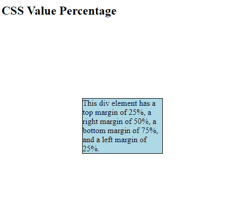
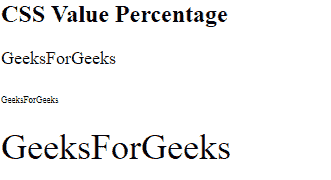

# CSS |百分比值

> 原文:[https://www.geeksforgeeks.org/css-percentage-value/](https://www.geeksforgeeks.org/css-percentage-value/)

用<percentage>表示，取一个数字作为参数。它用于定义相对于父大小的相对大小。在这个帮助下，你可以调整所有的 HTML-CSS 元素。在 CSS 中，许多以百分比作为参数的属性，如填充、宽度、高度、边距和字体大小。</percentage>

**语法:**

```css
<Percentage>
```

它以一个数字作为参数，后跟百分号(%)。

该数字可以是正数和负数，但有些属性不接受负数百分比。

**注意:**数字和百分比符号(%)之间不允许有空格。

**例 1:**

```css
<!DOCTYPE html>
<html>

<head>
    <style>
        div {
            border: 1px solid black;
            margin: 25% 50% 75% 25%;
            background-color: lightblue;
        }
    </style>
</head>

<body>
    <h2>CSS Value Percentage</h2>

    <div>
        This div element has a top margin
        of 25%, a right margin of 50%, a 
        bottom margin of 75%, and a left 
        margin of 25%.
    </div>
    <hr />
</body>

</html>
```

**输出:**


**例 2:**

```css
<!DOCTYPE html>
<html>

<head>
    <title>
        CSS | Percentage Value
    </title>
</head>

<body>
    <h2>CSS Value Percentage</h2>

    <!-- size of text is 18px -->
    <div style="font-size: 18px;">

        <p>GeeksForGeeks</p>

        <!-- Size of text is 50% of 18px -->
        <p><span style="font-size: 50%;">
                GeeksForGeeks
            </span>
        </p>

        <!-- Size of text is 200% of 18px -->
        <p><span style="font-size: 200%;">
                GeeksForGeeks
            </span>
        </p>
    </div>

    <hr />
</body>

</html>
```

**输出:**
