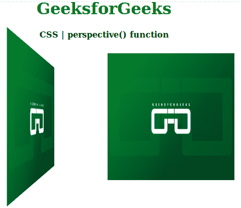

# CSS |透视()功能

> 原文:[https://www.geeksforgeeks.org/css-perspective-function/](https://www.geeksforgeeks.org/css-perspective-function/)

**透视()函数**是 CSS 中的一个内置函数，与 transform 属性一起使用来设置图像的透视效果。

**语法:**

```css
perspective( length );
```

**参数:**该功能接受单参数**长度**，用于保存透视等级的值。长度值表示从用户到 z=0 平面的距离。这是一个强制参数。

**返回值:**在用户定义值的基础上使图像透视。

下面的例子说明了 CSS 中的透视图()函数:

**示例:**

## 超文本标记语言

```css
<!DOCTYPE html>
<html>

<head>
    <title>
        CSS | perspective() function
    </title>

    <style>
        h1 {
            color: green;
        }
        .left {
            transform: perspective(400px) rotateY(70deg);
        }
    </style>
</head>

<body>
    <center>
        <h1>GeeksforGeeks</h1>

        <h4>CSS | perspective() function</h4>

        <div>
            

            
        </div>
    </center>
<body>

</html>
```

**输出:**



**支持的浏览器:**以下是 *CSS |透视()功能*支持的浏览器:

*   谷歌 Chrome
*   互联网浏览器/微软边缘
*   Mozilla Firefox
*   旅行队
*   歌剧